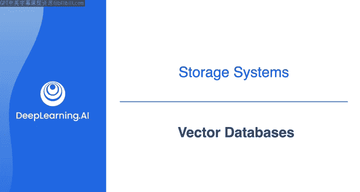
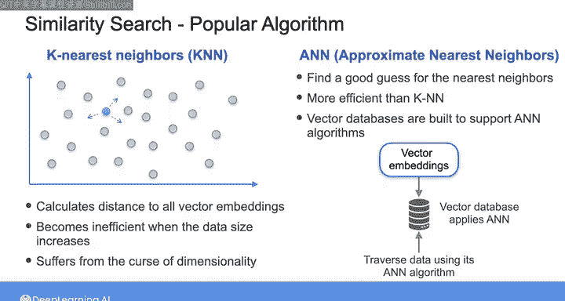

#  149：向量数据库 🧠

在本节课中，我们将学习一种随着机器学习应用兴起而日益流行的数据库类型——向量数据库。我们将了解它的核心概念、工作原理以及它如何通过相似性搜索来解决实际问题。

---

## 概述

向量数据库使你能够基于语义相似性高效地查询数据。这被称为相似性搜索，其应用范围从推荐系统到异常检测，再到文本生成。

例如，如果你想向客户推荐产品，可以查询向量数据库，以找出与客户过去购买过的产品相似的商品。或者，你可以查询向量数据库，以识别与正常交易不同的交易，从而检测异常和潜在的欺诈活动。

---

## 什么是向量数据库？

上一节我们介绍了向量数据库的应用场景。本节中，我们来看看它的定义和存储内容。

这些数据库专为存储和处理向量数据而优化。向量数据由排列在数组中的数值组成。

因此，你可以使用向量数据库存储任何以数字数组形式存在的数据。例如，一个代表一年中每天降雨量的数字数组。或者，你也可以存储可以重新排列成向量的数值数据，如图像数据，你可以将图像的RGB维度展开成一个数字数组。

然而，当今向量数据库的重要性主要在于存储和检索所谓的**向量嵌入**。

---

## 向量嵌入的核心概念

向量嵌入的核心思想是，获取一个项目（如文本文档或图像），并使用一个向量来捕捉其语义内容。

其工作方式是：你将原始数据（例如一段文本）输入到一个经过训练的机器学习模型中，该模型能够将文本转换为向量嵌入。然后，你可以将整个文档数据库或其他文本内容转换为这种嵌入，并将其存储在向量数据库中。

存储其他类型内容的向量嵌入表示的优势在于，基于向量表示来查找和检索相似项目，比直接比较原始数据库中的项目要容易得多，也快得多。

例如，假设你有一个项目（如一段文本），并且你想在向量数据库中找到与该文本相似的项目。要查询数据库，你首先需要计算查询项目的嵌入。然后，数据库可以测量任意两个向量之间的相似度，并返回最相似的向量。

在向量所代表的高维向量空间中，语义上相似的向量彼此会更“接近”。这里的“接近”不仅指你在这里看到的**欧几里得距离**（测量两个向量端点之间线段的长度），还可以通过其他类型的距离度量来确定，例如基于两向量夹角的**余弦距离**，或基于沿坐标轴测量的向量间距离的**曼哈顿距离**，以及其他度量标准。

因此，有许多算法可用于对向量嵌入数据库执行相似性搜索。

---

## 相似性搜索算法

以下是两种主要的相似性搜索算法：

### K最近邻算法

让我们仔细看看其中一种更流行的算法：K最近邻算法。

假设你想找到与给定项目最相似的K个项目。KNN算法将对所有项目的所有向量嵌入进行穷举搜索，以计算这些项目与给定项目之间的距离。

你可以想象，随着向量数据库规模的增大，这种算法的效率会降低。这还涉及到所谓的“维度灾难”的挑战，即由于高维向量空间可能很稀疏，距离度量可能无法准确反映它们之间的真实距离。

### 近似最近邻算法

为了克服这些挑战，你可以使用另一组称为ANN的算法，它代表近似最近邻。这些算法依赖于为给定项目找到最近邻的一个良好猜测，而不是计算与所有项目的精确距离。

因此，尽管它们可能导致结果略微不那么精确，但效率要高得多。实际上，向量数据库的构建就是为了支持ANN算法，以便在存储向量嵌入时能够执行高效的相似性搜索。

在向量数据库中存储向量嵌入时，数据库会应用一种ANN算法，将你的数据表示为一种能够实现更快搜索的数据结构。然后，当你基于给定项目查询向量数据库以执行相似性搜索时，数据库会使用特定的ANN算法遍历该数据结构，以返回近似最接近的项目。

在本视频之后，我包含了一个关于流行ANN算法（称为分层可导航小世界）的可选阅读材料。如果你有兴趣了解更多，请随时阅读有关该算法的更多信息。

---

## 总结

本节课中，我们一起学习了向量数据库。我们了解到，向量数据库专为存储和处理向量嵌入而设计，能够通过相似性搜索高效地查找语义上相似的项目。我们探讨了其核心概念，并介绍了K最近邻和近似最近邻这两种关键的搜索算法，后者通过牺牲少量精度换取了在大规模数据下的高效查询能力。

在下一个视频中，我将引导你学习如何使用Cypher查询语言来查询Neo4j图数据库中的数据，为你完成实验做好准备。