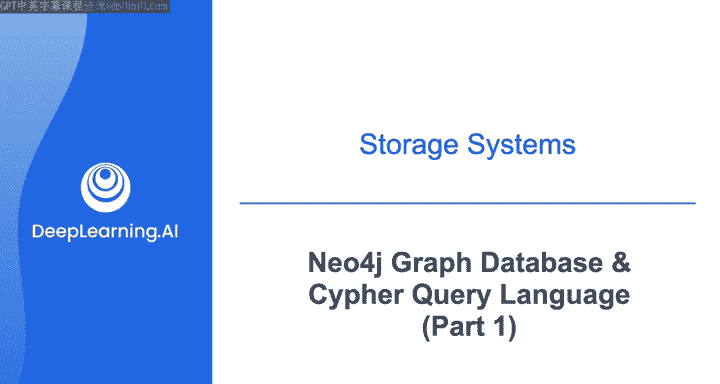
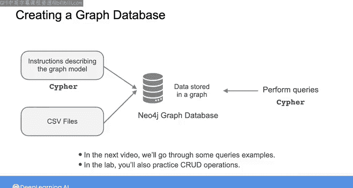
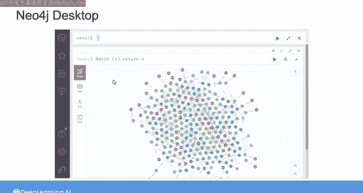

#  150：Neo4j与Cypher查询语言（第1部分）📊

在本节课中，我们将学习图数据库Neo4j及其查询语言Cypher。我们将了解如何将数据建模为图，以及如何与图数据库进行交互，这与操作关系型数据库的方式类似。

## 概述

图数据库（如Neo4j）允许你将数据建模为图，并通过查询语言与之交互。在接下来的实验中，你将探索Neo4j。本节将介绍一种名为“属性图模型”的特定图模型，你可以在Neo4j中实现它。你还将学习如何使用Cypher查询语言与这样的图进行交互。

## 属性图模型

在关系型数据库中，你可以使用关系模型来表示数据，该模型描述了表、每张表的列名以及表之间的关系。类似地，在Neo4j中，你可以使用属性图模型来建模图数据。

请注意，下图从高层次描述了图的结构，但并未展示实际数据。该模型描述了图中存在哪些类型的节点，以及这些节点是如何链接在一起的。

在这个示例模型中，包含五种类型的节点：`Customer`（客户）、`Order`（订单）、`Supplier`（供应商）、`Product`（产品）和`Category`（类别）。节点的类型被称为**节点标签**。例如，如果一个节点代表一个产品类别，它就应该拥有`Category`标签。

每个节点之间的边被称为**关系**，每个关系都有一个**类型**，显示在每个箭头旁边的文本中。每个关系类型都有一个**源节点**和一个**目标节点**。例如，`SUPPLIES`关系的源节点是`Supplier`节点，目标节点是`Product`节点。

## 实际数据示例

以下是一些遵循此图模型的实际数据示例。

你可以看到五个粉色的客户节点。对于每个客户，你可以看到他们购买的订单、每个订单包含的产品、每个产品所属的类别以及每个产品的供应商。

你还可以看到与每个节点关联的附加信息，例如订单节点的`ID`、客户节点的`CustomerId`和产品节点的`ProductName`。这些信息被称为**节点属性**。

你可以为每个节点关联多个属性，以进一步描述它所代表的实体。在描述完整的图模型时指定节点属性，因此得名“属性图模型”。

以下是此模型中一些节点和关系的属性示例：

*   **客户节点属性**：每个客户关联一组属性，包括他们的地址、联系人姓名、客户ID等。
    *   例如，客户`QUEDE`的属性值可能包括：`Address`、`ContactName`、`CustomerId`等具体信息。
*   **其他节点属性**：其他节点标签（如订单、产品）也有关联的属性集。
*   **关系属性**：你不仅可以为节点指定属性，还可以为每个关系指定属性。
    *   例如，`ORDERS`关系类型（将订单映射到特定产品）拥有以下属性集：`Discount`（折扣）、`Quantity`（数量）和`UnitPrice`（单价）。
    *   下图展示了此`ORDERS`关系属性的值示例。

## 在Neo4j中创建图数据库

在Neo4j中创建图数据库有几种方法。一种方法是向Neo4j编写一组指令，指定图模型的详细信息，例如节点及其标签和属性，以及节点之间的关系及其类型和属性，并指明节点及其关系的数据来源（可能在一些CSV文件中）。

Neo4j将使用给定的数据创建实际的图。然后，你可以执行查询来与图交互并可视化查询结果。

你需要使用**Cypher查询语言**来创建图数据库或与Neo4j中的数据交互。

## 后续内容与实验

在下一个视频中，我们将通过一些示例，介绍如何使用Cypher查询语言从图数据库中读取信息。然后在实验中，你将练习更多的CURD操作来创建和修改图数据库。

在实验中，你将按照说明打开Neo4j桌面浏览器，其界面大致如下所示：

我已经按照本视频开头看到的图模型示例创建了一个数据库。如果你想了解更多关于如何创建此图数据库的信息，可以查看视频后的阅读材料。我附上了所使用的CSV文件链接以及可用于创建相同图的Cypher指令。

## 总结

本节课我们一起学习了Neo4j图数据库的基础概念。我们介绍了**属性图模型**，它由带有标签和属性的**节点**，以及带有类型和属性的**关系**构成。我们还了解了在Neo4j中创建数据库的一种方法，并知道接下来需要使用**Cypher查询语言**来与图数据进行交互。

现在你已经了解了属性图模型的样子，接下来请和我一起进入下一个视频，学习将在实验中用于与图数据交互的Cypher查询语句。