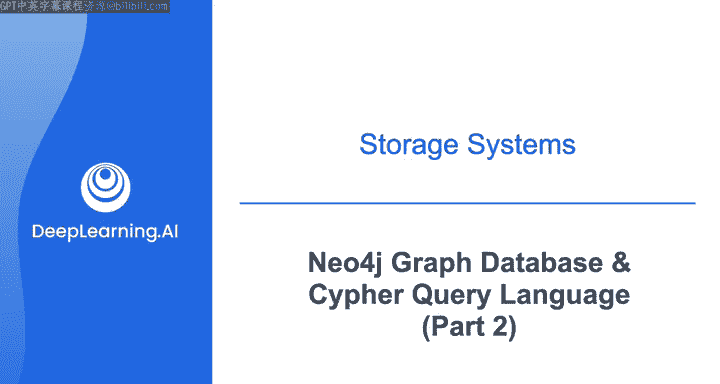
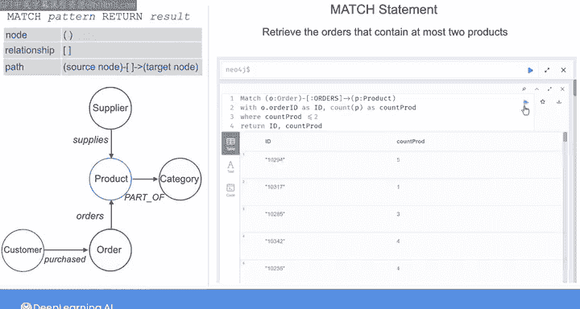

#  151：Neo4j与Cypher查询语言（第二部分）🔍



在本节课中，我们将深入学习如何使用Cypher查询语言从Neo4j图数据库中检索信息。我们将重点介绍`MATCH`语句，它用于在图中搜索并返回指定的模式，类似于关系型数据库中的`SELECT`语句。此外，我们还将学习如何过滤结果、聚合数据以及探索节点和关系的属性。

---

## 概述

上一节我们介绍了Neo4j的基本概念和图数据模型。本节中，我们将看看如何使用Cypher查询语言的核心语句——`MATCH`，来从图中检索所需的信息。`MATCH`语句允许你指定希望Neo4j搜索并返回的模式，其基本格式为：`MATCH pattern RETURN result`。

---

## 检索所有节点

首先，让我们从检索图中的所有节点开始。在Cypher中，我们使用圆括号 `()` 来表示一个节点。

以下是检索所有节点的查询语句：

```cypher
MATCH (n)
RETURN n
```

这个语句会返回图中的所有节点。

---

## 统计节点数量

如果你想获取节点的总数，可以使用 `COUNT` 函数。

查询语句如下：

```cypher
MATCH (n)
RETURN COUNT(n)
```

---

## 探索节点标签

你可以使用 `LABELS` 函数来查看图中存在哪些节点标签。使用 `DISTINCT` 关键字可以确保返回的标签不重复。

以下是查询语句：

```cypher
MATCH (n)
RETURN DISTINCT LABELS(n)
```

在本例中，节点具有的标签与之前看到的图模型一致。

---

## 统计特定标签的节点

如果你想统计具有特定标签（例如 `Order`）的节点数量，可以在 `MATCH` 模式中指定标签名称。

查询语句如下：

```cypher
MATCH (n:Order)
RETURN COUNT(n)
```

执行结果显示，该图包含99个 `Order` 节点。

---

## 探索节点属性

你可以通过在 `RETURN` 语句中调用 `PROPERTIES` 函数来查看与每种节点类型关联的属性。

例如，要查看所有 `Order` 节点的属性：

```cypher
MATCH (n:Order)
RETURN PROPERTIES(n)
```

此语句返回所有 `Order` 节点的属性。你可以使用 `LIMIT` 关键字来限制返回结果的数量。

例如，只查看第一个节点的属性：

```cypher
MATCH (n:Order)
RETURN PROPERTIES(n)
LIMIT 1
```

---

## 探索关系（边）

到目前为止，我们探索了图中节点的信息。但你也可以探索边（即节点之间的关系）的信息。

在Cypher中，使用方括号 `[]` 表示关系。由于关系存在于两个节点之间，表示从源节点到目标节点的有向路径的模式如下：

```
(source)-[r]->(target)
```

---

### 统计所有有向路径

如果你想统计图中所有有向路径的数量，可以编写如下 `MATCH` 语句：

```cypher
MATCH ()-[r]->()
RETURN COUNT(r)
```

此查询显示图中有518条有向关系。

---

### 查看关系类型

你可以修改 `RETURN` 语句来查看图中不同类型的关系：

```cypher
MATCH ()-[r]->()
RETURN DISTINCT TYPE(r)
```

---

### 指定关系类型并查看属性

你也可以通过指定关系的标签来调查特定类型的关系。例如，调查 `ORDERS` 关系：

```cypher
MATCH ()-[r:ORDERS]->()
RETURN TYPE(r), PROPERTIES(r)
```

---

### 计算订单平均价格

对于 `ORDERS` 关系，如果你想计算订单的平均价格，可以通过将 `quantity` 属性乘以 `unitPrice` 属性来得到价格，然后求平均值。

查询语句如下：

```cypher
MATCH ()-[r:ORDERS]->()
RETURN AVG(r.quantity * r.unitPrice) AS average_price
```

使用 `AS` 关键字可以为返回值创建别名，例如这里的 `average_price`。

---

### 按产品类别分组计算平均价格

如果你想按产品类别分组计算所有订单的平均价格，可以在 `MATCH` 语句中添加路径来获取类别节点。

查询模式是：匹配所有属于特定类别 `c` 的 `ORDERS` 关系 `r`。

以下是查询语句：

```cypher
MATCH (c:Category)<-[:PART_OF]-(:Product)<-[r:ORDERS]-()
RETURN c.categoryName, AVG(r.quantity * r.unitPrice) AS avg_price_per_category
```

在 `RETURN` 语句中，我们添加了 `c.categoryName`，这是一个代表每个类别的名称列表。

---

## 使用 WHERE 语句过滤结果

你可以使用 `WHERE` 语句来过滤结果，这与SQL中的 `WHERE` 语句类似。

---

### 示例：检索特定类别的产品

假设你想检索属于“Meat/Poultry”类别的所有产品的产品名称和产品单价。

首先，需要指定产品节点属于类别节点的路径。注意，我为产品和类别节点分配了变量，但没有为 `PART_OF` 关系分配变量，因为在后续查询语句中不需要引用该关系。

接下来，指定过滤条件：类别名称属性等于“Meat/Poultry”。最后，指定要返回的产品属性。

查询语句如下：

```cypher
MATCH (p:Product)-[:PART_OF]->(c:Category)
WHERE c.categoryName = 'Meat/Poultry'
RETURN p.productName, p.unitPrice
```

---

### 在节点括号内指定属性

除了在 `WHERE` 语句中指定属性，你也可以在节点括号内使用花括号 `{}` 来明确过滤条件。

上述查询可以改写为：

```cypher
MATCH (p:Product)-[:PART_OF]->(c:Category {categoryName: 'Meat/Poultry'})
RETURN p.productName, p.unitPrice
```

---

### 查找客户订购的产品

假设你想检索客户ID为“QUE”的客户订购的所有产品的名称。

查询路径是：从客户节点开始，通过 `PURCHASED` 和 `ORDERS` 关系链到达产品节点。

查询语句如下：

```cypher
MATCH (c1:Customer {customerID: 'QUE'})-[:PURCHASED]->()-[:ORDERS]->(p:Product)
RETURN p.productName
```

注意，对于 `PURCHASED` 关系，我不必为目标订单节点指定变量，因为在查询语句的其余部分不需要引用该变量。

---

### 查找订购相同产品的其他客户

对于同一客户“QUE”，假设你想获取订购了与“QUE”相同产品的其他客户的ID。

查询路径是：从客户“QUE”开始，通过两个 `PURCHASED` 和 `ORDERS` 关系链到达产品节点，然后通过 `ORDERS` 和 `PURCHASED` 关系使用左箭头 `<-` 从产品节点反向链接到另一个客户节点。

查询语句如下：

```cypher
MATCH (c1:Customer {customerID: 'QUE'})-[:PURCHASED]->()-[:ORDERS]->(p:Product)<-[:ORDERS]-()<-[:PURCHASED]-(c2:Customer)
RETURN c2.customerID
```

---

### 检索包含至多两个产品的订单

让我们对这个图进行最后一次搜索。假设你想检索包含最多两个产品的订单。

我们可以分步思考：
1.  首先，获取每个订单的产品总数。
2.  然后，过滤出产品数量小于等于2的订单。



第一步的查询语句如下，它相当于使用SQL的 `GROUP BY` 语句按订单ID分组，然后计算每个订单ID的产品数量：

```cypher
MATCH (o:Order)-[:ORDERS]->(p:Product)
RETURN o.orderID, COUNT(p) AS productCount
```

接下来，我们需要添加一个 `WHERE` 语句来过滤产品数量小于等于2的订单。为此，我们将 `RETURN` 语句替换为 `WITH` 语句，它允许你在之后访问 `orderID` 和 `productCount` 输出。

完整的过滤查询如下：

```cypher
MATCH (o:Order)-[:ORDERS]->(p:Product)
WITH o.orderID AS orderID, COUNT(p) AS productCount
WHERE productCount <= 2
RETURN orderID, productCount
```

---

## 总结


在本节课中，我们一起学习了Cypher查询语言的核心 `MATCH` 语句，用于从Neo4j图数据库中检索数据。我们涵盖了如何检索节点和关系、使用函数统计和聚合数据、通过 `WHERE` 语句过滤结果，以及构建更复杂的查询路径来回答具体问题。这些基础技能对于操作和分析图数据至关重要。


在接下来的实验中，你将有机会使用 `MATCH` 语句，并学习其他如 `CREATE` 和 `DELETE` 等语句。实验将指导你在Neo4j图形界面中可视化图，但完成实验主要将在Jupyter Lab中进行，你需要在代码单元格中编写查询。这些查询将封装在Python代码中，自动连接到实验提供的图数据库。你还将学习如何不仅将Neo4j作为图数据库，还作为向量数据库进行交互。