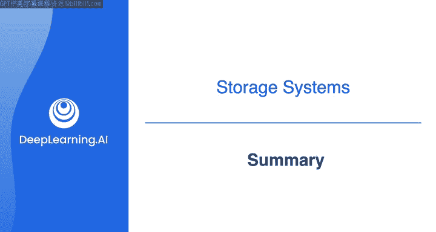
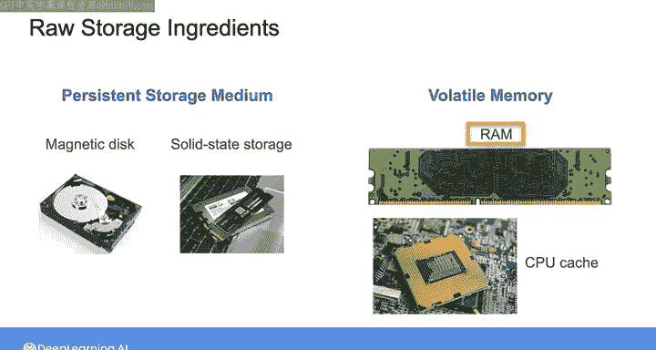
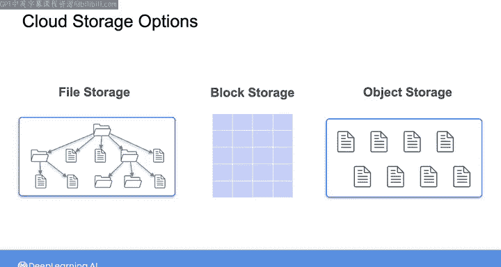
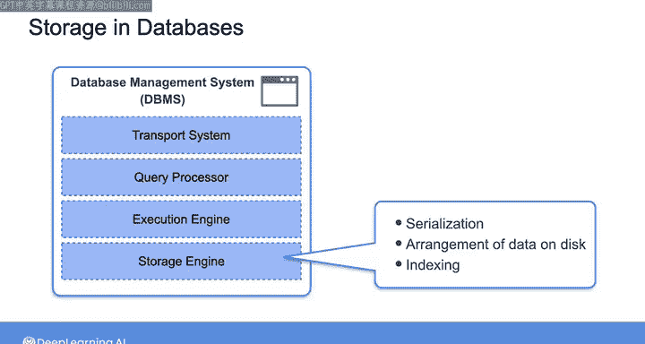
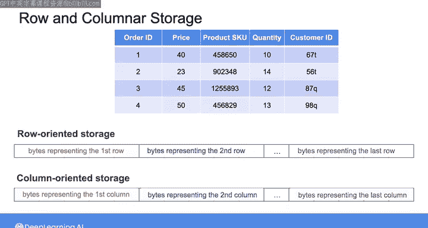
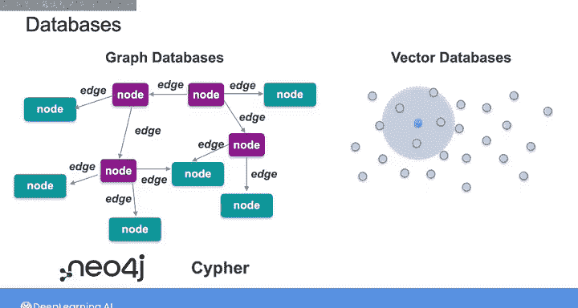

#  153：第1周总结 📚



在本节课中，我们将回顾第一周课程的核心内容。我们重点学习了存储层次结构的前两层：原始存储介质和构建于其上的存储系统。同时，我们也深入探讨了数据库的基础知识，包括存储引擎、索引以及不同的数据存储格式。

---

## 🧱 原始存储介质与存储系统

上一节我们介绍了课程的整体框架，本节中我们来看看存储层次结构的基础层。

我们比较了多种原始存储介质的成本与性能。

以下是主要的存储介质类型及其特点：
*   **机械硬盘**：成本较低，但读写速度相对较慢。
*   **固态硬盘**：读写速度快，但单位存储成本高于机械硬盘。
*   **内存**：速度最快，用于临时存储和处理数据，但成本最高且断电后数据会丢失。

在理解了这些基础组件后，我们探讨了构建于其上的存储系统。你基于先前关于对象存储和分布式存储系统的知识，通过实践练习探索了文件、块和对象存储之间的区别。

尽管对象存储可能是当今数据工程领域中最主要的文件存储和检索机制，但你仍需准备好评估每种云存储选项的性能，以便为组织的具体用例选择最佳方案。

---

## 🗃️ 数据库基础

在了解了基础存储系统后，本周第二课的重点转向了数据库。


数据库存储引擎负责在磁盘上物理存储和组织数据。通过探索各种示例，你学习了如何使用索引来提升查询性能。





索引的核心作用可以用一个简单的类比理解：就像一本书的目录，它能帮助你快速找到所需内容，而无需逐页翻阅。在数据库中，索引通过创建额外的数据结构来加速数据检索。



接着，我们深入探讨了行存储与列存储的细节，并了解了每种存储格式适用的不同数据工程用例。

以下是两种存储格式的简要对比：
*   **行存储**：将一整行数据连续存储。适合需要频繁进行整行读取或写入的事务处理场景。
*   **列存储**：将每一列的数据连续存储。适合需要快速对特定列进行聚合和分析的查询场景。

最后，我们概览了一些随着生成式AI兴起而流行的数据库。你学习了图和向量数据库如何存储和检索数据，并有机会使用Neo4j图数据库及其Cypher查询语言进行实践。

Cypher查询语言示例：
```cypher
MATCH (p:Person)-[:LIVES_IN]->(c:City)
WHERE c.name = '北京'
RETURN p.name
```

---

## 📈 总结与展望

本节课中，我们一起学习了存储系统的基石——从物理介质到数据库引擎。我们比较了不同存储介质的特性，分析了文件、块、对象存储的差异，并深入理解了数据库索引以及行、列存储格式的应用场景。



下周，我们将沿着存储层次结构向上，讨论存储抽象。你将看到存储架构和框架如何随着数据仓库、数据湖乃至数据湖仓的出现而演变，并深入探索每种架构的细节。




期待下次再见。