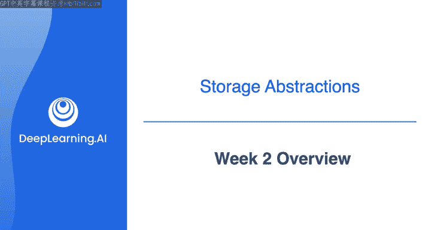
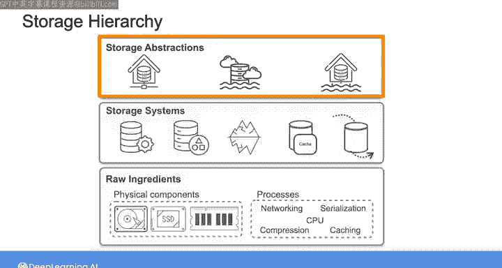
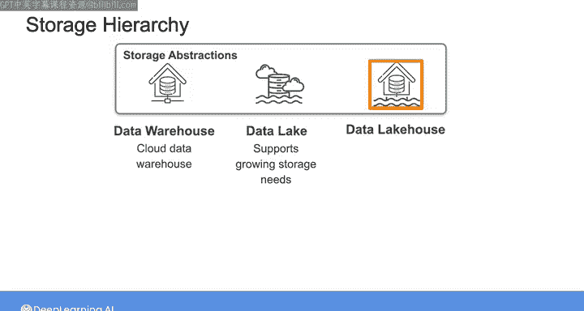
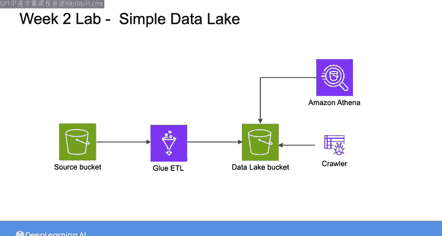
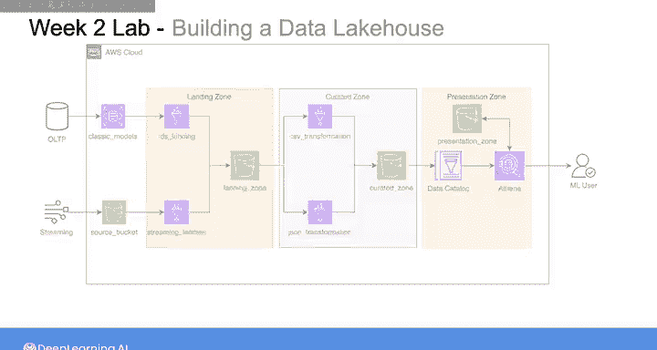
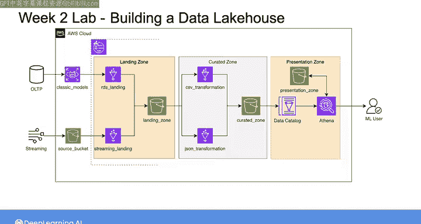

#  154：数据工程（导论，源系统、数据摄取和管道，数据存储和查询｜1-2-3课） - 第2周概览 🗂️

在本节课中，我们将要学习数据存储的抽象层次。我们将从数据仓库架构开始，探讨其向现代云数据仓库的转变，然后深入了解数据湖的兴起及其挑战，最后探索旨在结合两者优势的数据湖仓架构。

上周我们探讨了存储原始组件的细节。你看到了作为数据工程师，理解不同存储介质和流程的特性、性能和成本，如何帮助你更好地评估存储解决方案决策中的权衡。

然后我们探索了不同的存储系统，包括对象存储和常见类型的数据库。

本周我们将沿着存储层次向上移动，探索不同的存储抽象。

## 数据仓库架构的演变 🏢

上一节我们介绍了基础的存储系统，本节中我们来看看数据仓库架构。

我们将首先审视数据仓库架构，以及其向现代云数据仓库的变革性转变。

## 数据湖的兴起 🌊

在了解了数据仓库之后，本节我们将探讨数据湖。

我们将深入探讨数据湖的兴起，这是对数据量、数据类型和用例方面不断增长的存储需求的回应。我们也将审视与此架构相关的挑战。

以下是数据湖兴起的主要驱动因素：
*   数据量的爆炸式增长。
*   数据类型的多样化，包括非结构化数据。
*   支持更广泛的分析用例的需求。

## 数据湖仓架构：融合优势 🏢🌊

在分别探讨了数据仓库和数据湖之后，本节我们来看看结合两者优势的架构。

最后，我们将审视数据湖仓架构，其目标是结合数据仓库和数据湖两者的优势。

我将本周内容设置为一次穿越数据存储抽象历史的旅程。当我们探讨每一种范式时，你将思考其各自的优点、缺点和可能的用例。这里的目的是让你对每种架构有足够的理解，以便你能根据你的用例选择最合适的存储解决方案。

在本周的实验练习中，你将使用 AWS Glue 和 Athena 在数据湖中进行高效的数据检索。然后，你将有机会尝试使用 AWS Lake Formation 和 Apache Iceberg 表，通过一种称为“奖牌架构”的方式来创建数据湖仓。

在我们深入探讨每一种存储抽象范式的细节之前，我想给你一个机会，听听被广泛认为是数据仓库之父、该领域知识渊博的专家之一——Bill Inmon 的见解。下一个视频是可选的，如果你更想直接跳转到数据仓库架构的细节，可以自由跳过。否则，请享受接下来与 Bill Inmon 的对话。之后我将与你再次会面，更深入地探讨数据仓库。

---

本节课中我们一起学习了数据存储的三种主要抽象范式：数据仓库、数据湖和数据湖仓。我们了解了每种架构的演变背景、核心特点以及适用场景，为根据具体用例选择合适的存储解决方案奠定了基础。