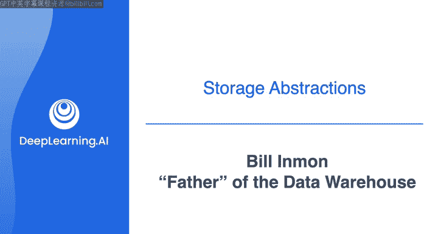

#  155：与Bill Inmon的对话 🎙️

在本节课中，我们将与数据仓库之父Bill Inmon进行对话，了解数据仓库的起源、ETL技术的发展历程以及数据工程领域的早期故事。通过他的亲身经历，我们可以更好地理解现代数据基础设施的演进背景。

---

## 数据仓库的诞生 🏗️

上一节我们介绍了数据工程的基础概念，本节中我们来看看数据仓库的起源。Bill Inmon是数据仓库概念的创建者，也可以说是现代数据行业的奠基人。

Bill Inmon于1965年在新墨西哥州的白沙导弹靶场编写了他的第一个程序。他回忆道，偶尔在傍晚时分，大家会走到阳台上观看从犹他州发射到白沙导弹靶场的导弹。他表示，如果不从事计算机行业，自己无法成为一名医生，也不想成为律师，因此不确定生活会走向何方。但编写第一个计算机程序后，他便爱上了计算。

随后，他提出了数据仓库的概念。

---

## 什么是数据仓库？ 📊

那么，什么是数据仓库？一个简单的单句定义是：**数据仓库无非是公司数据，即代表公司所有方面的数据**。

为了理解数据仓库，一个好的起点是了解数据仓库出现之前的世界。在那个时代，我们拥有应用程序。每个应用程序设计师都为使用该应用程序的人构建应用程序，这似乎很合理。但问题是，随着时间的推移，我们开始拥有大量应用程序。每个应用程序都是独立且不同的。因此，实际情况是，除了应用程序用户之外，公司中还有其他人需要使用应用程序数据。

公司中有市场营销、销售、财务、管理等各个部门，这些组织都需要所谓的**公司信息视图**。问题在于，你无法真正从应用程序中获得数据的公司视图，因为每个应用程序都是特定和定制化的。因此，当会计和营销部门的人员想要查看公司中的所有数据时，他们无法做到。

所以，数据仓库的一个简单定义是**公司数据**。它是跨越公司范围的数据。当谈论数据仓库时，通常会涉及**数据转换**，即从应用程序基础到公司基础的数据转换。

---

## ETL技术的起源与发展 ⚙️

上一节我们定义了数据仓库，本节中我们来看看数据如何进入仓库。典型情况下，这种转换是通过称为**ETL（提取、转换、加载）** 的技术完成的。ETL技术已经存在很长时间，Bill Inmon也是ETL的创始人之一。

在数据仓库的早期，人们围坐讨论如何将数据导入数据仓库。早期的做法是手动编写程序，使用PL/1、COBOL或类似的FORTRAN等语言。他们会编写这些程序来查找数据、转换数据并将其放入数据仓库。

但很快，他们发现构建这些程序是一项非常繁重的任务，既耗时又枯燥。此外，他们还发现逻辑一遍又一遍地重复。编写ETL程序的知识性刺激在最初的30秒内就消失了，因为你是在重复编写相同的程序。

因此，Bill Inmon和Prison Solutions的几位创始人提出：“我们真正需要的是自动化技术，可以进入数据世界，找到必要的数据，进行转换并将其导入数据仓库。”这就是ETL的起源。

---

## 早期挑战与行业故事 📜

Bill Inmon在行业中工作了很长时间，可以说他创建了这个行业。他有一些有趣的故事和轶事想与学生分享。

他可以谈谈数据仓库的早期日子，他认为这很有趣，否则可能没人会听到这些故事。但他必须警告，他将涉及一个供应商，因为当时有另一个供应商竭尽全力压制数据仓库，那就是**IBM公司**。

在数据仓库开始时，IBM是主导供应商。这实际上正是微软开始进军世界的时候。在当时，任何技术都是IBM的，IBM在公司的地位既是顾问又是销售人员，这对公司来说是危险的。

当数据仓库出现时，IBM竭尽全力反对。在那个时代，成为IBM的反对者很困难，就像大卫对抗歌利亚。而他当然不是歌利亚。

他们开始构建数据仓库。当时他恰巧是《Comp World》杂志的记者，并开始撰写文章。他指出，那篇惹恼IBM的文章在今天看来很有趣，但当时并不好笑。他提出建议，认为数据可以用于事务处理以外的用途。

这激怒了IBM及其盟友，他们有一种奇特的观点，认为数据只应用于事务处理，说其他任何话都是异端邪说。他唯一的平台就是他在《Computer World》上发表的文章。你应该看到一些回复和读者来信。他记得其中一封说：“这个人是个无政府主义者。”另一封说：“他不应该再被允许公开讲话。”还有一些含有脏话的信件，他也收到了很多。无论如何，这在学术界和IBM世界中引起了强烈的本能反应。

有趣的是，在早期，世界上的技术人员根本不支持数据仓库。他们将数据仓库卖给营销组织。感谢营销组织，如果没有营销人员，数据仓库今天就不会存在。

---

## 持续的动力与行业先驱 👨‍💼

最后，是什么让Bill Inmon在数据领域坚持了这么多年？他的真正方向是什么？

有时早上起床，他也会问自己同样的问题。当他看到一些他认为根本不对的事情时，就会促使他采取行动。他看到的一件不对的事情是文本在公司中没有得到利用，这促使他构建了称为**文本ETL**的技术。

另一件他看到不对的事情是，有一天他在一个会议上与其他计算机专业人士在一起，他提到Ed Yourdon去世了。令他惊讶的是，桌上没有一个人知道Ed Yourdon是谁。他感到惊讶，因为Ed Yourdon和其他三、四个人对我们的行业产生了惊人的影响。如果没有他们，我们的行业不会像今天这样，然而我们的行业却忘记了所有这些人。

以下是关于Ed Yourdon的介绍：

在很早的时候，当你是一名程序员时，结果总是说我们需要构建一个新系统，带上你的编码本。没有设计工作，什么都没有，最终用户认为他们想要什么，让我们今天就开始编码。在那个时代，编码就像狂野的西部，你只是开始写代码。

Ed Yourdon出现了，并看到了这一点。他说：“天哪，我们需要一种更有条理的方式来组织我们的专业，我们编写代码的方式，我们进行设计的方式。”Ed Yourdon开始了称为**结构化设计与分析**的工作。简化版本的结构化设计与分析表示，我们需要一种有组织、有条理、经过深思熟虑的方式来布局这些程序。今天，我们做到了这一点，但在早期，我们没有。

在开发完成的方式、应用程序设计的方式方面，都要感谢Ed Yourdon。然而在他参加的这次会议上，甚至没有人知道他的名字。

---

## 总结 📝

本节课中，我们一起学习了数据仓库之父Bill Inmon的见解。我们探讨了数据仓库的定义与价值，回顾了ETL技术的起源与发展，并聆听了数据工程早期与行业巨头抗争的故事。这些历史背景帮助我们理解，现代数据基础设施的建立并非一帆风顺，而是源于解决实际业务需求、挑战传统观念并持续创新的过程。Bill Inmon对行业先驱的铭记也提醒我们，在快速发展的技术领域中，尊重历史与 foundational work 同样重要。