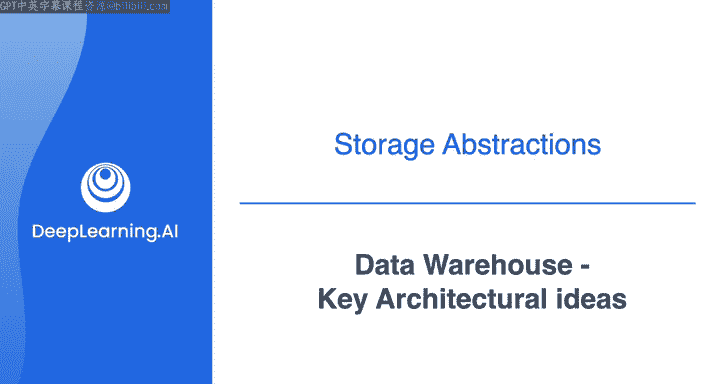
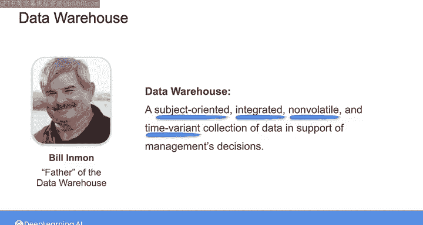
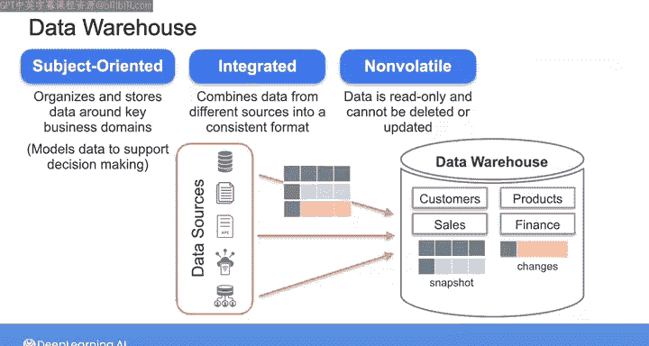
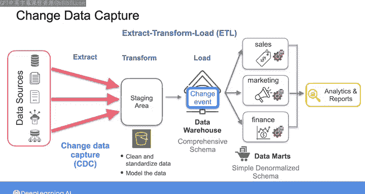
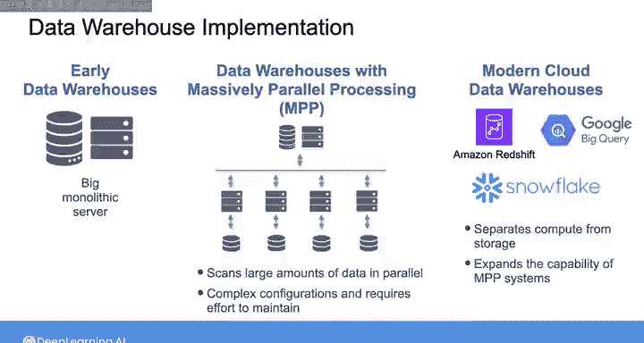

#  156：数据仓库关键架构理念 🏗️

在本节课中，我们将要学习数据仓库的核心概念、其定义、传统架构以及向现代云数据仓库的演进过程。理解这些理念对于构建高效、可靠的数据分析平台至关重要。

---

## 数据仓库的起源与定义

在数据工程师的工作中，你会从许多不同的源系统摄取数据。一个非常常见的来源是作为**OLTP系统**一部分的数据库，其数据以优化事务性工作负载的方式进行结构化。

OLTP系统已经存在了几十年。在数据分析的早期，团队直接在生产的OLTP数据库上运行分析查询的情况并不少见。

正如之前多次提到的，在生产数据库上运行分析查询可能带来灾难性后果。此外，直接在基于行的事务性数据上进行数据分析可能非常低效且成本高昂。

早在20世纪80年代末，Bill Inmon提出了**数据仓库**的概念来解决这个问题。他将数据仓库描述为：一个面向主题的、集成的、非易失的、随时间变化的数据集合，用于支持管理决策。这个基础定义强调了数据仓库作为中央数据存储库的角色，旨在促进报告和分析。

---

## 详解数据仓库定义

上一节我们介绍了数据仓库的起源，本节中我们来详细拆解其定义。

以下是Bill Inmon定义中四个关键特征的解析：

*   **面向主题**：数据仓库围绕业务的关键主题或领域（如客户、产品、销售或财务）组织和存储数据。其重点在于建模数据以支持决策，而非事务处理和记录。
*   **集成**：数据仓库汇集来自不同来源的数据，并确保其以预定义模式一致地存储。
*   **非易失**：数据仓库中的数据是**只读**的，通常意义上不能被删除或更新。这对于历史数据分析非常有用。非易失性原则要求数据仓库在从源系统初始加载数据时，将数据作为快照捕获并加载。当源系统发生后续更改时，要么将数据的新快照加载到数据仓库，要么仅加载更改。无论如何，数据的现有快照不会被删除或更改，而是保留在数据仓库中。
*   **时变**：数据仓库存储当前数据和历史数据。数据用户可以通过查看这些历史数据来观察多个主题的趋势，以支持其业务决策。这是OLTP源系统通常无法做到的，因为它们通常不支持保留历史数据或进行历史数据分析。

尽管数据仓库的技术层面已发生重大演变，但这个原始定义至今仍然适用。

---

## 传统数据仓库架构：ETL与数据集市

理解了数据仓库的核心特征后，我们来看看如何将数据加载到其中。

传统上，你会使用**ETL管道**从各种来源将数据加载到数据仓库。ETL即**提取、转换、加载**的摄取模式。典型流程如下：首先将提取的数据移动到数据仓库外部的**暂存区**（例如S3对象存储）。在那里，你将应用转换来清理和标准化数据。这也是你根据特定模型构建数据的地方，以使数据对下游用户有用。我们将在下一门课程中详细讨论数据建模。接下来，你将转换后的数据加载到数据仓库中。

数据仓库旨在为更广泛的组织服务，但你也可以通过将数据加载到所谓的**数据集市**来服务于特定用户群。你可以将每个数据集市视为数据仓库的一个更精细的子集，旨在满足单个部门或业务功能（如销售、营销或财务）的特定需求。与数据仓库的综合模式不同，数据集市中的数据通常遵循更简单的**反规范化模式**，仅提供特定于某个部门的、更聚焦的数据子集视图。

借助数据集市，你还可以在初始ETL管道提供的转换之外，执行额外的转换阶段，这可以提高需要复杂连接和聚合的分析查询的性能。

**ETL过程**通常用于使数据仓库中的数据与生产数据库保持同步，因为这些源数据库会持续更新。当你从生产数据库提取数据时，可以不用提取所有数据，而是使用**变更数据捕获**或**CDC**过程来识别和捕获仅变更事件（如插入、更新或删除），并将这些变更传送到你的数据仓库。通过仅提取增量变更，你可以最大限度地减少对源系统性能的影响。

---

## 从OLTP到OLAP：数据仓库的演进

上一节我们介绍了如何通过ETL将数据加载到仓库，本节中我们来看看数据仓库带来的核心转变。

因此，数据仓库是对传统OLTP系统的背离。通过从生产数据库中提取数据，将其建模以支持分析工作负载，然后将其加载到单独的数据仓库中，你可以将负载从生产系统转移开，并以改进的分析查询性能提供更好的最终用户体验。这使得数据仓库成为**在线分析处理**或**OLAP**数据架构的标准。

数据仓库的最早实现基于单一的整体式服务器，这限制了其性能。随着整个20世纪90年代数据量的稳步增长，传统数据仓库无法跟上。随后，**大规模并行处理**或**MPP**系统的出现使数据仓库能够扩展。实现了MPP的数据仓库能够并行扫描大量数据，实现高性能的分析查询。但这些系统复杂且固定，需要付出精力和时间来维护。

在21世纪10年代初，现代云数据仓库（如Amazon Redshift、Google BigQuery和Snowflake）出现，代表了与过去本地数据仓库架构的重大演变。现代云数据仓库架构将**计算与存储分离**，并扩展了MPP系统的能力。这使得大规模数据集的处理具有可扩展性和高效性，并使数据分析对小型组织而言更易于访问且更具成本效益。

---

## 总结

本节课中我们一起学习了数据仓库的关键架构理念。我们从其起源和Bill Inmon的经典定义开始，详细解析了其面向主题、集成、非易失和时变的特征。接着，我们探讨了传统的ETL数据加载流程以及服务于特定部门的数据集市概念。最后，我们回顾了数据仓库如何从OLTP系统中分离出来，成为OLAP的标准，并最终演进为将计算与存储分离的现代云数据仓库架构。理解这些核心理念是设计和构建有效数据工程解决方案的基础。