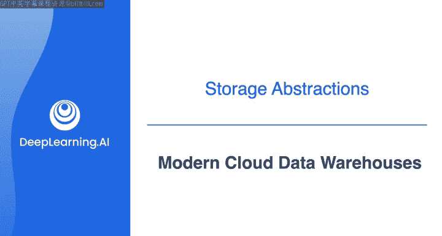
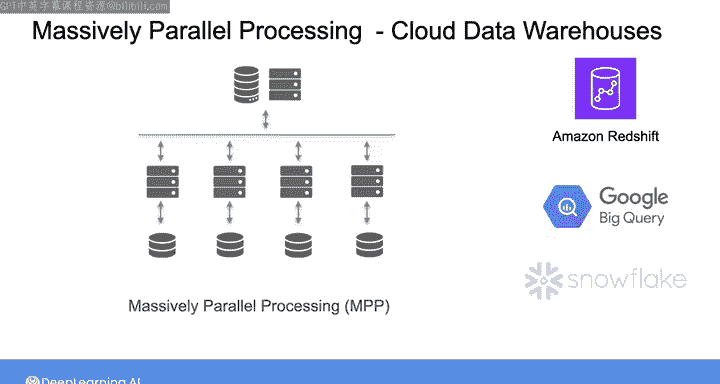
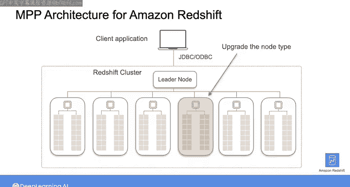
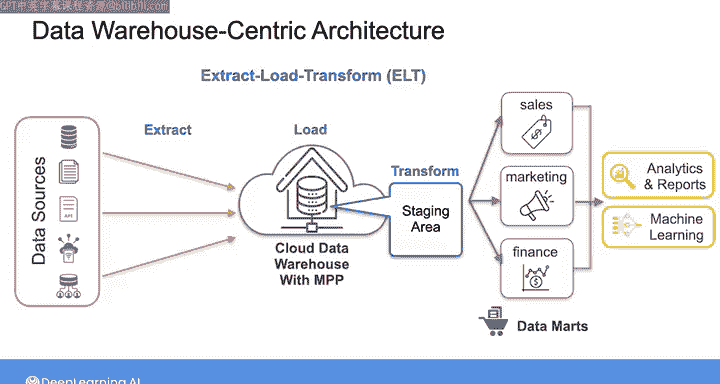
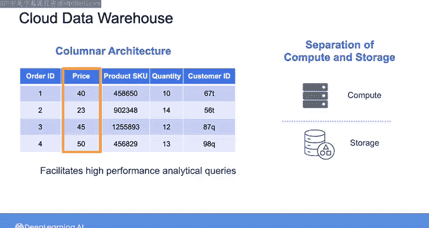
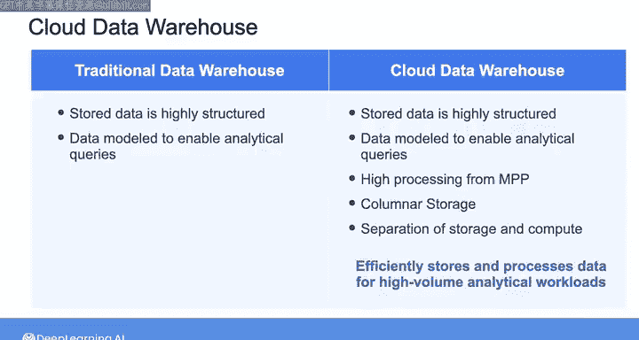

#  157：现代云数据仓库 🏢

在本节课中，我们将学习现代云数据仓库的核心概念。我们将探讨云数据仓库相比传统本地数据仓库的优势，并深入了解其架构特点，包括大规模并行处理、列式存储以及计算与存储分离等关键特性。

作为数据工程师，你很可能会接触到云数据仓库。在本视频中，我们将详细探讨云数据仓库相比传统本地数据仓库具备更强处理能力的因素。理解这些因素将帮助你设计更高效的数据仓库，并更好地管理扩展、性能和成本。

正如上一节视频所提到的，数据仓库通常采用大规模并行处理架构。这种架构使用多个处理器来处理海量数据。对于云数据仓库，你无需预先精确配置MPP系统，也无需花费数百万美元的前期投入来建立系统。你可以按需启动计算集群，随着数据和分析需求的增长逐步扩展，或在不再需要时删除集群。

接下来，让我们花点时间看看亚马逊Redshift的具体MPP架构。其他云数据仓库，如Google BigQuery和Snowflake，也使用类似的结构，但实现细节有所不同。

在Redshift中，计算资源的集合被称为一个集群。每个集群由一个或多个计算节点组成，这些节点由一个领导者节点管理。这些节点拥有自己的CPU、内存和磁盘空间。一个计算节点进一步划分为多个节点切片，每个切片包含节点CPU、内存和磁盘空间的一部分。

当你将数据加载到Redshift时，领导者节点管理数据如何在节点切片之间分布。当客户端应用程序向数据仓库发送查询请求时，领导者节点将请求解析为一系列步骤，并形成一个执行计划。然后，基于该计划，领导者节点编译代码并将其分发给包含与查询相关数据的相应计算节点切片。这些切片并行工作以完成工作负载。接着，计算节点将中间结果发送回领导者节点。最后，领导者节点聚合结果，并将最终结果发送回客户端应用程序。

随着工作负载的增加，你可以启动更多计算节点，或将节点类型升级为具有更高计算能力的类型。从这个意义上说，云数据仓库扩展了MPP系统的能力，使你能够轻松扩展数据基础设施，以处理单次查询中高达PB级别的数据。

随着MPP带来的处理能力提升，云数据仓库还可以支持ELT提取、加载和转换的摄取模式。从存储系统提取数据后，你无需在数据仓库外部转换和建模数据，而是可以将原始的、未经处理的数据直接加载到数据仓库内的暂存区域。然后，你可以利用云数据仓库的巨大计算能力来转换数据。这带来了更快的摄取速度，使你能够快速为下游利益相关者提供数据。

我们在云数据仓库中看到的另一个变化是从行式架构向列式架构的转变。正如上周所见，列式存储与数据压缩相结合，促进了大规模分析查询的更高性能。

最后，在许多云数据仓库中，数据存储在对象存储中，这提供了几乎无限的存储空间。这意味着你可以分离计算和存储，允许你独立管理和扩展这些资源，以优化成本和性能。

现在，云数据仓库仍然具备传统数据仓库的所有属性，即你存储的数据可以是高度结构化和建模的，以支持分析查询。将这些属性与MPP、列式存储以及计算与存储分离所带来的高处理能力相结合，使得云数据仓库在存储和处理大规模分析工作负载的数据时非常高效。

那么，如果你的公司想要存储和查询非结构化数据，比如文本、图像、音频文件或视频，该怎么办呢？现代数据应用不再局限于分析和报告。它们通常涉及机器学习或探索性分析等用例，这些用例需要直接访问各种非结构化数据，而不仅仅是运行SQL查询访问的数据。这正是数据湖存储架构发挥作用的地方。

本节课中，我们一起学习了现代云数据仓库的关键特性，包括其基于MPP的弹性扩展能力、对ELT模式的支持、列式存储的优势以及计算与存储分离的架构。这些特性共同构成了云数据仓库高效处理大规模分析工作负载的基础。