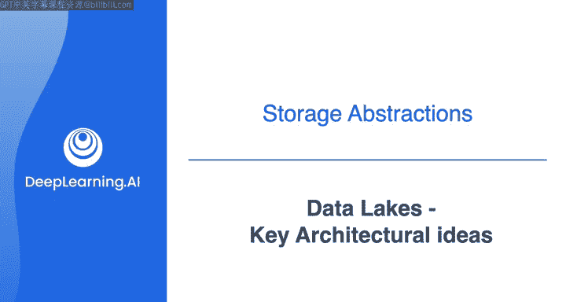
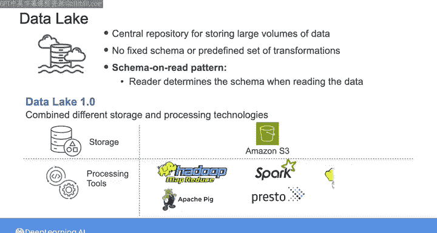
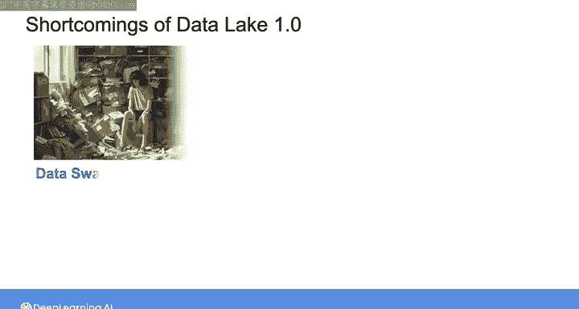
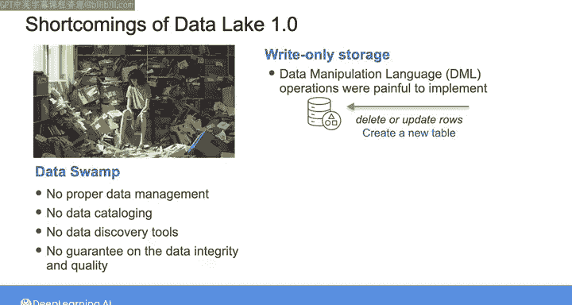

#  158：数据湖关键架构理念 🏞️

在本节课中，我们将要学习数据湖这一核心数据架构理念。我们将了解其基本概念、第一代数据湖（Data Lake 1.0）的贡献与局限性，以及它为何对许多组织而言既是机遇也是挑战。

想象你是一家电子商务公司的数据工程师，你的任务是将来自销售订单数据库的结构化数据、来自客户关系管理系统的半结构化客户记录，以及文本、视频和音频文件形式的客户评论整合在一起。你最初可能从数据仓库入手，但很快会发现半结构化和非结构化数据无法适应固定的模式，并且数据量非常庞大。

那么，与其对数据施加严格的结构限制，为什么不简单地将所有数据（无论是结构化的还是非结构化的）都导入一个中央存储库呢？这正是数据湖的概念，它在21世纪初至2010年代早期兴起。“数据湖”这个名字出现得稍晚一些，但存储海量结构化和非结构化数据的中央存储库理念，是这一新范式的驱动力。

与数据仓库不同，数据湖不要求你提前决定固定的模式或预定义一组转换。相反，数据湖遵循“读时模式”模式，即由读取者在读取数据时确定模式。

## 第一代数据湖（Data Lake 1.0）的贡献

上一节我们介绍了数据湖的基本理念，本节中我们来看看其最初的具体实现。第一代数据湖，我称之为Data Lake 1.0，通过结合不同的存储和处理技术，为实现上述承诺做出了扎实的贡献。

以下是其核心组成部分：

*   **存储方面**：Data Lake 1.0始于**HDFS**。但随着云计算的普及，基于云的对象存储（如**Amazon S3**）上构建数据湖变得更加常见。这种极其廉价且几乎无限的存储容量，允许你存储任何大小和任何类型的大量数据，为组织中的所有数据创建一个单一的真相来源。
*   **处理方面**：当你需要转换或查询数据时，可以从许多不同的技术中进行选择，包括**MapReduce**、**Apache Pig**、**Spark**、**Presto**和**Hive**等。

## Data Lake 1.0的严重缺陷

尽管前景广阔且备受炒作，Data Lake 1.0存在许多严重的缺陷。最大的缺点是，1.0时代的数据湖常常变成了“数据沼泽”——一个组织倾倒数据却没有适当数据管理的地方。

以下是导致数据沼泽的几个关键问题：

*   **缺乏数据管理**：没有数据目录和数据发现等工具，用户很难找到所需的数据，也难以理解不同数据之间的关系。
*   **数据质量无保障**：即使能找到数据，也无法保证数据的完整性或质量。你无法判断数据是否是最新的或准确的。
*   **数据操作困难**：原始的数据湖概念本质上只支持写入。在SQL中常用的简单数据操作语言操作（如删除或更新行）实现起来非常痛苦，通常需要用户创建全新的表。这使得组织很难遵守GDPR等数据法规，因为这些法规要求组织在收到请求时能够删除用户记录。
*   **查询性能不佳**：没有模式管理和仔细的数据建模，处理存储在数据湖中的数据也非常具有挑战性。数据没有像数据仓库中的结构化数据那样为查询进行优化。例如，像**连接**这样的常见数据操作，编码成MapReduce作业非常头疼。

## Data Lake 1.0的价值与挑战

即使Data Lake 1.0有所有这些缺点，许多组织，特别是像Netflix和Facebook这样高度以数据为中心的科技公司，仍然在数据湖中发现了巨大价值。这些公司拥有资源来建立成功的数据实践，并创建自己的定制工具来处理数据。

然而，对于许多组织来说，Data Lake 1.0是一次代价高昂的失望。好消息是，近年来出现了许多工具和实践，可以帮助企业更好地组织和查询存储在数据湖中的数据。

本节课中我们一起学习了数据湖的核心架构理念，回顾了Data Lake 1.0的贡献与主要缺陷。下一节视频，我们将共同探索下一代数据湖的特性。