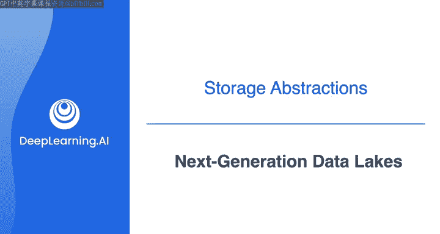
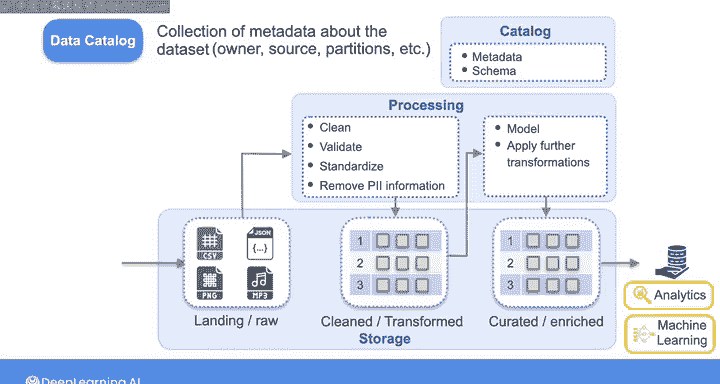
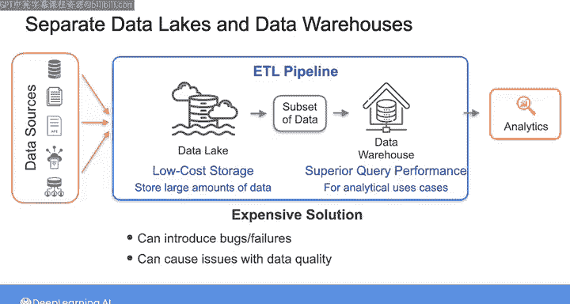

#  159：下一代数据湖 🏞️

在本节课中，我们将要学习如何改进传统数据湖的不足，探索数据分区、数据目录等关键技术，并了解它们如何共同作用，以更高效地管理和查询海量数据。

---

上一节我们介绍了传统数据湖1.0版本的一些局限性。本节中，我们来看看工程师们为更高效地管理和查找数据湖中的数据而开发的一些方法。

具体来说，我们将探讨数据分区、数据分区和数据目录。

为了更好管理存储在数据湖中的数据，你可以将其组织到不同的区域中。每个区域存放着经过不同程度处理的数据。虽然没有关于区域数量或命名的固定规则，但一个常见的设计模式是拥有三个区域。

以下是三个常见的数据区域：

1.  **着陆区或原始区**：当你将原始数据加载到数据湖时，它首先进入此区域。这样，你可以永久记录从源系统摄取的所有原始数据。
2.  **清洗区或转换区**：在你对原始数据应用转换（如清洗、验证、标准化，以及移除或屏蔽任何个人身份信息）后，转换后数据的副本将被写入此区域。
3.  **策展区或丰富区**：接下来，你通过施加业务逻辑并应用进一步的转换来对数据进行建模。然后，你将转换后的数据写入此区域。该区域的数据应符合组织的标准，并已准备好供消费使用。

你通常使用开放文件格式（如 **Parquet**、**Avro** 或 **ORC**）将数据存储在清洗区和策展区。这些格式使磁盘存储更高效。由于它们是开源的，也允许广泛的分析引擎和机器学习系统直接访问数据。

正如我所说，这些区域的数量和命名可以变化。你可能设计一个只有原始区或策展区的数据湖。或者，你可能需要执行更复杂的转换以符合严格的法规，在这种情况下，你可能需要四五个或更多的区域来处理中间存储阶段。

无论如何，将数据组织到不同的区域，允许你对每个区域应用适当的数据治理策略，并确保数据用户根据其特定需求，消费具有适当质量和准备度的数据。

---

现在，为了提高数据湖的查询性能，你通常希望从清洗区或策展区获取数据，并将其存储为分区数据。

数据分区是一种基于某些标准（如数据中记录的时间、日期或位置）将数据划分为更小、更易管理的部分的技术。这样，当你查询数据时，查询引擎只需要扫描包含与查询相关数据的那些分区，从而获得更快的查询性能。

---

最后，为了解决数据湖中数据可发现性的挑战，你可以创建一个数据目录。

数据目录是有关数据的元数据集合。这种集中式的元数据允许数据用户根据数据所有者、数据源、分区信息、列的业务定义等进行数据搜索。目录还记录和维护数据的模式，包括随时间的变化。因此，数据目录是一个关键特性，它为组织中的每个人提供了对数据结构和含义的共同理解。

---

通过这些增强的数据管理功能和搜索能力，你可以使用数据湖来存储、管理和处理大量不同类型的数据。

尽管人们努力使数据湖更有组织性和可搜索性，但历史上，组织仍然需要多个存储系统来满足其业务需求。他们希望利用数据湖的低成本存储来存储大量数据以用于机器学习应用，同时也希望利用数据仓库的卓越查询性能来支持分析用例。

因此，他们首先会在数据湖中摄取和处理数据，以便为所有数据建立一个单一的事实来源。然后，他们会将需要频繁查询的数据子集加载到数据仓库中，以支持低延迟的查询性能。

但这种解决方案成本高昂，因为你必须通过ETL管道持续地将数据从数据湖移动到存储成本更高的数据仓库中。并且ETL过程的每一步都可能引入错误或故障，导致数据质量、重复性和一致性问题。

为了解决这些挑战，一种名为“数据湖仓”的新存储架构被创建出来。这种新架构旨在将数据仓库和数据湖的优势结合到一个统一的架构中。

---

在我们深入了解这种新架构之前，我将引导你完成接下来的实验。在实验中，你将获得一些动手实践，对数据进行分区并创建数据目录，以提高从数据湖中检索数据的效率。

---

然后，在实验之后，请加入下一节视频，我们将更详细地探讨数据湖仓架构。

---

本节课中，我们一起学习了如何通过数据分区、数据目录等技术来优化数据湖的管理与查询性能，并了解了传统多系统架构的局限性，为引入下一代数据湖仓架构做好了铺垫。