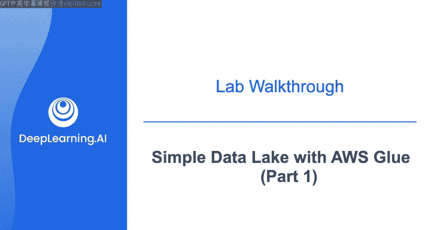
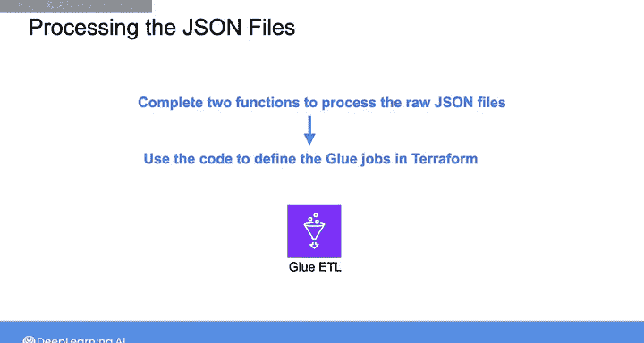
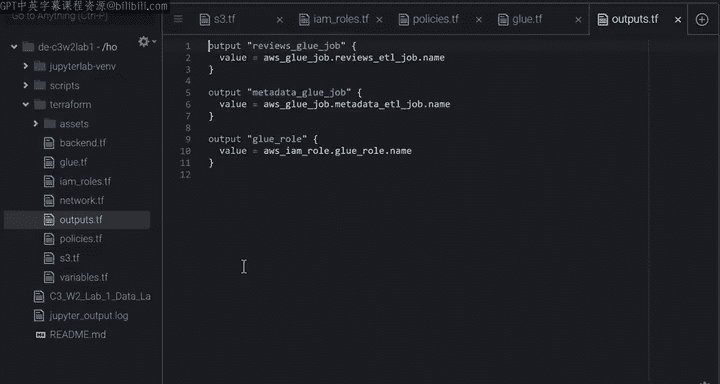

#  160：使用 AWS Glue 构建简单数据湖（第1部分）🏗️

## 概述

在本节课中，我们将学习如何使用 AWS Glue 构建一个简单的数据湖。我们将处理存储在 Amazon S3 中的原始 JSON 文件，将其转换为 Parquet 格式，并使用 AWS Glue 爬虫和 Amazon Athena 来查询处理后的数据。本部分将重点介绍数据转换函数的定义以及通过 Terraform 定义相关 AWS 资源。

## 实验简介与目标

在本次实验中，你将操作一个使用 Amazon S3 作为主要存储的简单数据湖。实验提供了一个包含原始 JSON 文件的 S3 存储桶，这些文件代表某些亚马逊产品的评论和元数据。

你的任务是处理和转换这些文件为 Parquet 格式，并将其存储回同一个存储桶。为了处理数据，你将使用 Terraform 定义 Glue ETL 作业，然后使用 Glue 爬虫将处理后的数据填充到数据目录中。这使你和其他利益相关者能够使用 Amazon Athena 通过 SQL 查询来查询 S3 存储桶中的处理数据。

实验末尾有一个可选部分，你将探索在 S3 中存储数据时，压缩和分区技术对存储容量和数据检索性能的影响。

在这一系列实验演练视频中，我将概述你将应用于 JSON 文件的转换步骤，讲解如何在 Terraform 中定义 Glue 作业，并展示如何使用 Glue 爬虫和 Amazon Athena 来查询你的数据湖。

## 第一部分：定义数据转换函数

在实验的第一部分，我们将完成两个用于处理原始 JSON 文件的函数。这些文件包含产品评论和元数据。

以下是每个数据文件的结构和处理目标。

### 评论数据处理

每个评论条目包含以下信息：
*   评论者ID和姓名
*   产品ID
*   评论文本及其摘要
*   产品评分
*   评论时间
*   一个“helpful”字段，包含两个数字：认为该评论有帮助的用户数量，以及对该评论有用性进行评分的用户总数。

你将把这个评论数据导入到一个表格数据框架中，并进行如下处理：
1.  从时间戳中提取`年份`和`月份`。
2.  将`helpful`列拆分为两列。

之后，你将使用`年份`和`月份`列在 S3 存储桶中对数据进行分区。

### 元数据处理

第二个 JSON 文件中的元数据项示例如下。每个项目包含：
*   产品ID
*   产品相关信息
*   相关产品列表
*   销售类别和销售排名等。

你同样需要将这些数据导入表格形式，并保留相关列。具体处理步骤如下：
1.  展开`sales rank`列，将其拆分为两列：`sales_category`和`sales_rank`。
2.  删除数值列中包含空值的记录。
3.  将其他列中的空值替换为空字符串。

## 使用 Terraform 定义 AWS 资源

定义完上述两个函数后，你将使用这些代码，通过 Terraform 为转换任务定义 Glue 作业。

在 `terraform` 文件夹下，你可以找到定义实验所需所有资源的 Terraform 文件，例如 S3、Glue、允许 Glue 作业与 S3 存储桶交互的 IAM 角色和策略，以及输入变量和输出值。虽然你只会直接与 `glue.tf` 文件交互，但让我们浏览一下其他一些文件，以便全面了解实验中使用的资源。

### S3 存储桶配置

在 `s3.tf` 文件中，提供的“数据湖”存储桶被定义为一个数据块。当你运行 Terraform 时，将创建另一个存储桶，用于存放 Glue 作业的转换脚本。

这里的第三个资源块确保你创建的脚本存储桶不允许公共访问。虽然你可以手动上传脚本到存储桶，但也可以通过定义 `aws_s3_object` 资源类型，使用 Terraform 将脚本上传到存储桶。

在这些资源块中，你可以找到目标存储桶的名称、脚本加载到 S3 存储桶时将分配的键（Key），以及脚本的本地路径（位于 `assets` 文件夹下）。

### IAM 角色与策略

为了允许 Glue 作业访问 S3 数据湖，你需要创建一个 Glue 作业可以担任的角色。然后，你将向该角色附加一个权限策略，详细说明对 S3 存储桶允许的操作。

在 `iam_roles.tf` 文件中，你会看到定义 IAM 角色的 `aws_iam_role` 块，以及概述附加到该角色的权限策略的 `aws_iam_role_policy` 块。角色和权限策略的详细信息在单独的 `policies.tf` 文件中定义。

`policies.tf` 文件中的第一个块生成一个“信任关系”策略，你可以在其中列出可以代表你调用 AWS 服务的受信任实体（在本例中是 AWS Glue）。第二个块为被担任的角色生成权限策略，你可以在其中列出资源以及允许对这些资源执行的操作。可以看到，列表包括了 S3，并且允许对 S3 的所有操作。

### Glue 作业定义

现在让我们查看 `glue.tf` 文件。这里你可以看到两个类型为 `aws_glue_job` 的资源块。每个块定义一个你需要运行的 Glue 作业，分别用于处理评论数据和元数据。

对于每个 Glue 作业，你需要定义：
*   作业名称
*   附加到作业的角色
*   指定转换脚本位置的命令块

`default_arguments` 块包含转换脚本期望的参数，以及 Glue 自身的参数。

以下是转换脚本期望的参数：
*   `--S3_bucket`
*   `--source_path`
*   `--target_path`
*   `--compression`
*   `--partition_columns`

这些参数定义了提取原始数据的源路径、存储处理数据的目标路径、用于存储处理数据的压缩算法，以及用于数据分区的列名。

其余参数都是可选的，由 AWS Glue 用于设置你的作业。有关这些参数的更多信息，请随时查阅 AWS Glue 文档。

在 `default_arguments` 块之后，你会看到 `timeout` 属性，你可以在此指定 Glue 作业在被终止之前允许运行的分钟数。这有助于防止 Glue 作业因某些代码错误或数据异常而运行时间超出预期。

对于此块中的最后一个参数，AWS Glue 在幕后使用一个名为 Spark 的分布式框架，因此你可以指定 Spark 将用于运行 Glue 作业的工作节点的数量和类型。

### 输出定义

最后，在 `outputs.tf` 文件中，你可以看到运行 Terraform 后可以使用的输出值列表。这些输出包括 Glue 作业的名称和 IAM 角色。稍后，你将使用这个 IAM 角色来创建 Glue 爬虫。

## 总结

在本节课中，我们一起学习了实验的第一部分内容。我们明确了实验目标：构建一个基于 S3 的数据湖，处理 JSON 数据为 Parquet 格式。我们详细定义了两个核心的数据转换函数，分别用于处理产品评论和元数据。我们还系统性地了解了如何通过 Terraform 代码定义所需的 AWS 资源，包括 S3 存储桶、IAM 角色策略以及最重要的 Glue 作业配置。

下一节视频中，我们将具体讲解如何在 Terraform 中定义你的 Glue 作业。我们下节课再见。