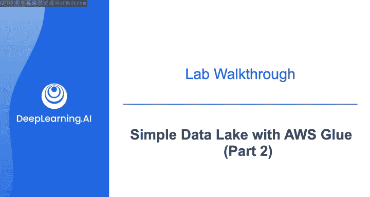
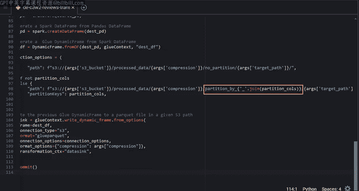
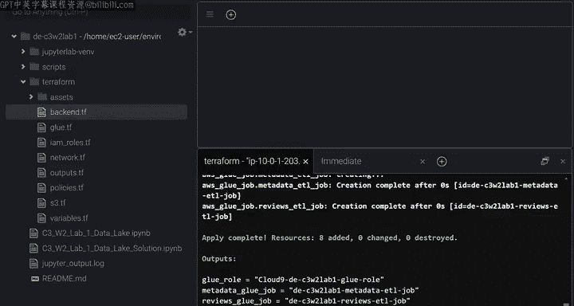
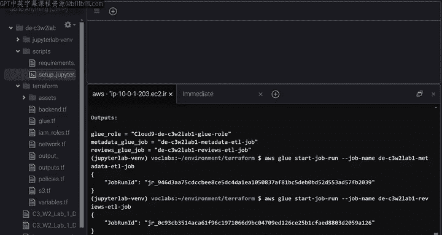
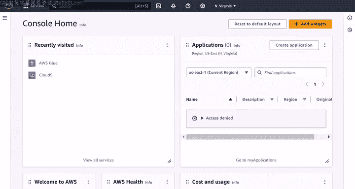
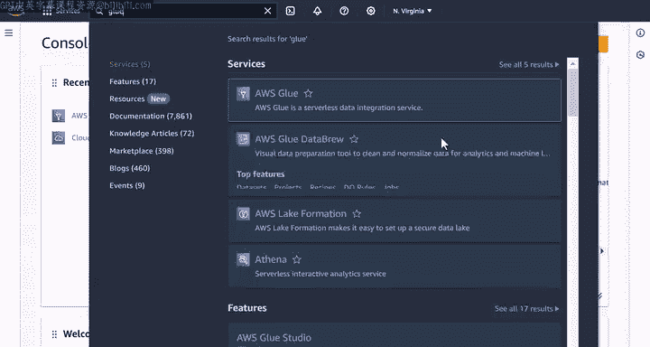
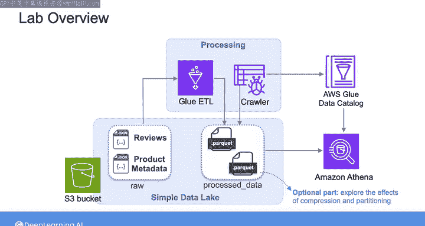

#  161：实验演练 - 使用AWS Glue构建简单数据湖（第2部分） 🧪



在本节课中，我们将学习如何完成AWS Glue数据转换脚本，运行Glue作业，并最终通过AWS Glue数据目录和Athena查询处理后的数据。我们将详细解析提供的转换脚本，并了解整个数据处理流程。

---

## 概述

上一节我们介绍了对JSON文件应用的基本转换类型。本节中，我们将详细查看在Terraform资产文件夹下提供的两个转换脚本，并学习如何运行它们以构建数据湖。

## 转换脚本解析

当运行Terraform时，脚本将从本地目录复制到脚本存储桶。我们将一起查看评论转换脚本，元数据转换脚本的结构与此非常相似。

以下是提取在Glue作业中定义的参数以便在脚本中使用的方法：

```python
# 示例：从Glue作业参数中提取值
args = getResolvedOptions(sys.argv, ['JOB_NAME', 'input_path', 'output_path'])
```

如前所述，AWS Glue ETL在底层使用Spark。我们将在下一课程中详细学习Spark，这里仅概述此脚本与Spark框架交互的过程。

要使用Spark框架，首先需要创建一个名为`GlueContext`的对象。该对象允许你初始化Glue作业、连接到S3存储桶源、将数据从源提取到数据帧中，并最终将处理后的数据存储回S3存储桶。完成后，需要调用`commit`方法来结束Glue作业。

在实验中，你将完成这个转换函数来处理评论数据集。该函数期望一个Pandas数据帧作为输入，并返回另一个包含处理后数据的Pandas数据帧。

## 数据提取与转换流程

`GlueContext`的`create_dynamic_frame`方法允许你连接到S3存储桶以提取原始数据。以下是存储桶内CSV文件的路径示例。此方法将读取CSV文件并将其导入到Glue数据帧中。

你可以直接使用这个Glue数据帧来转换数据。但为了本次练习，我们将其转换为Pandas数据帧，以便在其上调用转换函数。在下一课程中，你将有机会与Spark和Glue数据帧进行交互。

包含处理后数据的返回Pandas数据帧随后被转换回Glue数据帧。这是因为下一个方法`write_dynamic_frame`（用于将处理后的数据存储到目标位置）需要一个Glue数据帧作为输入。

## 数据存储配置

在`write_dynamic_frame`方法中，你需要指示连接到S3存储桶，指定希望数据以Parquet格式存储，提供处理后数据的路径，并指定要使用的压缩算法。

查看处理后数据的路径，其键名将以`processed_data`开头，后跟压缩算法的名称，然后是分区状态。分区功能被启用。你还需要将分区列作为脚本参数传递。

这种包含压缩算法名称和分区状态的键名格式，在实验的可选部分会非常有用，届时你将尝试这些数据格式化选项。

## 运行实验步骤

完成两个转换脚本中的转换函数后，你需要从终端运行Terraform来创建资源。脚本存储桶应该被创建成功。




你将获得Glue作业和Glue角色的名称。






然后，从终端使用这些名称来运行Glue作业。






## 监控作业与验证结果

你可以从控制台检查每个作业的状态，当然也可以在终端中完成此操作。在搜索栏中，我将输入“glue”然后打开此服务。


在左侧，点击“ETL作业”。这里列出了两个Glue作业。点击第一个作业，然后点击“运行”选项卡。你将看到运行此Glue作业的所有尝试的状态。一段时间后，你会看到两个作业都已成功运行。

让我们查看S3存储桶中的处理数据。它以`processed_data`开头。然后是`snappy`，这是所使用的压缩算法的名称。接着你会看到数据存储时使用了分区。在`toys_reviews`目录内，可以看到数据按年份然后月份进行分区，最终数据以Parquet格式存储。

## 使用Glue数据目录与Athena查询

现在，假设你的最终用户希望从S3存储桶查询处理后的数据。你需要首先使用AWS Glue数据目录创建一个包含处理后数据元数据的表。

AWS Glue数据目录是一个中央存储库，用于存储跨各种数据源的所有数据资产的元数据。在Glue数据目录内，你可以创建元数据库，其中可以包含许多表，每个表存储基本的元数据，如列名、数据类型和分区键。

要填充你的目录数据库，可以使用AWS Glue爬虫程序自动从数据存储中发现和提取元数据，然后相应地更新Glue数据目录。

数据目录中的表设置完成后，你的最终用户就可以使用Amazon Athena通过常规SQL查询来查询数据。

## 实验中的具体操作

在实验中，为了为处理后的数据创建元数据库并使用Athena查询数据，你将使用AWS Wrangler。AWS Wrangler是建立在Pandas和Boto3等开源库之上的AWS SDK。它扩展了Pandas的功能以支持AWS。

以下是具体步骤：

首先，你将在Glue目录中创建一个数据库，用于包含处理后数据的元数据。

```python
# 使用Boto3创建Glue客户端对象
import boto3
glue_client = boto3.client('glue')
```

然后，你可以在此Glue客户端上调用`create_crawler`方法来创建Glue爬虫程序。你需要指定爬虫程序的名称，将其附加到通过Terraform创建的角色，指定Glue目录的数据库名称以及处理后数据的路径。

之后，你可以在Glue客户端上调用`start_crawler`方法来启动Glue爬虫程序。可能需要等待几分钟才能创建表。

表创建后，你将使用AWS Wrangler通过Athena查询数据。你将使用`read_sql_query`方法，该方法期望将SQL查询作为字符串和目录数据库的名称。然后它执行查询并将结果作为Pandas数据帧返回。

## 可选实验部分

至此，你已经准备好尝试这个实验。但如前所述，在实验的最后有一个可选部分，你将在其中探索在S3中存储数据时压缩和分区的效果。如果你有兴趣尝试这个可选部分，可以观看下一个视频，我将引导你完成那些可选实验，或者你也可以直接开始实验。



---

## 总结


本节课中，我们一起学习了如何完成并理解AWS Glue数据转换脚本，运行Glue ETL作业处理数据，以及如何利用AWS Glue数据目录和Amazon Athena使得处理后的数据可供查询。我们涵盖了从脚本编写、作业执行到元数据管理和SQL查询的完整数据湖构建流程。