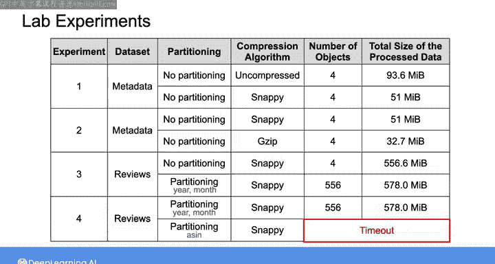
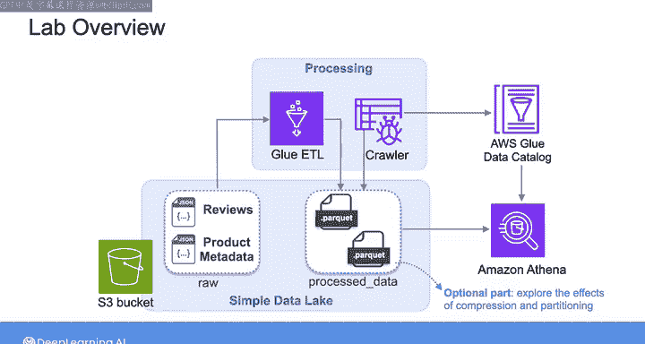
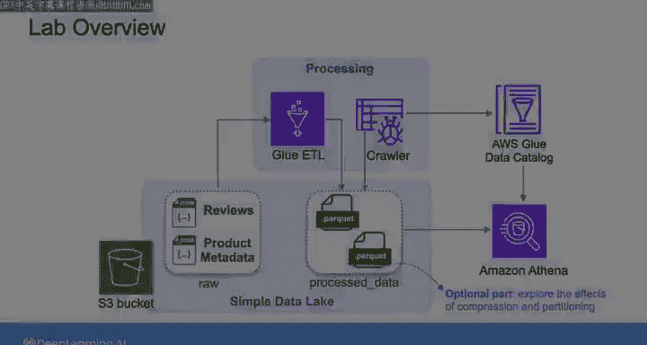

#  162：使用 AWS Glue 构建简单数据湖（第 3 部分，可选）🏗️


在本节课中，我们将通过四个实验，探索 AWS Glue 作业中不同配置（特别是压缩与分区）对数据存储和处理性能的影响。我们将分析压缩算法的选择以及分区键的设计如何优化存储成本与查询效率。

---

## 实验概述

在实验的第一部分，我们创建了两个 Glue 作业来处理评论和元数据数据集。在作业中，我们选择了 **Snappy** 作为压缩算法，并为每个数据集指定了分区列。本可选部分将进行四项实验，以探索不同的 Glue 作业配置，帮助我们理解压缩和分区对存储的影响。

---

## 实验一：探索压缩效果

首先，我们将通过更改 Glue 作业中的压缩参数来探索压缩效果，此实验不进行数据分区。

以下是操作步骤：
1.  首先处理元数据，并为压缩参数选择 **未压缩** 选项。
2.  然后再次处理数据，但这次为压缩算法选择 **Snappy**。

完成两次实验后，您可以使用以下命令（带 `summarize` 选项）来显示给定 S3 路径下的对象数量和总大小信息：

```bash
# 示例命令，用于汇总S3路径信息
aws s3 ls --summarize --human-readable s3://your-bucket/path/
```

您将观察到，启用压缩后，对象占用的存储空间更少。尽管没有指定分区键，但仍会生成多个 Parquet 文件，这是因为 AWS Glue 底层处理框架会自动尝试对数据进行分区。

---

## 实验二：比较压缩算法

接下来，我们将比较两种压缩算法：第一个实验中已使用的 **Snappy** 和本实验中将使用的 **Gzip**。

您会注意到，使用 **Gzip** 压缩时，总文件大小比 **Snappy** 更小。Gzip 和 Snappy 都是流行的压缩算法，**Gzip 通常能实现更高的压缩率**，而 **Snappy 的处理速度通常比 Gzip 更快**。

---

## 实验三：探索分区效果

在第三个实验中，我们将通过比较两种数据处理结果来探索分区的影响：
1.  使用 Snappy 压缩但**未分区**的处理后的评论数据。
2.  来自实验第一部分的数据，其中我们通过指定分区键，按**年份和月份**对评论进行了分区。

您可以观察到，进行分区后，生成了 **556 个 Parquet 文件**，每个文件对应特定的年份和月份组合。而未分区时，数据被自动分区为 **4 个 Parquet 文件**。

当对数据进行分区时，需要选择一个合适的分区键，将数据组织成与您的查询模式相匹配的有意义的文件。这是因为当您在 `WHERE` 子句中指定分区条件时，Athena 只会扫描该分区的数据，从而限制每次查询扫描的数据量，**提升性能并降低成本**。

---

## 实验四：不当分区键的影响

一个糟糕的分区键会将数据分割成过多的小文件，这可能增加存储成本并使数据处理速度变慢。

例如，在最后一个实验中，我们选择 **ASIN 列**（即评论标识符）作为分区键。使用 ASIN 列对数据进行分区将耗时超过 15 分钟，并导致作业超时。

这个实验表明，选择不当的分区键（如高基数列）会导致极低效的数据布局。



---

## 课程总结

本节课中，我们一起学习了 AWS Glue 中压缩与分区配置的实践影响。我们了解到：
*   **压缩**可以节省存储空间，不同算法在压缩率和速度上各有权衡。
*   **分区**能大幅提升查询效率，但分区键的选择至关重要，应贴合查询模式并避免产生过多小文件。





感谢您坚持完成这些实验演练。现在轮到您动手尝试了。当您进行到末尾的可选部分时，可以自由选择完成或跳过这些实验。我们将在下一课再见，探讨数据湖仓架构。