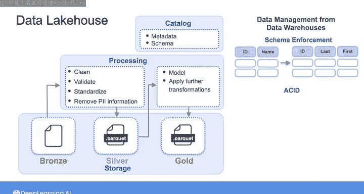

#  163：数据湖仓架构 🏔️🏠

在本节课中，我们将要学习数据湖仓架构。这是一种结合了数据湖和数据仓库优势的新型数据架构，旨在为数据分析、机器学习和商业智能提供一个统一、高性能且易于管理的平台。

---

## 什么是数据湖仓？🤔

你可以将数据湖仓架构视为一个内置了额外功能的数据湖，这些功能旨在创造一种类似于数据仓库的使用体验。它的目标是将数据湖灵活、低成本的存储优势，与数据仓库卓越的查询性能和强大的数据管理能力结合起来。这使得它能够支持分析和报告应用，以及机器学习和大数据处理等用例。

上一节我们介绍了数据湖仓的基本概念，本节中我们来看看它的核心架构组件和特性。

---

## 核心架构与存储层 🏗️

在其核心，数据湖仓与数据湖非常相似。它使用一个构建在对象存储之上的单一存储层，来存储任何类型的大量数据。

你可以像在前一个视频中看到的那样，将存储层组织成不同的区域，以促进数据治理并确保更好的数据质量。

以下是数据湖仓存储层的一个常见组织方式，被称为“奖牌架构”：

*   **青铜区**：存储原始数据。
*   **白银区**：存储经过清洗的数据。
*   **黄金区**：存储经过建模和丰富处理的、可直接用于分析的精选数据。

经过转换的数据存储在白银区和黄金区，并以开放的文件格式（通常是 **Parquet**）写入，以实现更高效的存储，并允许各种分析和查询引擎直接访问数据。

---

## 数据管理特性 📊

除了数据湖的特性，湖仓还包含了数据仓库中常见的数据管理功能。

它们在存储级别强制执行**模式**，以确保你加载的数据符合指定的格式和质量标准，并且它们也支持**模式演进**。

数据湖仓通常遵循 **ACID** 原则，这意味着事务具有原子性、一致性、隔离性和持久性。这使得你的数据用户可以并发地读取、插入、更新和删除数据，同时确保数据对于分析过程是可靠的。

---

## 治理、安全与版本控制 🔒

湖仓还具有内置的数据治理和安全功能，例如强大的访问控制、数据编目和数据血缘跟踪。

你还可以使用连接器 **API** 连接到数据湖仓，然后使用 **SQL** 对你的数据集执行增量更新和删除操作。

这些是实现数据法规和隐私规则合规性的关键功能。并且，由于湖仓保留了文件的旧版本和元数据，你也可以根据需要回滚或访问任何版本的历史数据。

---

## 总结与展望 📈

通过整合数据仓库和数据湖的最佳能力，数据湖仓提供了一个统一的架构，支持从 **SQL** 应用到商业报告再到机器学习的各种工作负载。

自数据湖仓概念诞生以来，各种云和软件供应商以及开源组织一直在创建新产品，以帮助组织向数据湖仓架构迁移。

在本节课中，我们一起学习了数据湖仓架构的定义、核心组件（如奖牌架构）、关键特性（如ACID事务、模式管理）以及其带来的统一优势。下一节视频，我们将更深入地探讨数据湖仓实现的一些细节。