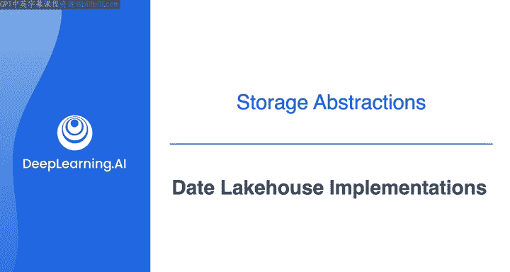
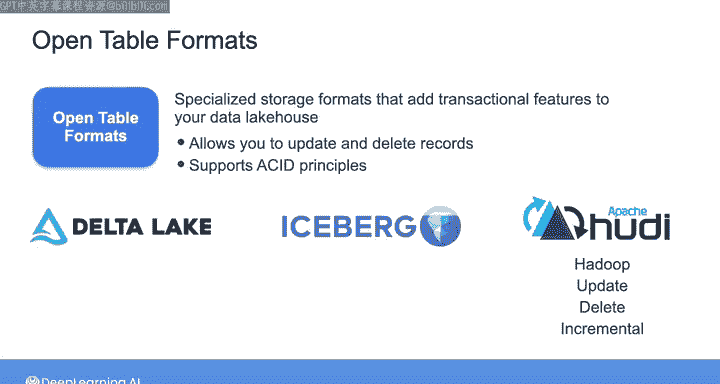
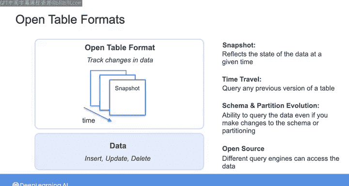
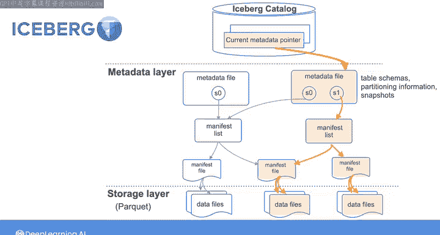
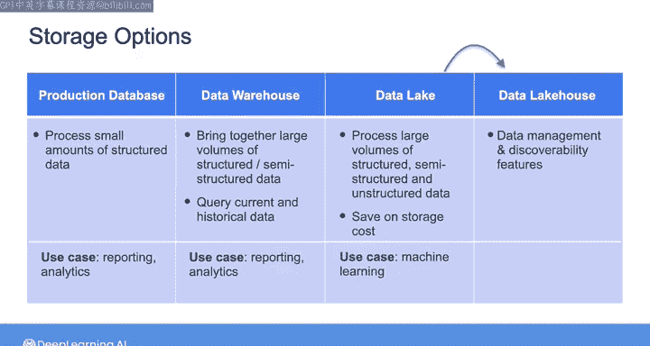

#  164：数据湖仓实施 🏗️

在本节课中，我们将学习数据湖仓（Lakehouse）的概念及其实现方式，特别是通过开放表格式（Open Table Formats）来融合数据仓库和数据湖的优势。

---

自数据湖仓概念诞生以来，我们见证了云数据仓库与数据湖之间发生的有趣融合。云数据仓库提供商已开始集成通常与数据湖相关的功能。与此同时，数据湖技术也开始拥抱数据仓库的典型特性，例如强制执行和管理模式以及SQL功能。在本视频中，我们将探讨如何使用开放表格式实现数据湖仓。在下一个视频中，Morgan将引导您了解如何在AWS上实现湖仓。

## 开放表格式简介

上一节我们介绍了数据湖仓的融合趋势，本节中我们来看看实现这一目标的关键技术：开放表格式。

在湖仓实施方面，已经开发出多种开放表格式来支持更具事务性的数据湖理念。这些开放表格式包括：
*   Databricks Delta Lake
*   Apache Iceberg
*   Apache Hudi（代表Hadoop Upserts Deletes and Incrementals）

这些开放表格式是专门的存储格式，为您的数据湖仓添加了事务性功能。这使得您可以在构建于对象存储数据湖之上的存储层中，轻松更新和删除单个记录，同时支持传统数据仓库中的ACID原则。

## 开放表格式的工作原理

了解了开放表格式是什么之后，我们来看看它们具体是如何工作的。

简而言之，它们在您的存储数据之上提供了一个逻辑抽象层。当您对数据表执行操作（例如插入、更新或删除记录）时，开放表格式会跟踪这些更改，并将其存储为一系列反映数据在特定时间点状态的快照。

以下是这些快照支持的核心功能：
*   **时间旅行**：您可以通过指定时间戳来查询表的任何先前版本。
*   **回滚**：可以将表回滚到先前的版本，以恢复对表所做的任何错误更改。
*   **模式和分区演进**：即使您进行了模式更改（如添加或删除列）或更改了数据集的划分方式，您仍然能够查询数据。

由于开放表格式是开源的，它们还支持不同的查询引擎访问存储在数据湖仓中的数据。因此，您可以使用任何适合您用例的处理工具，而无需复制数据并将其重组为另一种格式。

## 主流开放表格式对比

在您作为数据工程师的工作中，可能会遇到Databricks Delta Lake、Apache Iceberg和Apache Hudi。这些技术都提供模式演进和时间旅行等相同功能，但它们通常在底层实现细节上有所不同。

例如，以下是Iceberg的工作原理：
1.  与数据湖类似，有一个**数据目录**和一个**数据存储层**（包含以Parquet格式写入的文件以实现高效存储）。
2.  但在目录和存储层之间，存在一个**元数据层**。
3.  每当您更新或创建数据文件时，Iceberg会创建一个新的清单文件来跟踪这些数据文件以及每个文件元数据的附加细节。
4.  然后创建一个新的清单列表，用于跟踪有关清单文件位置、每个清单文件所属的快照以及分区信息的信息。
5.  最后，创建一个以JSON格式编写的新元数据文件，其中包含指向新清单列表的新快照。这些文件包含诸如当前表模式、分区信息、快照以及哪个快照是当前快照等信息。

在Iceberg目录中，有一个指针指向存储在湖仓中的每个表，该指针引用表的最新元数据文件。因此，每当创建新的元数据文件时，该指针都会更新。

当您运行查询时：
1.  目录中的指针根据正在查询的表告诉查询引擎哪个元数据文件是当前的。
2.  查询引擎然后从元数据文件中检索当前快照的清单列表。
3.  接着检索相关的清单文件。
4.  最后检索相关的数据文件。

这个元数据层帮助Iceberg确定需要读取哪些数据文件，并忽略与查询无关的文件，从而显著加快查询性能。

## 如何选择存储架构

了解了具体技术后，我们来探讨一个实际问题：如何在不同的存储架构间做选择。

在数据仓库、数据湖或数据湖仓之间进行选择，实际上是为支持组织的需求而选择正确的存储抽象。

以下是选择时需要考虑的因素：
*   **早期公司/简单需求**：如果您是一家处于早期阶段的公司，只需要处理少量结构化数据进行分析和报告，您或许可以直接将BI工具连接到生产数据库的只读副本。
*   **数据量增长/多源整合**：随着数据量和数据源的增长，您会希望使用云数据仓库来整合来自多个源的结构化和半结构化数据，并允许您的数据用户查询当前和历史数据以进行分析和报告，而不会给生产数据库增加太多额外负载。
*   **海量数据/非结构化数据**：如果您的组织需要处理海量数据，尤其是非结构化数据（例如用于机器学习应用），那么您可能需要考虑实施数据湖架构以节省存储成本。在这种情况下，您可以选择通过添加数据管理和可发现性功能，将存储架构演进为数据湖仓，以同时支持机器学习应用和低延迟分析查询。

## 总结与展望

正如您所看到的，云数据仓库和数据湖的技术架构已经开始融合。我认为这种融合趋势只会继续下去。数据湖和数据仓库仍将作为不同的架构存在，但在实践中，它们的功能将融合在一起。

因此，在未来，您将无需在仓库或湖之间做出选择，而是可以根据您的具体情况和数据用例，选择融合的数据平台。

接下来，Morgan将引导您了解如何使用AWS Lake Formation在AWS上实现数据湖仓。之后，我将带您预览即将进行的实验，您将有机会创建自己的数据湖仓架构。

---

**本节课中我们一起学习了**：数据湖仓作为融合数据仓库和数据湖优势的架构，其核心实现技术是开放表格式（如Delta Lake、Iceberg、Hudi）。这些格式通过在数据存储之上添加事务性元数据层，实现了ACID事务、时间旅行、模式演进等功能，从而支持高效的分析查询和灵活的数据管理。最后，我们讨论了如何根据组织的数据规模、类型和用例，在数据仓库、数据湖和数据湖仓之间做出合适的选择。