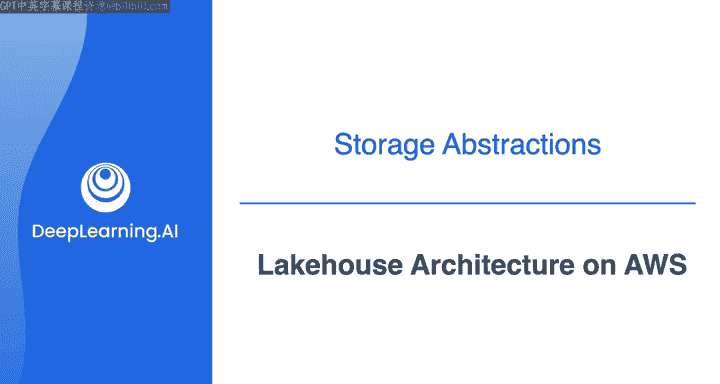
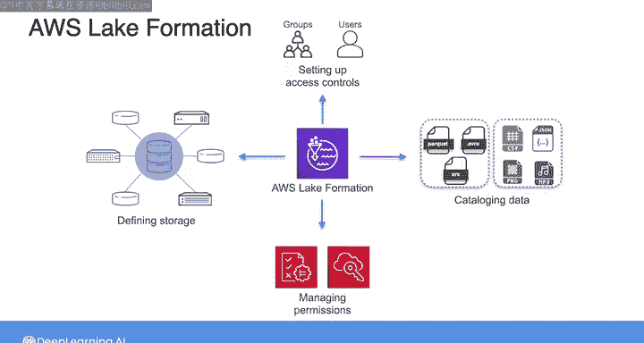
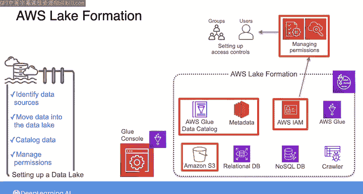
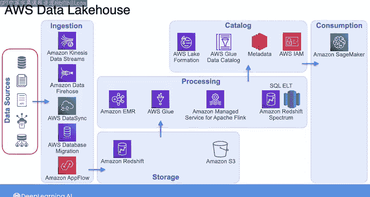

#  165：AWS上的湖仓架构 🏗️

在本节课中，我们将学习如何在AWS上构建一个数据湖仓架构。我们将了解AWS Lake Formation如何简化数据湖的构建和管理，并探讨一个集成了多种AWS服务的典型湖仓架构。

## 概述

你已经从Joe那里学到了数据湖、数据仓库和数据湖仓之间的区别，并且完成了使用AWS Glue和Amazon S3建立简单数据湖的实验。许多组织通常从这样一个简单的数据湖开始，然后逐步演进到使用更成熟的解决方案，如数据湖仓。现在，我们将讨论如何使用AWS服务（包括AWS Lake Formation和Amazon Redshift Spectrum）来架构一个数据湖仓。

## AWS Lake Formation 简介

AWS Lake Formation的核心设计目标是简化构建和管理数据湖的过程。传统上，设置数据湖或湖仓涉及大量手动步骤：定义存储、设置访问控制、编录数据以及管理数据资产的权限。这个过程可能复杂且耗时。Lake Formation自动化了其中一些任务，使其变得简单，便于你快速开始。

以下是它的工作原理：
*   首先，识别你现有的数据源，例如Amazon S3或关系型及NoSQL数据库。
*   然后，使用Lake Formation将这些数据移入你的数据湖。
*   之后，使用Lake Formation爬取数据、进行编录，并使其准备好进行分析。
*   最后，你可以授予用户安全的自助服务访问权限，让他们使用自己偏好的分析工具访问这些数据。

这是一种简化的方式，确保组织中的每个人都能轻松找到并使用他们需要的数据。

你可能发现其中一些任务与你之前使用AWS Glue完成的任务类似。这是因为Lake Formation实际上是构建在AWS Glue之上的。它利用了你已经熟悉的Glue功能，如Glue作业、工作流和爬取程序来执行这些任务。当你使用Lake Formation时，你可以创建工作流等，也可以直接在Glue中管理这些功能。

## 湖仓架构详解

在典型的数仓或湖仓架构中，有许多AWS服务相互交互，同时终端用户访问不同的数据集。随之而来的是管理权限的大量开销。Lake Formation帮助自动化数据湖创建的一部分工作，就是管理复杂的细粒度权限。Lake Formation还对存储在S3中的数据以及数据目录中的元数据提供细粒度访问控制。因此，你可以集中管理权限和IAM策略，以简化在内部和外部为分析和机器学习应用程序治理和共享数据的过程。

现在你已经对Lake Formation有了高层次的理解，让我们回顾一个使用AWS服务架构的数据湖仓示例图。随着课程的深入，我们将更深入地探讨这个架构的各个方面。

以下是该架构的各个层次：

### 数据源层

从数据工程师的角度来看，数据源通常是你无法控制的。这些包括数据库、文件共享、SaaS应用程序等。

### 数据摄取层

摄取机制将数据摄入到数据湖仓中。正如你在之前的课程中学到的，有多种服务可用于数据摄取，包括：
*   Amazon Kinesis Data Streams
*   Amazon Data Firehose
*   AWS DataSync
*   AWS Data Migration Service
*   Amazon AppFlow

此外，AWS Lake Formation可以通过AWS Glue管理一些数据摄取任务。

### 存储层

所有摄入的数据都需要存储在某个地方。因此，在摄取层旁边是存储层，它使用Amazon Redshift和Amazon S3。

### 处理层

存储层之上是处理层。在这里，你将从湖仓存储层读取数据，并为下游消费者进行转换。你会使用以下服务：
*   Amazon EMR
*   AWS Glue
*   Amazon Managed Service for Apache Flink
*   或者在Amazon Redshift上进行SQL数据处理。

### 目录层

目录层使用Lake Formation提供一个中央目录，用于存储和管理存储层中所有数据集的元数据。在这一层，你还可以使用Lake Formation管理权限并提供细粒度的访问控制。

### 消费层

湖仓架构最右边的层是消费层。它提供了你可能用来消费数据的AWS服务，包括但不限于：
*   **Amazon SageMaker**：用于机器学习用例。
*   **Amazon QuickSight**：用于商业智能和数据可视化。
*   **Amazon Athena** 和 **Amazon Redshift Spectrum**：用于查询湖仓中的数据。

我们将在下一个视频中花更多时间探索Amazon Redshift Spectrum。

## 总结

本节课我们一起学习了AWS上的湖仓架构。我们了解了AWS Lake Formation如何作为核心服务，通过自动化任务和集中管理权限来简化数据湖的构建。我们还详细剖析了一个集成了数据源、摄取、存储、处理、目录和消费各层的完整湖仓架构示例。由于你已经学习了很多关于数据源和摄取用例的知识，我们现在不再重点讨论这些。我邀请你加入下一个视频，我们将更深入地探讨这个数据湖仓架构的存储、处理、目录和消费层。