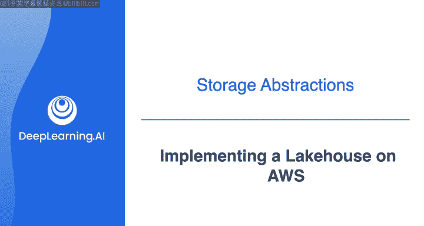

#  166：在AWS上实施湖仓架构

在本节课中，我们将学习如何在AWS上构建一个数据湖仓架构。我们将重点探讨其核心的存储层、目录层和消费层，并了解如何利用AWS服务（如S3、Redshift、Lake Formation、Glue、Athena和Redshift Spectrum）将这些层有效地整合在一起。

## 架构概述

在上一节视频中，我们宏观地概述了如何将各种AWS服务组合成数据湖仓架构中的一系列层级。

作为回顾，该架构的概览如下：左侧是**源和摄取层**，中间是**存储、处理和目录层**，右侧则是**消费层**。接下来，我们将从存储层和目录层开始深入探讨。

## 存储层 🗄️

上一节我们介绍了架构的整体分层，本节中我们来看看具体的存储层实现。

在数据湖和数据湖仓中，使用S3进行存储非常普遍。对于湖仓，通常同时使用S3和Redshift作为存储层。
*   S3通常为**结构化、半结构化和非结构化数据**提供存储。
*   Amazon Redshift则存储经过高度整理、符合预定义模式的**结构化或半结构化可信数据**。

这种双重存储方法结合了S3在处理大规模结构化和非结构化数据时的**成本效益和可扩展性**，同时利用Redshift对更结构化数据进行**高性能分析**。

创建数据湖仓的部分原因，是希望能够**同时分析存储在S3和Redshift中的数据**。当然，你可以编写定期将数据从S3移动到Redshift的ETL作业，但长期来看，为此创建数据管道可能成本高昂，并导致数据冗余。此外，每次移动和转换数据时，都可能引入错误或问题，从而影响数据质量和可用性。

因此，如果能以原生方式将数据湖与数据仓库集成起来，将会非常理想。这正是**Amazon Redshift Spectrum**的用武之地，它充当了S3和Redshift之间用于查询数据的集成桥梁。它在架构图中属于存储层，但也是AWS上数据湖仓消费层的关键部分。

Redshift Spectrum允许你**直接查询存储在S3中的数据，而无需先将其加载到Redshift中**。这非常棒，因为它消除了在数据湖和数据仓库之间移动数据的复杂ETL管道的需求。通过集成这两个数据存储系统，它帮助你实现了数据湖仓的构想。

所以，使用像Redshift Spectrum这样的工具来同时查询数据湖存储和数据仓库存储中的数据，无疑是比通过ETL流程将数据移出S3再导入Redshift进行查询更可取的方法。关于消费层的更多细节，我们稍后会详细讨论。

## 目录层 📇

接下来，我们将讨论存储层之上的目录层。

中央数据目录用于在单一位置为湖仓中的所有数据集提供元数据，并使其易于搜索。这对于湖仓中数据的自助服务发现**极其重要**。你之前学习过“数据沼泽”的概念，你肯定不希望数据使用者在浑浊的水中艰难跋涉。相反，你希望能够清晰地了解湖仓中的数据。

在本案例中，我们使用**Lake Formation**，它在后台使用**Glue**来创建数据目录，以存储湖仓中托管的所有数据集的元数据。Lake Formation协调Glue爬虫程序来识别数据，然后将元数据（包括模式信息、分区信息和数据位置）持久存储在Glue数据目录中。

需要记住的重要一点是，存储层中的数据集通常会随着时间推移而**模式不断演变，数据分区不断增加**。因此，填充元数据目录不是一劳永逸的工作，它必须得到维护和更新。

为了自动保持目录的最新状态，你可以配置AWS Glue**定期爬取**湖仓存储层，以发现新的或更新的数据集并提取其元数据，然后将其存储在目录的一个表中。

虽然Lake Formation和Glue非常适合管理和编目你的数据，但**高效处理不断演变的模式和大数据集**正是Apache Iceberg表可能发挥作用的地方。你在之前的视频中学习过Iceberg表，它们如何让你更容易地更改数据模式，而不会破坏现有流程或底层数据。这部分是通过**模式和数据的版本控制**实现的，它允许用户跟踪数据随时间的变化。借助版本控制，你可以使用“时间旅行”功能来访问和查询数据的历史版本，并分析数据在更新和删除之间的变化。

Lake Formation也支持Iceberg表，你可以在AWS Glue数据目录中创建使用Parquet格式的Iceberg表。

## 消费层 🍽️

现在，让我们进入消费层，我想花更多时间介绍Redshift Spectrum和Amazon Athena。你将在接下来的实验中有机会使用Athena。虽然你不会使用Redshift Spectrum，但它在AWS的数据湖仓中很常用，因此你应该了解其基础知识。

Redshift Spectrum使Redshift能够为数据消费者提供一个统一的SQL接口，该接口可以接受和处理SQL语句，其中同一个查询可以引用和组合存储在数据湖（S3）以及数据仓库（Redshift）中的数据。这意味着，通过使用Redshift Spectrum，你可以**减少数据延迟**。换句话说，通过就地查询数据，你可以更快地获得洞察，而无需等待数据移动或转换。

Redshift Spectrum查询使用大规模并行处理来针对大型数据集运行查询，并且大部分处理发生在Redshift Spectrum层。这意味着在你定义了Redshift Spectrum表之后，大部分数据仍保留在Amazon S3中。你可以像查询任何其他Amazon Redshift表一样查询和连接这些表。

多个Redshift集群也可以同时查询Amazon S3中的同一份数据，而无需为每个集群复制数据。

使用Redshift Spectrum，你可以做很多事情，例如：
*   将大量历史数据保留在数据湖中，并将几个月内的热数据摄取到数据仓库中。
*   通过同时处理来自Redshift的热数据和来自S3的历史数据来创建丰富的数据集，而无需在任一方向移动数据。
*   更轻松地将大量历史数据从数据仓库卸载到S3中，S3提供了更具成本效益的数据湖存储，同时仍然能够作为Amazon Redshift查询的一部分轻松查询这些数据。

然后是**Amazon Athena**。Athena使得能够**直接使用标准SQL查询S3中的数据**。因此，无需将数据加载到另一个系统中即可使用SQL进行查询。相反，你可以使用Athena创建表并直接查询。Athena是无服务器的，因此无需设置或管理基础设施，你只需为查询扫描的数据量付费。你将在接下来的实验中尝试这一点。

Athena还支持称为**联合查询**的功能，允许你查询S3之外的数据。它支持广泛的数据源进行联合查询，包括Redshift。Amazon Athena Redshift连接器使Athena能够访问你的Amazon Redshift表，因此你可以编写从数据仓库中提取数据的查询。

所以，对于使用SQL的消费，你可以使用Athena和/或Redshift Spectrum来查询S3和Redshift中的数据集。这两者都可以使用存储在Lake Formation目录中的模式，并遵循你在课程早期从Joe那里学到的“读时模式”方法来应用它。

## 总结

本节课中，我们一起学习了在AWS上构建数据湖仓架构的示例，该架构利用了AWS Lake Formation及其他服务，包括Amazon Athena和Amazon Redshift Spectrum。我们探讨了如何通过S3和Redshift构建双重存储层，如何使用Lake Formation和Glue管理元数据目录以应对模式演变，以及如何通过Redshift Spectrum和Athena实现统一、高效的SQL查询消费。在接下来的实验中，你将有机会亲手操作其中一些服务。祝你实验愉快，我们很快再见。