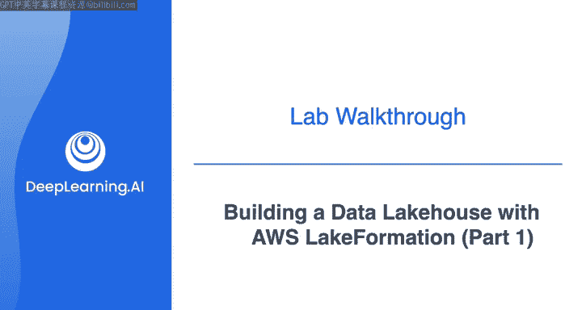
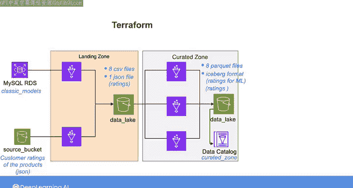
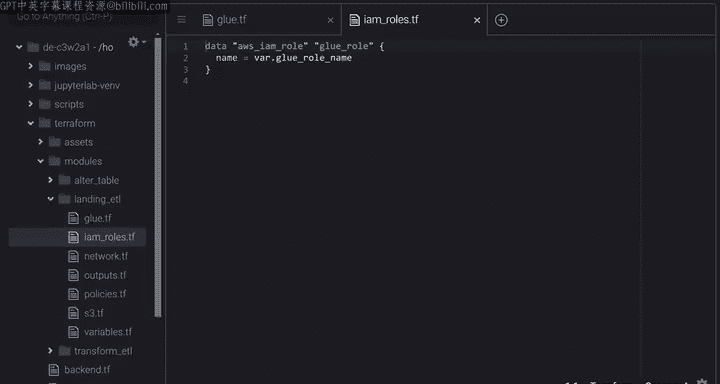
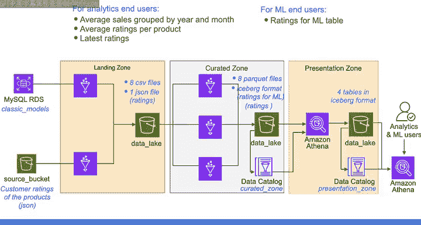

#  167：使用AWS Lake Formation和Apache Iceberg构建数据湖仓 🏗️💾



在本节课中，我们将学习如何利用AWS服务（如S3、Lake Formation）和开源格式（如Apache Iceberg）来构建一个具有“奖牌”架构的数据湖仓。我们将从原始数据摄取开始，经过处理和转换，最终创建可供分析和机器学习使用的数据表。

## 概述

实验将指导您使用Amazon S3、Apache Iceberg和AWS Lake Formation，实现一个具有类似“奖牌”架构的数据湖仓。您将获得一个已注册到Lake Formation的S3存储桶作为数据湖仓的底层存储，从而探索如何为数据湖中的数据建立治理和细粒度权限控制。

## 数据湖仓架构与数据流转

上一节我们介绍了实验的整体目标，本节中我们来看看数据在湖仓各层（着陆区、整理区、展示区）中的具体格式和流转过程。

### 着陆区：原始数据摄取

首先，您需要将原始数据从两个源系统摄取到数据湖存储桶的着陆区。

以下是数据摄取的具体步骤：

1.  **从MySQL源数据库提取数据**：提取每个表，并将其保存为着陆区中的CSV文件。这意味着您将创建八个CSV文件，每个文件对应一个表。
2.  **CSV文件命名规则**：S3对象键的格式为：`landing-zone/rds/<表名>`。
3.  **从S3源提取JSON数据**：提取包含客户产品评级的JSON文件。该文件是一个JSON对象列表，每个对象包含客户编号、产品代码和该客户对给定产品的评级。
4.  **处理JSON数据**：将JSON文件作为数据帧摄取，添加表示文件摄取时间戳的字段 `ingest_ts`，最后将数据帧作为JSON文件存储在着陆区。
5.  **JSON文件命名规则**：S3对象键的格式为：`landing-zone/json/ratings`。

### 整理区：数据处理与转换

将原始数据传输到着陆区后，您将提取数据，对其执行三次转换，然后将处理后的数据存储在整理区。

以下是三次转换的概述：

1.  **第一次转换：处理CSV文件**
    *   从着陆区提取所有八个表，并将每个表转换为数据帧。
    *   为每个表添加两个元数据列：`ingest_ts`（表示数据在整理区的摄取时间戳）和 `source`（表示源数据库的名称）。
    *   强制执行预定义的模式，将数值列转换为预期类型。
    *   最后，使用Snappy作为压缩算法，将每个表存储为Parquet文件。
    *   **S3路径格式**：`curated-zone/<表名>`
    *   **目录关联**：在Glue数据目录中名为“curated-zone”的数据库内，为整理区创建的每个对象关联一个对应的目录表。

2.  **第二次转换：为机器学习准备数据**
    *   通过结合最新的评级数据与来自着陆区CSV表的客户和产品信息，创建机器学习团队所需的数据。
    *   从着陆区提取CSV表和最新的JSON评级文件，并将它们各自转换为数据帧。
    *   创建一个新的数据帧，其中包含来自客户表的部分客户信息、来自产品表的部分产品信息以及评级数据中的评级。
    *   向此数据帧添加一个包含数据处理时间戳的附加列。
    *   最后，通过指定以 `curated-zone/ratings-for-ml/iceberg` 开头的S3键，使用Iceberg格式将数据帧存储在数据湖存储桶的整理区。
    *   **目录关联**：将处理后的数据与其在Glue数据目录“curated-zone”数据库中的对应目录表关联。



3.  **第三次转换：存储最新评级数据**
    *   专注于提取最新评级，并使用Iceberg格式将其存储在数据湖存储桶的整理区。
    *   **S3路径格式**：`curated-zone/ratings/iceberg`
    *   **数据更新逻辑**：如果整理区中的评级表已包含某客户对某产品的评级，则在摄取新数据时，将提取新的客户-产品对并更新已存在对的评级。
    *   **目录关联**：将评级数据与其在Glue数据目录“curated-zone”数据库中的目录表关联。

### 使用Glue ETL和Terraform执行转换

您将使用Glue ETL通过为着陆区和整理区定义ETL作业来执行这些转换，这些作业使用Terraform进行配置。



以下是Terraform配置的关键组件：

*   **模块结构**：在Terraform文件下，您会找到三个模块。`landing-etl` 和 `transform-etl` 模块包含用于着陆区和整理区对应ETL作业的配置文件。
*   **着陆区ETL作业**：在 `landing-etl` 模块的Glue配置文件中，可以找到将原始数据摄取到数据湖存储桶着陆区的Glue作业。还包括定义连接到RDS数据库所需信息的代码块。
*   **转换ETL作业**：在 `transform-etl` 模块下，可以找到用于处理着陆区原始数据并将其存储在整理区的三个Glue作业的配置文件。
*   **Python脚本**：在 `assets` 文件夹中，可以找到包含每次转换的Python脚本的文件夹。每个脚本包含三个部分：从源提取数据、处理数据、将数据存储到目标位置。
    *   `batch_transform.py`：对应处理着陆区CSV文件、对每个表强制执行模式，然后将处理后的数据作为Parquet文件存储在整理区的作业。在此文件中，可以找到每个表的模式定义，定义为 `StructType`。
        ```python
        # 示例：定义表模式的StructType
        from pyspark.sql.types import StructType, StructField, StringType, IntegerType

        schema = StructType([
            StructField("customerNumber", IntegerType(), True),
            StructField("customerName", StringType(), True),
            # ... 其他字段定义
        ])
        ```
    *   在其他两个脚本中，您将从JSON文件提取原始数据并对其进行转换，以创建存储在Iceberg格式中的 `ratings-for-ml` 和 `ratings` 数据。
*   **Iceberg配置**：在脚本中，您会找到用于为AWS Glue启用Iceberg的配置设置。通过设置这些配置，您可以使用AWS Glue对Amazon S3中的Iceberg表执行读写操作，或使用AWS Glue数据目录处理Iceberg表。
    ```python
    # 示例：在Glue作业中启用Iceberg的配置
    spark.conf.set("spark.sql.catalog.glue_catalog", "org.apache.iceberg.spark.SparkCatalog")
    spark.conf.set("spark.sql.catalog.glue_catalog.warehouse", "s3://your-data-lake-bucket/")
    spark.conf.set("spark.sql.catalog.glue_catalog.catalog-impl", "org.apache.iceberg.aws.glue.GlueCatalog")
    spark.conf.set("spark.sql.catalog.glue_catalog.io-impl", "org.apache.iceberg.aws.s3.S3FileIO")
    ```

### 展示区：创建最终分析表

在整理区准备好所有处理后的数据后，您将在展示区创建额外的表，这些表将与最终用户共享。

以下是创建展示区表的方法：

*   **表类型**：
    1.  为分析最终用户创建两个表：一个包含按年月分组的平均销售额，另一个包含每个产品的平均评级。
    2.  创建一个代表您在整理区创建的 `ratings` 表的附加表。
    3.  为机器学习最终用户创建一个代表您在整理区创建的 `ratings-for-ml` 表的表。
*   **使用Athena创建表**：虽然可以使用Glue ETL在展示区创建这些表，但您将改用Athena。由于您已将目录表与整理区中的数据关联，因此可以将Athena用作处理工具。
*   **SQL查询示例**：以下是一个使用Athena在展示区创建评级表的SQL查询示例。
    ```sql
    CREATE TABLE presentation_zone.ratings
    WITH (format = 'ICEBERG', location = 's3://your-data-lake-bucket/presentation-zone/ratings/')
    AS
    SELECT * FROM curated_zone.ratings;
    ```
*   **执行过程**：编写此查询后，将其传递给AWS Wrangler包中的 `start_query_execution` 方法，同时指定要与此表关联的目录数据库名称（本例中为 `presentation_zone`）。执行该语句后，将在S3存储桶中创建实际数据及其在Glue数据目录中的目录表。
*   **存储格式**：对所有表重复相同的过程，并将它们全部以Iceberg格式存储在展示区。

## 总结



本节课中，我们一起学习了构建数据湖仓实验的完整流程。我们概述了数据在着陆区、整理区和展示区的格式与流转，包括如何使用Glue ETL和Terraform进行数据处理，以及如何利用Athena和Iceberg格式创建最终的分析表。在接下来的视频中，我们将深入探讨Iceberg格式的细节以及Lake Formation服务的治理功能。