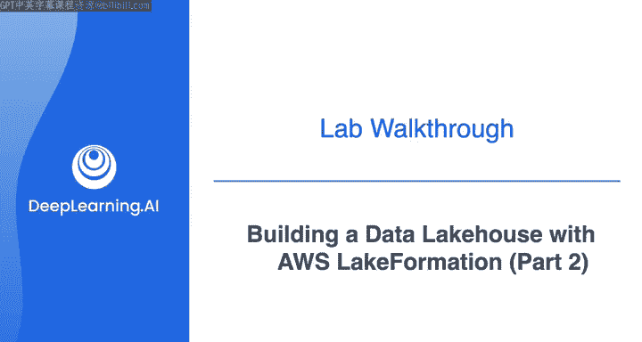
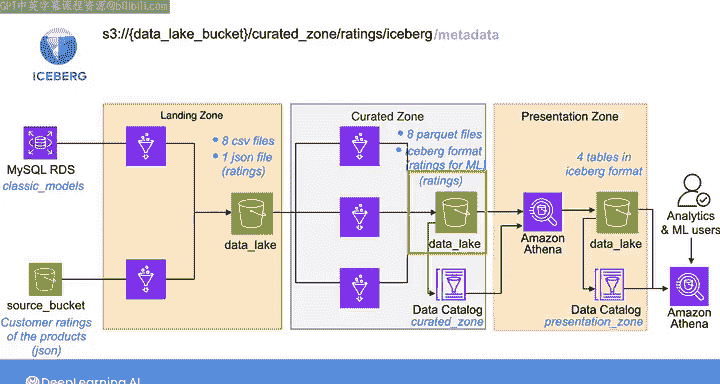
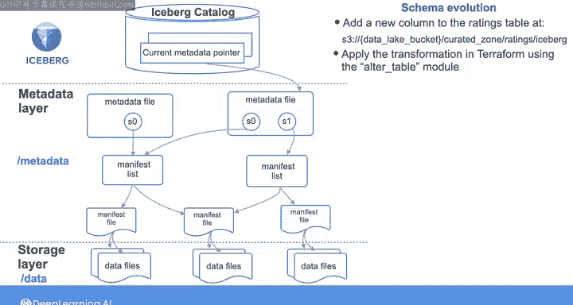
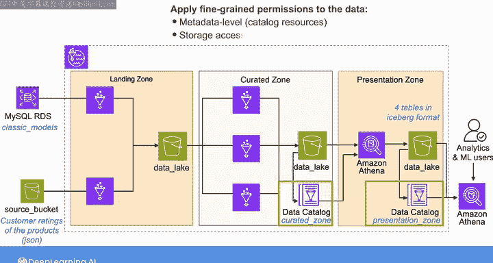
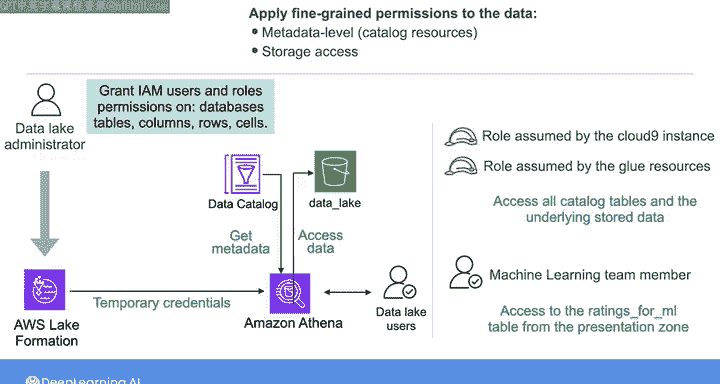

#  168：使用AWS Lake Formation和Apache构建数据湖仓 🧪

在本节课中，我们将学习如何在实验中将处理后的数据以Iceberg格式存储，并深入了解Iceberg文件在S3存储桶中的组织结构。我们还将探索Iceberg的架构演进和时间旅行特性，并学习如何使用AWS Lake Formation为数据湖应用精细的权限控制。

---

## Iceberg格式与S3存储结构

上一节我们介绍了如何在实验中将数据以Iceberg格式存储。本节中，我们来看看这些文件在S3存储桶中是如何组织的。

我们以在“精炼区”创建的`ratings`数据为例。当你将`ratings`数据导入精炼区时，你会在S3存储桶中指定一个路径。如果进一步检查带有`iceberg`前缀的文件，你会看到两个额外的前缀：`metadata`和`data`。

*   `metadata`前缀代表**元数据层**，它包含我们在之前视频中讨论过的元数据清单列表和清单文件。
*   `data`前缀代表**存储层**，它包含存储在Parquet文件中的实际数据。

以下是创建数据后，元数据层的内容示例：

*   `.json`文件代表元数据文件，它包含表结构信息、表在S3中的存储位置、表最后更新的日期时间以及当前快照的UUID（每次表内容更新时都会创建一个新的快照）。
*   每次对表的元数据进行更改时，都会创建另一个元数据文件。
*   以`Snap`开头的`.avro`文件是另一个元数据文件，代表对应一个快照的清单列表文件。它指向包含该快照详细元数据的清单文件列表。
*   这个清单列表文件指向另一个`.avro`格式的清单文件。

以下是存储层或数据层的内容，它包含Parquet数据文件。

需要记住的是，在元数据层和存储层之上，是**目录层**。目录层指向当前的元数据，并帮助确定在给定表中读取或写入数据的位置。在实验中，这个目录层是通过Glue数据目录实现的，它会为你在精炼区和展示区创建的每个Iceberg文件创建一个目录表。这些目录表被组织到`curated_zone`和`presentation_zone`数据库中，正如我之前提到的。

---

## 探索Iceberg高级特性

在实验的可选部分，你将探索Iceberg的架构演进特性。系统会要求你向`ratings`表添加一个新列，以适应输入数据架构的变化。

从源存储桶中，你将使用第三个模块`Al_table`在Terraform中应用转换。当你向`ratings`表添加新列时，**只有元数据文件会被更改，你无需重写或更新任何数据文件**。

你还将探索Iceberg的时间旅行特性，并查看如何同时查询`ratings`表的新版本和旧版本。

---

## 使用Lake Formation管理数据湖权限

最后，你将探索如何使用Lake Formation为你的数据湖应用精细的权限控制。正如我已经提到的，提供给你的数据湖已在Lake Formation中注册，你将扮演数据湖管理员的角色。我在资源部分包含了AWS文档的链接，向你展示如何设置Lake Formation并将其与你的数据湖关联。

Lake Formation允许你在两个级别强制执行权限：

1.  **元数据级权限**：针对数据目录资源（如数据库和表）的权限。
2.  **存储访问权限**：针对底层存储数据的权限。

Lake Formation使你（数据湖管理员）能够向IAM用户或角色授予对数据、数据库、表、列、行和单元格的精细权限。当你使用Lake Formation管理对底层数据的访问时，它会向集成的分析引擎（如Amazon Athena或AWS Glue）提供临时访问权限，以访问S3数据。这样，你无需编写详细的IAM策略来授予数据湖用户直接与底层S3对象交互的权限。

然而，你使用Lake Formation授予数据湖用户的权限旨在**补充**常规的IAM权限，而不是取代它们。数据湖用户仍然需要附加一个IAM策略，该策略授予他们访问AWS Glue服务、Lake Formation服务和Amazon Athena的权限。其工作方式是：通过IAM策略，你向用户或角色应用广泛的权限；然后，通过Lake Formation，你应用精细的权限，授予他们访问特定S3对象的权限。

在实验中，系统为你提供了Cloud9实例和Glue资源所承担的角色，以及一个代表机器学习团队成员的用户。这些IAM实体的广泛权限已在实验中为你定义。你将使用Lake Formation向数据湖表应用精细权限。具体来说，你将：

*   授予Cloud9实例承担的角色访问所有目录表及其底层存储数据的权限。
*   仅授予机器学习用户访问展示区中`ratings_for_ml`表的权限。
*   然后验证他们无法访问其他表。

---

## 总结

我认为你已经准备好尝试这个实验了。这个实验可能有点长，所以如果你时间紧张，可以跳过或仅浏览可选部分。完成实验后，我将在这里与你见面，对本周内容进行快速总结。

---

本节课中，我们一起学习了Iceberg表格式在S3中的具体组织结构，包括其元数据层、存储层和目录层。我们还实践了Iceberg的架构演进和时间旅行两大核心特性。最后，我们探讨了如何使用AWS Lake Formation在元数据和存储两个层面，为数据湖实施精细的访问权限控制，从而安全地管理数据资产。