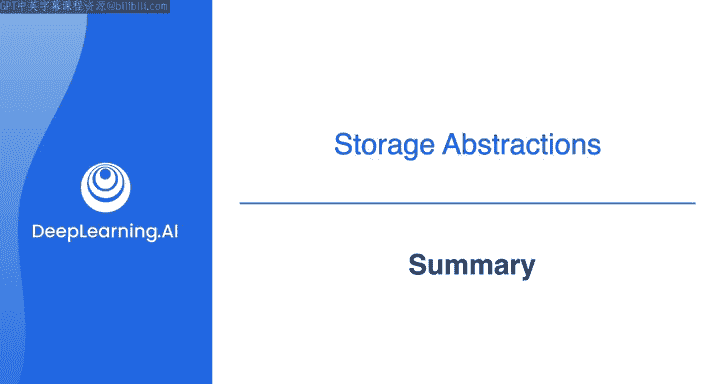
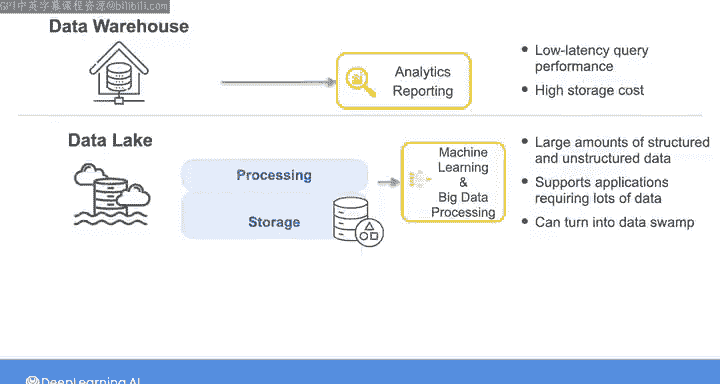
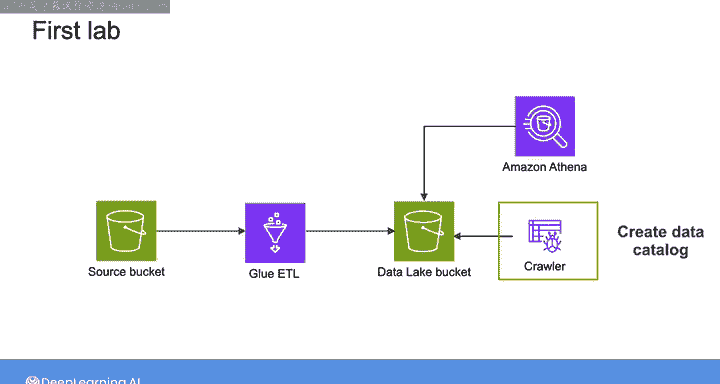
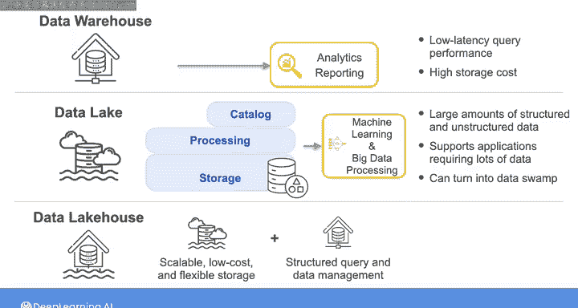
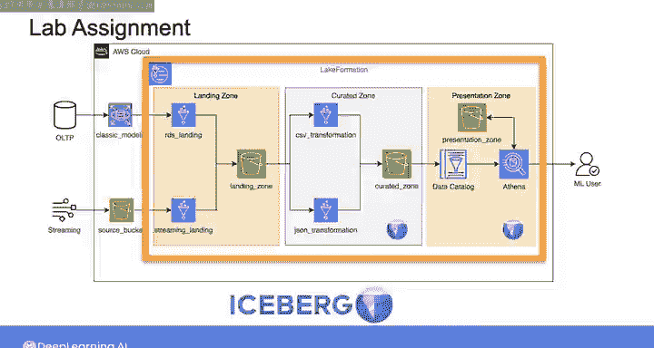

#  169：数据工程（导论，源系统、数据摄取和管道，数据存储和查询｜1-2-3课） - 第2周总结 🗂️




在本节课中，我们将回顾第2周的核心内容，重点梳理从传统数据仓库到现代数据湖仓的存储架构演变。我们将理解每种架构的关键概念、优缺点，并学习如何根据组织需求选择合适的存储方案。

## 存储架构的演变 🏗️

上一节我们介绍了数据工程的基础，本节中我们来看看数据存储架构的发展历程。

本周我们探讨了存储抽象概念的演变过程，从传统数据仓库到现代云数据仓库，再到数据湖，最后到数据湖仓。

你看到了数据湖仓架构如何旨在结合数据仓库和数据湖两者的优势，以支持许多组织日益增长的数据需求。

理解每种架构的关键概念，使你能够根据组织的需求选择最合适的存储解决方案。

## 核心架构对比 ⚖️

以下是三种主要存储架构的核心特点与权衡。

*   **现代云数据仓库**：可用于存储分析工作负载和报告用例的数据。它们通过利用云计算的大规模并行处理能力，实现低延迟查询性能。但数据仓库通常伴随较高的存储成本。
    *   **核心优势公式**：`低延迟查询 = 大规模并行处理(MPP)`
*   **数据湖**：构建在低成本对象存储之上，用于存储大量结构化和非结构化数据。支持需要海量数据的应用，如机器学习和大数据处理。但若缺乏适当的数据管理功能或数据发现工具，你的数据湖很容易变成无法使用的“数据沼泽”。
    *   **核心风险**：`数据湖 - 管理工具 = 数据沼泽`
*   **数据湖仓**：结合了数据湖的可扩展、低成本、灵活存储能力，以及数据仓库的结构化查询和数据管理功能，提供了一个统一的平台，同时支持低延迟分析工作负载和机器学习。

## 实践与应用 🛠️

理解了理论概念后，我们来看看如何在实践中应用这些知识。






在本周的第一个实验中，你看到了如何通过为存储在数据湖中的数据集创建**数据目录**，并**对数据进行分区**以提高数据检索效率，来缓解“数据沼泽”的挑战。

在实验作业中，你使用 **Lake Formation** 和 **Iceberg 表** 创建了一个数据湖仓。



```python
# 示例：创建Iceberg表（概念性代码）
CREATE TABLE sales_iceberg (
    transaction_id BIGINT,
    product_id INT,
    sale_amount DECIMAL(10,2),
    sale_date DATE
)
USING iceberg
PARTITIONED BY (sale_date);
```



## 未来趋势与下周预告 🔮

正如我之前所说，现有的数据仓库技术正越来越多地融入使其也能像数据湖一样运作的功能，而数据湖技术也正在融入使其能像数据仓库一样运作的功能。

因此，在你未来作为数据工程师的工作中，我认为你很可能会看到数据湖、数据仓库和数据湖仓之间的界限开始模糊，取而代之的是一套工具集，它们让你能够灵活地根据组织需求优化存储解决方案。

接下来的一周，我们将深入探讨查询。你将了解查询在底层是如何工作的，并探索提升查询性能的策略。我们下周见。

---

**本节课总结**：本节课我们一起学习了数据存储架构的演变，对比了数据仓库、数据湖和数据湖仓的核心特点与适用场景，并通过实验了解了构建数据目录、数据分区以及使用现代工具（如Lake Formation和Iceberg）创建数据湖仓的具体方法。理解这些架构有助于你为不同的业务需求设计最有效的数据存储解决方案。