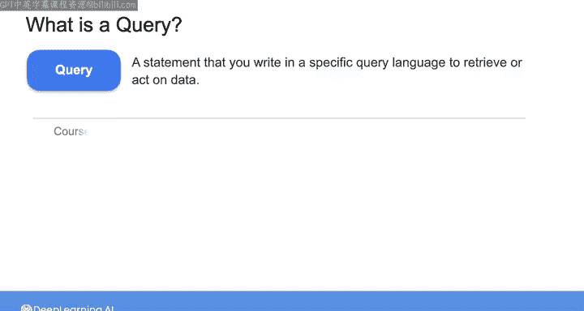
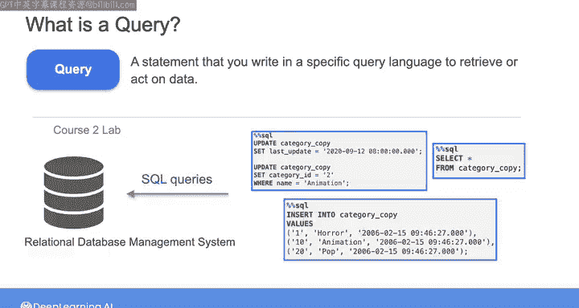
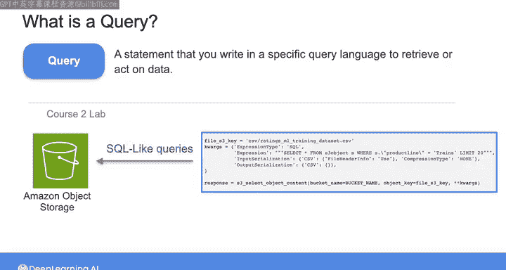
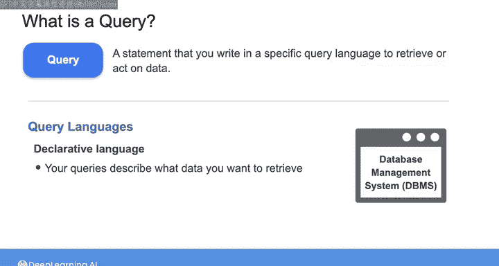
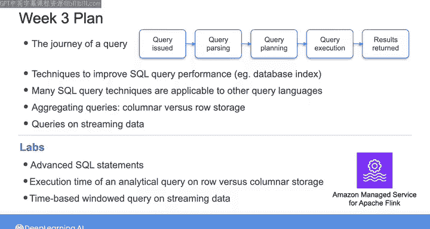

#  170：数据工程（导论，源系统、数据摄取和管道，数据存储和查询｜1-2-3课）｜第3周概览 🗺️

在本节课中，我们将要学习数据工程课程的第三周，也是最后一周的内容。我们将探讨数据存储与管理方式如何直接影响数据检索速度，以及查询如何影响存储系统本身的性能。作为数据工程师，理解查询的内部工作机制至关重要。

在前几周，我们学习了数据如何存储在数据库和对象存储等存储系统中，以及存储抽象如何在存储系统之上添加额外的管理层。

本节中，我们来看看数据存储和管理的方式如何直接影响数据检索的速度，即查询数据的速度，以及查询如何影响存储系统本身的性能。

在你的数据工程师工作中，你将编写查询以从内部和外部系统提取数据，并设置可供利益相关者直接查询的数据存储解决方案。因此，你需要理解你的数据存储和管理选择如何影响查询性能和系统性能。

要做到这一点，你需要详细了解查询的实际工作原理。查询是你用特定查询语言编写的语句，用于检索数据或对数据执行操作。

例如，在之前的课程中，你编写了SQL语句来与关系数据库管理系统（RDBMS）交互。

但查询不仅限于表格数据。在那门课程的另一个实验中，你使用了类似SQL的语句从亚马逊对象存储中检索数据。在本课程的第一周，你使用了Cypher语言从Neo4j图数据库中查询关系和节点属性。

查询语言是声明性语言。这意味着当你编写查询时，你只需向DBMS描述你想要检索什么数据或想对数据做什么，而无需担心执行查询所需的确切步骤。这些细节对你来说是抽象的，并由DBMS处理。

既然DBMS处理了这些细节，你可能会认为不必确切理解查询在幕后是如何处理的。

但如果你不真正理解查询的工作原理，有一天你可能会运行一个查询，导致关键数据库宕机数天甚至更久。相信我，这绝不是好事。

即使你自己已经擅长编写高效的查询，理解查询的处理过程也能帮助你建模数据，使其更易于被利益相关者检索且速度更快。

因此，本周我们将探索查询从编写到执行所经历的旅程：从你编写查询的那一刻起，到它被解析，再到创建和执行执行计划，最后到结果返回或所需操作被执行。

然后，我们将介绍可用于提高SQL查询性能的技术，例如创建数据库索引，这有助于优化对数据库中特定记录的搜索。

本周我们将重点讨论SQL，因为它是一种极其流行且成熟的语言，并且我们将介绍的许多技术也适用于其他查询语言。

我们还将研究聚合操作，重新讨论行存储与列存储的对比，并讨论流数据上的查询。

在本周的实验中，你将获得以下实践经验：
以下是本周实验你将获得的实践经验：
*   使用高级SQL语句。
*   比较在行存储与列存储上执行分析查询的执行时间。
*   最后，使用亚马逊Apache Flink托管服务对流数据执行基于时间的窗口查询。

在下一个视频中，请与我一起深入探究查询的生命周期。

本节课中我们一起学习了第三周的课程概览。我们明确了理解查询内部工作原理的重要性，概述了查询从编写到执行的完整旅程，并预告了本周将学习的核心技术与实践内容，包括查询性能优化、存储格式对比以及流数据处理。