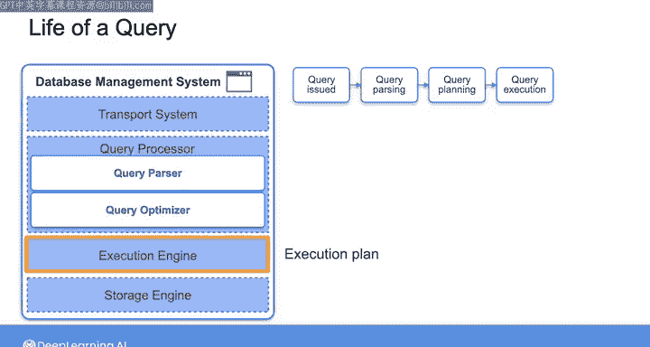
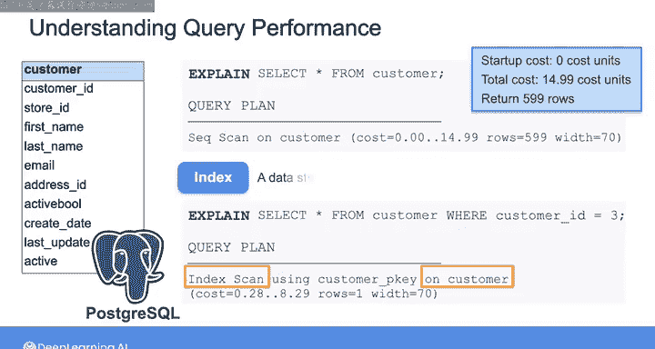

#  171：查询的生命周期 🔍


在本节课中，我们将学习数据库管理系统执行一个查询的完整生命周期。虽然运行查询看起来只是编写代码、执行并获取结果的简单任务，但其背后涉及多个组件的协同工作。我们将详细解析从提交查询到返回结果的每一个步骤。

---

## 查询处理的架构概述

上一节我们介绍了数据库系统的基本概念，本节中我们来看看一个典型数据库管理系统的内部架构。下图展示了一个通用架构：


本课程第一周已详细讨论过存储引擎，因此本节将聚焦于架构中的其他核心组件。

---

## 查询生命周期的阶段

当你向数据库发送查询请求时，该请求会经历一系列有序的阶段才能最终被执行。

以下是查询处理的主要阶段：

1.  **传输系统接收查询**
    你的查询请求首先通过传输系统抵达数据库。

2.  **查询处理器解析**
    传输系统将查询交给查询处理器。处理器包含两个主要部分：**查询解析器**和**查询优化器**。

3.  **解析与验证**
    查询解析器将查询语句分解为**查询令牌**，这些是SQL查询的基本构建块，包括`SELECT`、`FROM`等关键字、表名、属性名、操作符等。
    接着，解析器检查语法是否正确，并通过验证引用的所有表和属性名是否真实存在于数据库中来确认查询有效性。
    同时执行控制检查，以确保运行查询的用户拥有访问这些属性的适当权限。

4.  **生成字节码**
    验证通过后，查询解析器将SQL代码转换为**字节码**。字节码以一种高效的、机器可读的格式表达了执行查询所需的步骤。
    公式表示：`SQL 语句 -> 解析 -> 字节码`

5.  **查询优化**
    生成的字节码随后传递给**查询优化器**。优化器分析查询，并制定从存储层检索结果的执行计划。
    由于一个查询可以有多种执行方式，查询优化器会尝试找到一种能最高效利用可用资源的合适策略。
    为此，优化器会根据所需操作类型、数据中是否存在索引、扫描数据量大小等因素生成多种可能的执行计划。
    然后，它为每个计划计算一个**成本值**。成本可能包括多个组成部分，例如将数据从磁盘传输到内存的I/O成本，以及计算和内存使用成本。
    最终，查询优化器选择**成本最低**的计划。
    代码逻辑示意：
    ```python
    plans = generate_plans(query)
    costs = calculate_cost(plans)
    chosen_plan = select_plan_with_minimum_cost(costs)
    ```

6.  **执行引擎运行**
    一旦执行计划创建完毕，**执行引擎**便按照计划中概述的操作序列执行，并产生最终的查询结果。

---

## 理解执行计划

虽然执行查询的所有细节通常对你来说是抽象的，但你可以访问任何查询语句的执行计划，以便在执行前理解其性能，或在执行后排查慢查询的原因。

例如，在关系型数据库中，你可以在SQL语句前添加`EXPLAIN`命令，以显示数据库为执行该查询将采取的步骤序列。这还会展示各个查询阶段的各种资源消耗和性能统计信息。

让我们看一个例子。

以下是你在之前课程实验中见过的DVD租赁数据库的客户表。假设我将这些数据存储在Postgres数据库中，并且想从客户表中选择所有记录。

我可以在简单的`SELECT`语句前添加`EXPLAIN`命令，以获取Postgres查询优化器创建的执行计划。



```sql
EXPLAIN SELECT * FROM customer;
```


返回的计划指明它将执行**顺序扫描**，即全表扫描。它还显示两个成本值：第一个是输出结果前所需任何处理的**启动成本**，第二个是检索查询结果的**总执行成本**。此外，计划还输出预计返回的行数以及预期的行宽度（字节数）。

在此示例中，全表扫描的启动成本为0个成本单位，但返回599行的总成本为14.99个成本单位。

现在，假设你想再次运行SELECT查询，但这次决定使用`WHERE`子句来过滤记录，以便只返回客户ID等于3的记录。

```sql
EXPLAIN SELECT * FROM customer WHERE customer_id = 3;
```



现在返回的计划指明它将使用**客户ID列上的索引**来查找匹配WHERE条件的指定行，而不是扫描整个表。回顾第一周的内容，索引是一种你创建的特殊数据结构，作为一种保存额外元数据的方式，以帮助更高效地定位所需数据。


你会注意到，使用这种基于索引的策略，估计的总成本低于全表扫描的成本。我们将在另一个视频中详细讨论数据库索引。

因此，每当你想要理解查询性能时，都可以使用这个`EXPLAIN`功能。并且，该功能并非关系型数据库独有，你也可以在NoSQL数据库、数据仓库或数据湖屋中使用它。

---

## 总结

本节课中，我们一起学习了查询在数据库管理系统中的完整生命周期。我们从查询通过传输系统进入开始，逐步了解了查询处理器（包括解析器和优化器）如何将SQL语句解析、验证、优化为成本最低的执行计划，最终由执行引擎执行并返回结果。我们还学习了如何使用`EXPLAIN`命令来查看和理解查询的执行计划，这对于性能分析和优化至关重要。在接下来的视频中，我将带你快速了解本周的第一个实验。