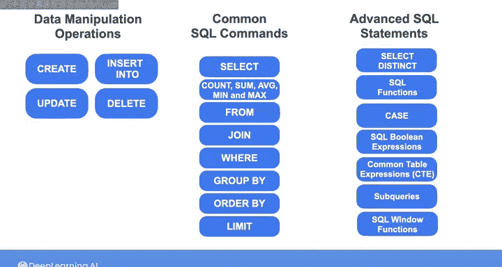
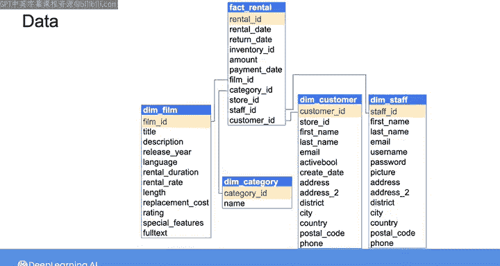
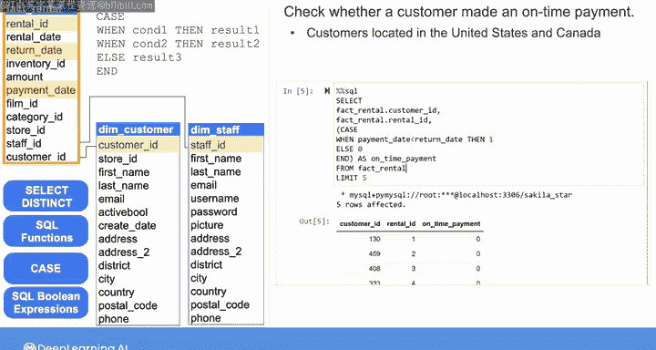
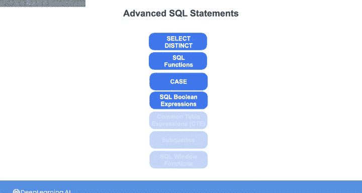

#  172：高级SQL查询（第1部分） 🗂️


## 概述


在本节课中，我们将学习一系列高级SQL查询技术。这些技术包括使用`SELECT DISTINCT`、字符串和日期操作函数、`CASE`语句、布尔表达式等，以更高效、更灵活地从关系型数据库中提取和处理数据。

---

## 回顾基础SQL操作

在上一门课程的第一个实验中，你使用SQL查询对关系型数据库执行了CRUD操作。CRUD代表创建、读取、更新和删除。

你学习了如何创建表和新的记录，使用`SELECT`语句读取一组记录，以及更新和删除现有记录。你还学习了如何使用`WHERE`子句应用谓词来过滤数据，使用`JOIN`连接不同表的数据，并应用聚合函数，如`COUNT`、`SUM`、`AVG`、`MIN`和`MAX`。



## 引入高级SQL语句

在接下来的实验中，你将使用更高级的SQL语句。这些语句包括`SELECT DISTINCT`、用于操作字符串和日期的SQL函数、`CASE`语句、SQL布尔表达式、公共表表达式（CTE）、子查询和SQL窗口函数。

在开始实验之前，让我们先了解一下这些高级SQL语句。

## 数据模型：星型模式

以下是我们将要使用的数据的实体关系图（ERD）。它包含与你在课程2中使用的DVD租赁数据库相同的信息，但在这里它被组织成所谓的**星型模式**。你将在下一课程中了解更多关于数据模型的知识。

中间的事实表名为 `fact_rental`，它包含了客户每次租赁交易的详细信息，例如租赁日期、归还日期、支付金额、租赁的电影ID、电影类别ID、服务客户的员工ID等。

周围的其他维度表则包含了关于客户、电影、电影类别、演员以及商店和员工的更详细信息。

为了讲解这些高级SQL语句，我们将只关注租赁事实表以及客户、员工、电影和电影类别的维度表。



## 使用 SELECT DISTINCT 去重

假设你想从 `fact_rental` 表中了解哪位员工服务了哪位客户。你可以选择 `staff_id` 和 `customer_id`。

```sql
SELECT staff_id, customer_id FROM fact_rental;
```

这个查询返回所有员工和客户ID的组合。但由于同一个客户可能被同一位员工服务多次，结果中可能包含重复的员工-客户ID对。

你可以向`SELECT`语句中添加SQL关键字`DISTINCT`，以确保结果只包含唯一的员工-客户ID对。

```sql
SELECT DISTINCT staff_id, customer_id FROM fact_rental;
```

## 连接表与字符串函数

现在，让我们包含员工的名字和姓氏，这些信息可以在员工维度表 `dim_staff` 中找到。因此，我将基于 `staff_id` 列将 `fact_rental` 表与 `dim_staff` 表连接起来。

我将把员工的名字和姓氏添加到`SELECT`语句中。你可以将名字和姓氏连接成一个字符串。根据数据库管理服务器的不同，字符串连接的语法可能有所不同。这里我使用的是MySQL数据库，可以使用`CONCAT`函数来组合名字和姓氏。

```sql
SELECT DISTINCT
    f.staff_id,
    f.customer_id,
    CONCAT(s.first_name, ' ', s.last_name) AS staff_name
FROM fact_rental f
JOIN dim_staff s ON f.staff_id = s.staff_id;
```

这个`CONCAT`函数将返回员工的全名，但名字之间没有空格。为了使其更易读，让我们在名字和姓氏之间添加一个空格。

除了连接两个字符串，你还可以应用其他字符串操作函数，例如`LOWER`将字符串转换为小写，或`UPPER`将其转换为大写。

你也可以使用`SUBSTRING`函数来提取字符串的一部分。例如，要返回姓氏的第一个字母，我将对 `staff_last_name` 应用`SUBSTRING`函数。

```sql
SELECT DISTINCT
    f.staff_id,
    f.customer_id,
    CONCAT(s.first_name, ' ', SUBSTRING(s.last_name, 1, 1)) AS staff_name_initial
FROM fact_rental f
JOIN dim_staff s ON f.staff_id = s.staff_id;
```

这个函数需要两个参数：起始位置和要提取的字符数。由于我只想要第一个字母，起始位置和字符数都将是1。

## 使用 CASE 语句创建条件列

现在，假设你想检查客户是否按时付款，即他们在归还DVD之前支付了DVD租赁费用。在 `fact_rental` 表中，你可以比较单个记录的 `payment_date` 和 `return_date` 列。

但为了使其更容易，让我们使用SQL `CASE`语句创建一个列，如果付款日期在归还日期之前，则该列包含1，否则为0。

该语句以`CASE`关键字开始，以`END`关键字结束。在这两个关键字之间，你可以使用`WHEN`关键字指定条件，使用`THEN`关键字指定与该条件关联的结果。列出所有条件后，你可以使用`ELSE`关键字指定如果列出的条件均未满足时要返回的结果。

让我们使用该语句从 `fact_rental` 表创建指示列。

```sql
SELECT
    customer_id,
    rental_id,
    CASE
        WHEN payment_date < return_date THEN 1
        ELSE 0
    END AS on_time_payment
FROM fact_rental
LIMIT 5;
```

我将此列标记为 `on_time_payment`。让我们限制此查询仅显示结果的前五行。

以下是此查询的结果。所有这五位客户的 `on_time_payment` 列中都是0，这意味着他们在归还DVD之后才支付了DVD租赁费用。

## 使用 WHERE 子句和布尔表达式过滤结果

让我们过滤这些结果，以便你只能看到位于美国和加拿大的客户的结果，以及发生在2005年5月24日至2005年7月26日之间的任何租赁的结果。

要获取客户的国家/地区，我将基于 `customer_id` 将 `fact_rental` 表与客户维度表 `dim_customer` 连接起来。

你需要使用`WHERE`语句根据国家和日期过滤结果。



首先，检查客户的国家是美国还是加拿大。或者，你可以使用`IN`运算符编写此表达式，并检查客户的国家是否在包含美国和加拿大的列表中。

```sql
SELECT
    f.customer_id,
    f.rental_id,
    CASE
        WHEN f.payment_date < f.return_date THEN 1
        ELSE 0
    END AS on_time_payment
FROM fact_rental f
JOIN dim_customer c ON f.customer_id = c.customer_id
WHERE c.country IN ('United States', 'Canada')
    AND f.rental_date BETWEEN '2005-05-24' AND '2005-07-26';
```

这里我选择使用`IN`运算符，当你有两个以上的选项时，它会很方便。

接下来检查日期，你可以使用`BETWEEN`运算符检查租赁日期是否在2005年5月24日（即2005-05-24）和2005年7月26日（即2005-07-26）之间。我在这里的这两个布尔表达式之间写`AND`，因为我希望国家和日期条件都为真。

现在运行查询以查看结果。

---

## 总结



本节课中，我们一起学习了`SELECT DISTINCT`语句、一些SQL字符串函数、布尔表达式和`CASE`语句。这些高级SQL技术能帮助你更精确地查询和转换数据。在下一个视频中，我们将继续探讨实验中会出现的更多高级SQL技巧。