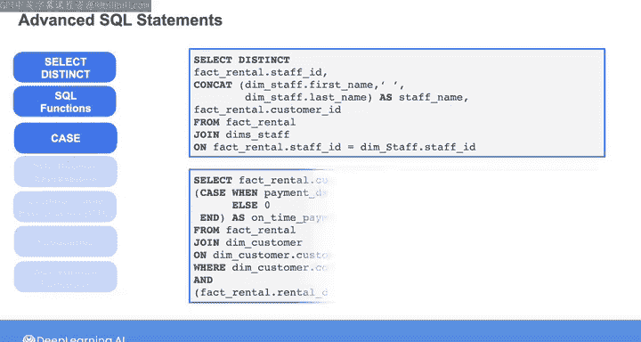
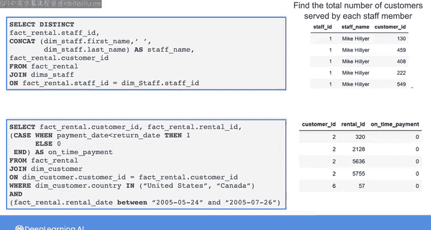
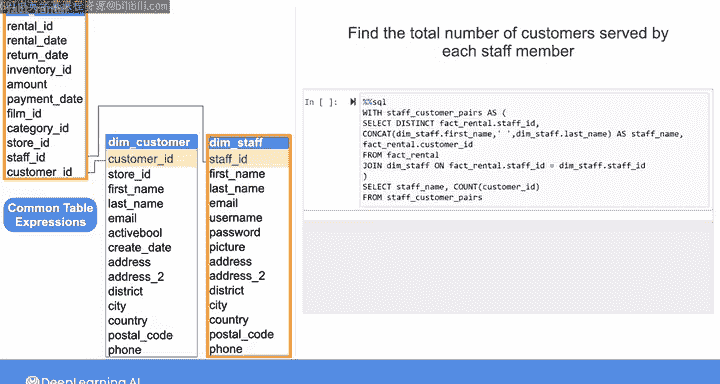
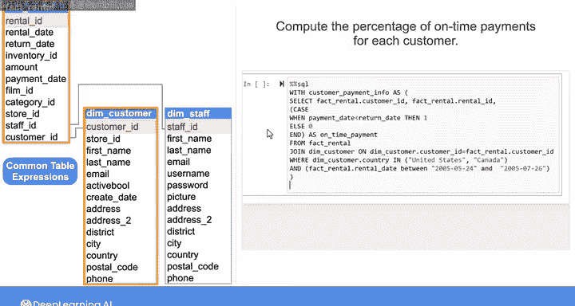
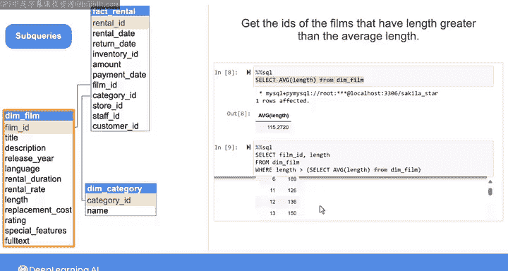
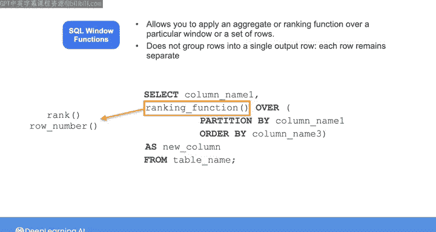
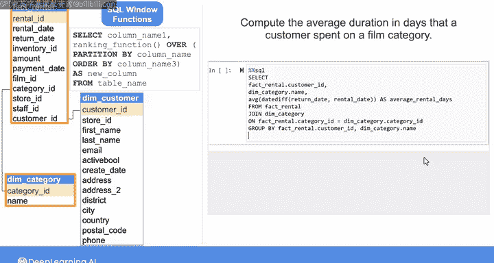
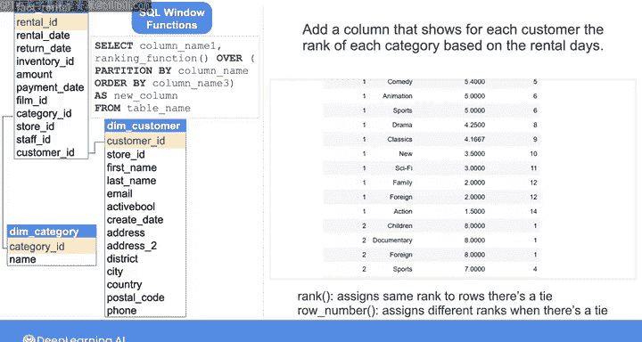

#  173：高级SQL查询（第2部分）📊


在本节课中，我们将学习几种高级SQL技术，包括公共表表达式、子查询和窗口函数。我们将通过具体的DVD租赁数据库示例，了解如何应用这些技术来执行更复杂的数据分析和计算。

---

在上一节视频中，我们学习了如何使用 `SELECT DISTINCT` 语句和SQL字符串函数来查询DVD租赁数据库中员工与客户的唯一配对。我们还使用 `CASE` 语句创建了一个指示客户是否按时支付租金的列，并通过 `WHERE` 子句中的布尔表达式过滤了结果。

本节中，我们将看看如何将一些高级SQL技术应用到查询中。

## 使用公共表表达式（CTE）📝

有时，我们可能需要在先前查询结果的基础上执行额外的计算，但又不希望将这些结果存储在单独的表中。这时，我们可以使用公共表表达式来定义临时的结果集，以便在查询的其他部分引用。



以下是定义和使用CTE的步骤：



1.  使用 `WITH` 关键字开始。
2.  为CTE指定一个名称。
3.  使用 `AS` 关键字。
4.  将代表临时结果的查询用括号括起来。

让我们通过两个例子来具体说明。

### 示例一：计算每位员工服务的客户总数

首先，我们定义一个名为 `staff_customer_pairs` 的CTE，它包含了上一课中获取的唯一员工-客户配对查询。

```sql
WITH staff_customer_pairs AS (
    -- 获取唯一员工和客户配对的查询
    SELECT DISTINCT staff_id, customer_id
    FROM rental
)
```

定义好CTE后，我们就可以像查询普通表一样查询它。以下查询从CTE中选择员工ID并统计客户数量，然后按员工ID分组。



```sql
SELECT staff_id, COUNT(customer_id) AS total_customers
FROM staff_customer_pairs
GROUP BY staff_id;
```

### 示例二：计算每位客户的按时支付百分比

接下来，我们定义一个名为 `customer_payment_info` 的CTE，它包含了计算按时支付指示列的查询。

```sql
WITH customer_payment_info AS (
    -- 计算按时支付指示列的查询
    SELECT customer_id,
           CASE WHEN return_date <= rental_date + INTERVAL '7 days' THEN 1 ELSE 0 END AS on_time_payment
    FROM rental
)
```

然后，我们可以从这个CTE中查询，计算每位客户的按时支付平均值（即百分比）。



```sql
SELECT customer_id, AVG(on_time_payment) * 100 AS percent_on_time
FROM customer_payment_info
GROUP BY customer_id;
```

为了验证所有客户的按时支付百分比，我们可以定义第二个CTE，并从中找出最大百分比值。

```sql
WITH customer_payment_info AS (...),
     customer_percent_on_time AS (
         SELECT customer_id, AVG(on_time_payment) * 100 AS percent_on_time
         FROM customer_payment_info
         GROUP BY customer_id
     )
SELECT MAX(percent_on_time) AS max_percent_on_time
FROM customer_percent_on_time;
```

---

## 使用子查询🔍

除了CTE，我们还可以在主查询内部使用子查询来合并临时结果。子查询是嵌套在另一个SQL语句中的查询。

让我们以电影维度表为例。假设我们想找出长度大于平均长度的电影ID。

首先，我们需要一个查询来获取电影的平均长度：

```sql
SELECT AVG(length) FROM dim_film;
```



然后，我们可以将这个查询作为子查询嵌入到主查询的 `WHERE` 条件中：

```sql
SELECT film_id, length
FROM dim_film
WHERE length > (SELECT AVG(length) FROM dim_film);
```

---

## 使用SQL窗口函数🪟

最后，我们来探讨SQL窗口函数。这类函数允许你在一个特定的“窗口”或行集上应用聚合或排名函数。它与使用 `GROUP BY` 进行聚合类似，但不同之处在于，窗口函数将聚合应用于行的子集，并且不会将多行合并为单行输出，每一行都保持独立。

要定义窗口，需要使用 `OVER()` 子句，它需要两个信息：按哪一列对行进行分区，以及按哪一列对行进行排序。



### 排名函数示例

假设我们有一个查询（可以定义为CTE），用于计算每位客户在每个电影类别上的平均租赁天数。

```sql
WITH customer_info AS (
    SELECT r.customer_id,
           c.name AS category_name,
           AVG(DATEDIFF(r.return_date, r.rental_date)) AS avg_rental_days
    FROM fact_rental r
    JOIN dim_category c ON r.category_id = c.category_id
    GROUP BY r.customer_id, c.name
    ORDER BY r.customer_id, avg_rental_days DESC
)
```



现在，我们想为这个结果添加一列，显示对于每位客户，每个类别基于租赁天数的排名。

我们可以使用 `RANK()` 窗口函数：

```sql
SELECT customer_id,
       category_name,
       avg_rental_days,
       RANK() OVER (PARTITION BY customer_id ORDER BY avg_rental_days DESC) AS rank_category
FROM customer_info
ORDER BY customer_id, rank_category;
```

`RANK()` 函数在遇到并列情况时会分配相同的排名。如果想在并列时分配不同的排名，可以使用 `ROW_NUMBER()` 函数。

### 聚合函数示例

同样在窗口函数中，你也可以使用聚合函数，如 `SUM()`。以下查询会计算每位客户在每个类别上的平均租赁天数的累计和。

```sql
SELECT customer_id,
       category_name,
       avg_rental_days,
       SUM(avg_rental_days) OVER (PARTITION BY customer_id ORDER BY avg_rental_days DESC) AS running_sum
FROM customer_info;
```

还有其他窗口函数，如 `LEAD()` 和 `LAG()`，可以在本实验的可选部分进行探索。

---

## 总结📚



本节课中，我们一起学习了三种高级SQL查询技术：
1.  **公共表表达式**：用于创建可重用的临时结果集，使复杂查询的结构更清晰。
2.  **子查询**：允许将一个查询的结果嵌套在另一个查询中，用于条件过滤或计算。
3.  **窗口函数**：能够在保留各行独立性的同时，在指定的行窗口上执行排名或聚合计算，非常适合进行高级数据分析。

掌握这些技术将极大地增强你处理复杂数据查询和分析任务的能力。接下来，我们将在后续视频中探讨这些SQL语句在后台是如何被处理的，并学习一些可用于提升其性能的策略。