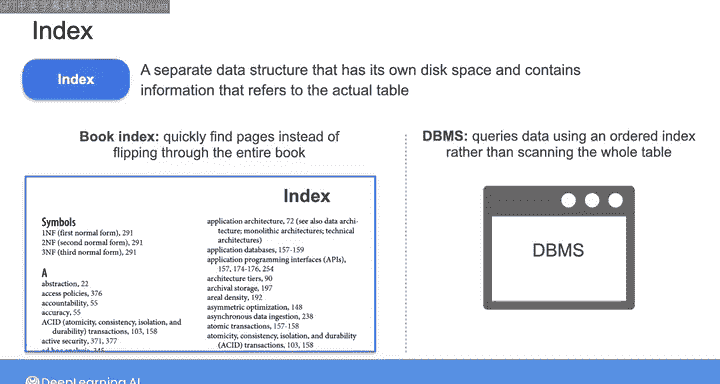
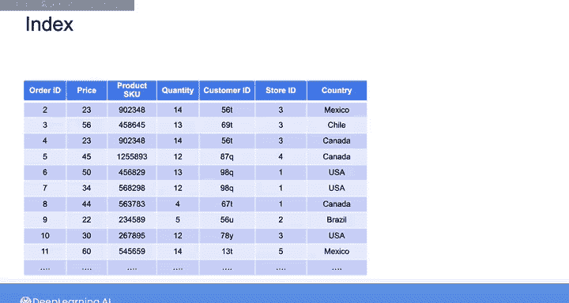
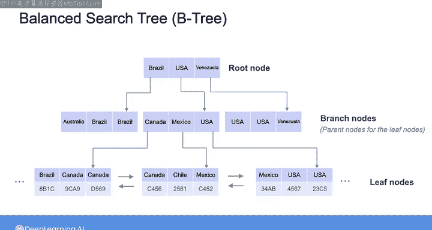
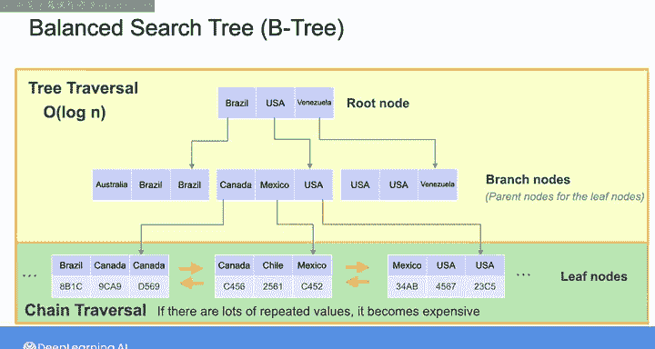
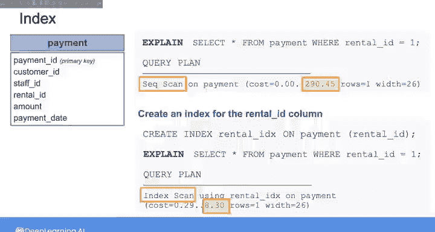
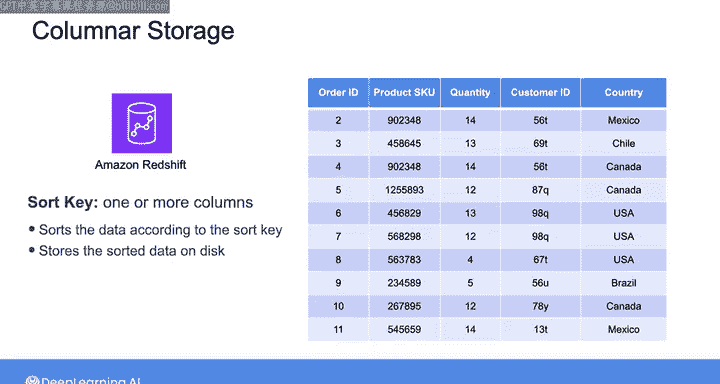
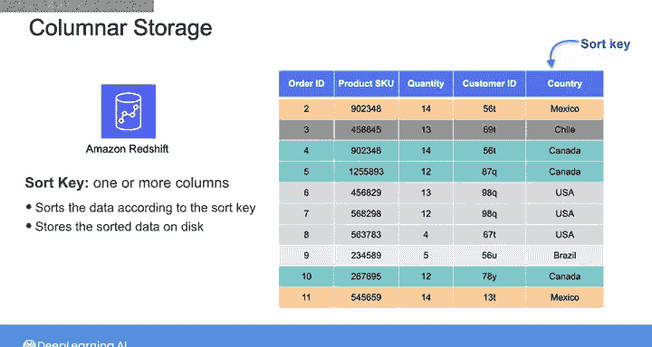
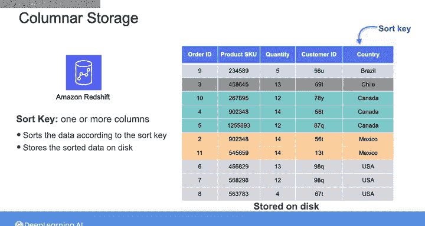

#  174：索引深入探讨 🔍


在本节课中，我们将要深入学习数据库索引的内部结构和工作原理。理解索引的实现方式有助于你设计更优的索引结构，从而提升SQL查询的性能。

## 概述

索引是一种独立的数据结构，拥有自己的磁盘空间，并存储指向实际表中数据的信息。它存储一个或多个列的数据，并按照明确的顺序排列。就像使用书籍末尾的字母索引来快速定位特定主题的页码，而不是翻阅整本书一样，数据库管理系统可以通过搜索有序的索引来查询数据，而非扫描整个表，从而更快地返回结果。

## 索引的基本概念与结构





在第一周的学习中，你已经了解到可以在关系型数据库中创建索引来帮助特定查询运行得更快。实际上，当查询优化器分析一个查询时，它会考虑是否存在索引，以及使用基于索引的计划是否能降低查询成本。

以下是索引结构的一个示例：


在这个例子中，`country`列中的条目按字母顺序存储在索引结构中。当你想查询发生在特定国家的订单时，例如，你想从`order`表中选择`country`为`USA`的所有记录，数据库可以对索引执行二分查找，以定位`country`列中包含`USA`的实际订单表中的行。

## 索引的物理实现

上一节我们介绍了索引的逻辑概念，本节中我们来看看索引在物理上是如何实现的。

在上述示例中，我以表格形式展示索引条目来解释索引的概念。然而，索引中的数据实际上并非像表一样顺序存储。它被划分为多个数据块，这些数据块通过双向链表连接在一起，以便从任何数据块进行前向和后向读取。每个数据块内部的数据是排序的，然后索引块以保持整个索引逻辑顺序的方式链接在一起。此外，数据块的位置并不重要，因为它们被正确地链接在一起。这种结构便于在插入新数据或删除旧数据时更新索引。

例如，假设向表中添加了一个来自泰国的订单。泰国在字母顺序上位于墨西哥和美国之间。你会将其添加到此处看到的第三个索引块中，并相应地移动其余数据。如果该记录被删除，那么你将从其索引块中移除相应的国家。整个过程，索引块始终保持双向链接。

## B树：高效定位索引块

为了高效地定位这些索引块，在索引块之上会构建另一种称为平衡搜索树或B树的结构。索引块代表树的叶节点。从这些叶节点向上构建，你拥有内部节点（也称为分支节点），它们充当叶节点组的父节点。

例如，这个内部节点是这三个叶节点的父节点。内部节点存储三个条目：`Canada`、`Mexico`和`USA`，它们分别代表每个叶节点中按字母顺序排序的最后一个国家。这样，如果数据库要查找名称在`Canada`和`Mexico`之间的国家，它将遍历到这里的第二个叶节点。如果名称在`Mexico`和`USA`之间，它将遍历到第三个叶节点。

这种节点分组和链接的模式在树中向上重复，直到到达树的第一个节点或根节点。

假设你想查询在加拿大下的订单。为了定位这些行，数据库从根节点开始，然后查找国家`Canada`。`Canada`不在根节点中，但由于它在字母顺序上位于`Brazil`和`USA`之间，数据库选择第二个内部节点，你知道该节点将包含字母顺序在`Brazil`和`USA`之间的国家。数据库在此内部节点中搜索`Canada`，并发现它是第一个条目，因此数据库选择第一条路径并到达一个叶节点，在那里找到代表在加拿大下订单的所有记录。由于`country`列中的条目不是唯一的，数据库还需要水平遍历叶节点以找到所有与`Canada`对应的条目。

## 索引查询的成本分析

总结一下，要检索具有索引结构的数据，数据库需要首先遍历B树。由于树被维护为平衡的，意味着子节点的数量在父节点之间均匀分布，一直到树的根节点，因此遍历树始终是一个高效的操作，时间复杂度为 **O(log n)**。

但是，如果索引不包含唯一元素，一旦数据库定位到适当的叶节点，它就需要水平遍历一系列叶节点以检索所有具有所需索引值的行。如果存在大量重复值，遍历节点链最终可能几乎像扫描整个表一样，在这种情况下，查询优化器将选择扫描整个表而不是使用索引。

因此，当你创建索引时，需要仔细选择合适的列来构建索引。一般策略是创建能够提高你最关注性能的查询性能的索引结构。你也不希望用太多索引使表过载，因为每当数据更新时，维护许多树结构的平衡实际上可能会降低数据库的性能。

## 索引实践：示例分析



为了更好地理解索引如何影响查询成本，让我们以本周第一个实验中所见的VD租赁数据库的`payment`表为例。

首先，让我们检查一个不涉及索引的SQL查询的执行计划。这里，我将从`payment`表中选择`rental_id`为1的记录。你可以通过在查询前添加`EXPLAIN`关键字来获取查询计划。

```sql
EXPLAIN SELECT * FROM payment WHERE rental_id = 1;
```

从返回的计划中，你可以看到查询优化器选择了顺序扫描，即全表扫描。

现在，让我们为`rental_id`列创建一个索引。我将以关键字`CREATE INDEX`开始，并给这个索引命名为`rental_id_idx`。我想在`payment`表的`rental_id`列上创建这个索引结构。

```sql
CREATE INDEX rental_id_idx ON payment (rental_id);
```



然后，我在之前的相同查询前添加`EXPLAIN`关键字以检查执行计划。

```sql
EXPLAIN SELECT * FROM payment WHERE rental_id = 1;
```

这次，查询优化器识别到索引的存在，并选择了基于索引的策略，因为其成本要低得多。通过添加索引，我能够将查询时间减少超过30倍。

在视频之后的阅读材料中，我包含了更多关于索引的示例。请务必查看这些内容，以更好地理解索引如何真正提高你的查询性能。

## 列式存储中的索引概念

到目前为止，我们一直在讨论传统关系型数据库的索引概念，但相同的概念也存在于列式存储中。

例如，当你在Amazon Redshift中创建表时，可以将其一个或多个列声明为排序键。然后，无需创建单独的数据结构，Redshift会根据排序键直接对数据的行进行排序，然后在磁盘上存储排序后的数据。

例如，当你将`country`列声明为此表的排序键时，表的所有行将根据`country`列重新组织，就像这样：





这类似于在电子表格中按一列或一组列排序。每个列重新组织后的版本随后存储在磁盘上。顺便说一下，其他云数据仓库，如BigQuery，将排序键称为集群键，但这是完全相同的概念。


通过在行式数据库中正确创建索引，或为列式存储指定排序键或集群键，你可以通过减少需要扫描的行数来增强特定查询的性能。

## 总结

本节课中我们一起学习了数据库索引的深入知识。我们探讨了索引的基本概念、物理实现方式（如双向链表和B树结构），以及索引如何影响查询性能。我们还通过实际示例分析了创建索引前后的查询计划变化，并了解了索引概念在列式存储（如排序键）中的应用。理解这些原理将帮助你设计更有效的数据库结构，优化查询，从而提升整体数据工程管道的效率。

在查看下一个阅读材料中的额外索引示例后，请加入后续视频，学习查询数据的另一个最佳实践：只查询和检索你实际需要的数据。



