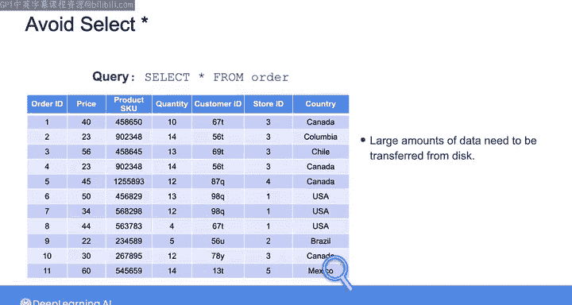
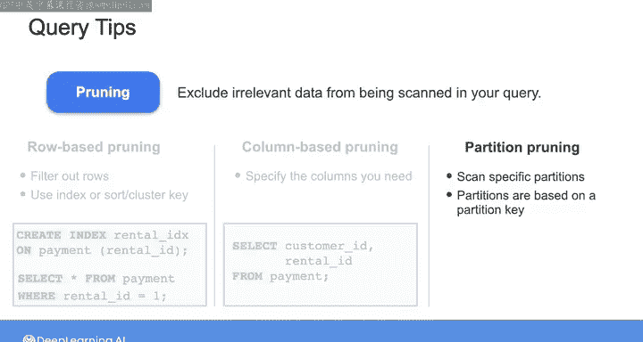

#  175：只检索所需数据 📊

在本节课中，我们将学习如何通过优化查询来只检索所需数据，从而避免不必要的性能开销和额外成本。我们将探讨几种“剪枝”技术，包括行剪枝、列剪枝和分区剪枝，以提升查询效率。

---

在上一节视频中，我们了解到为表创建合适的索引可以避免代价高昂的全表扫描。然而，实际上存在比全表扫描更糟糕的情况，那就是编写一个不仅扫描整个表，而且返回所有数据的查询。

当运行不带任何谓词（即没有 `WHERE` 子句来过滤结果）的 `SELECT *` 时，数据库管理系统需要扫描整个表并检索每一行和每一列。这对于源数据库来说代价高昂，因为需要从磁盘传输大量数据，并且数据可能还需要进一步处理。

我记得有一次，在我咨询的一家大型连锁超市，一位新分析师在生产数据库上运行了一条 `SELECT *` 命令，导致整个关键的库存数据库宕机了整整三天。公司不得不花费大量资金来解决这个问题，而那位可怜的分析师处境也不妙。

在按使用量付费的云数据库或数据仓库上运行 `SELECT *` 也可能非常昂贵。您将需要为从整个表读取的所有字节以及查询运行时使用的任何计算资源付费。

因此，一般来说，您应该避免运行不带 `WHERE` 子句来过滤结果的 `SELECT *`。作为一个经验法则，您应该只查询需要的数据。如果您想探索数据，请考虑使用一种称为“剪枝”的技术，从查询扫描中排除不相关的数据。

以下是几种常见的剪枝技术：

**行剪枝** 是最常见的剪枝技术之一，即过滤掉不满足 `WHERE` 条件的行。例如，您可以像之前看到的那样，从 `payments` 表中选择 `rental_id` 列为 1 的所有记录。在过滤结果时，您可以通过在传统的行式数据库中使用索引，或在列式存储（如 BigQuery 或 Amazon Redshift）中使用排序键或集群键来进一步提高查询性能。正如上一视频所见，您可以在 `payments` 表的 `rental_id` 列上创建一个名为 `rental_idx` 的索引来加速此查询。

**列剪枝** 技术包括在查询语句中仅指定需要的列。例如，您可以选择仅从 `payments` 表中查询 `customer_id` 和 `rental_id` 列，而不是选择所有记录。这样，数据库就不必扫描所有其他不相关的列。

**分区剪枝** 是指仅扫描包含相关数据的特定分区，而不是扫描整个表。当您使用的数据存储允许您基于分区键（例如日期或位置）对数据进行分区时，这种剪枝就成为可能。例如，在 BigQuery 中，您可以将这个未分区的表基于 `order_date` 对记录进行分区，然后进一步按 `country` 对每个分区进行排序。

假设用户查询数据，并按特定订单日期（4月1日）和国家（美国）进行过滤，数据库只需扫描 4月1日 分区中的记录，然后查找国家为美国的记录。

因此，为了避免产生意外费用或降低源数据存储的性能，您应始终确保只读取需要的数据。

另一个对查询性能有巨大影响的因素是连接不同表中数据的方式。我们将在下一个视频中讨论表连接带来的挑战。我们下节课见。

---

本节课中，我们一起学习了如何通过避免使用 `SELECT *` 和运用行剪枝、列剪枝及分区剪枝等技术，来优化查询并只检索所需数据，从而提升性能并控制成本。