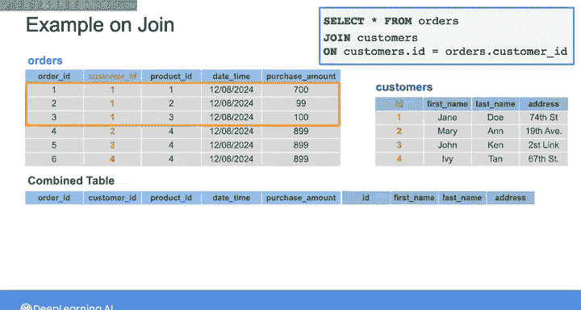
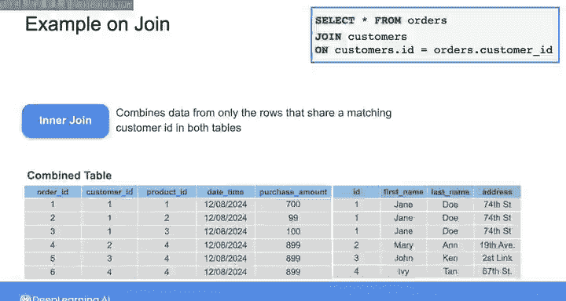
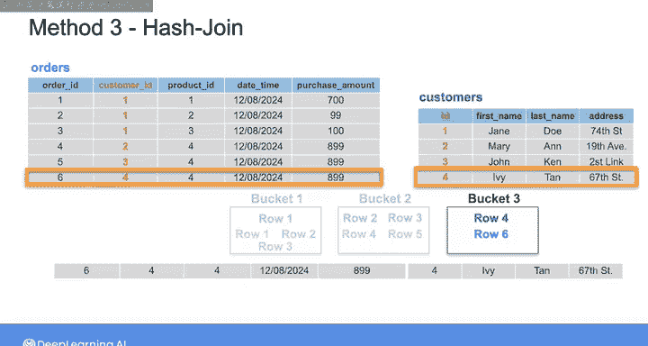
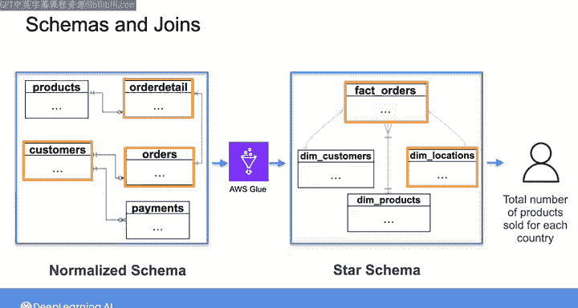
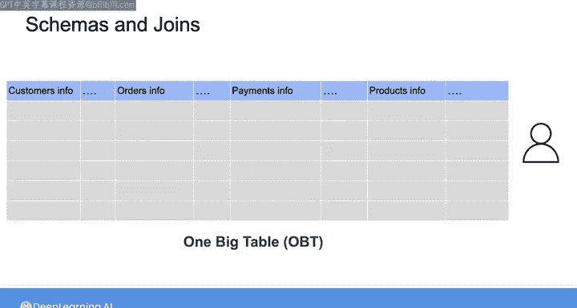
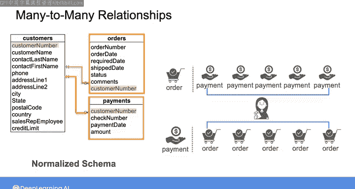
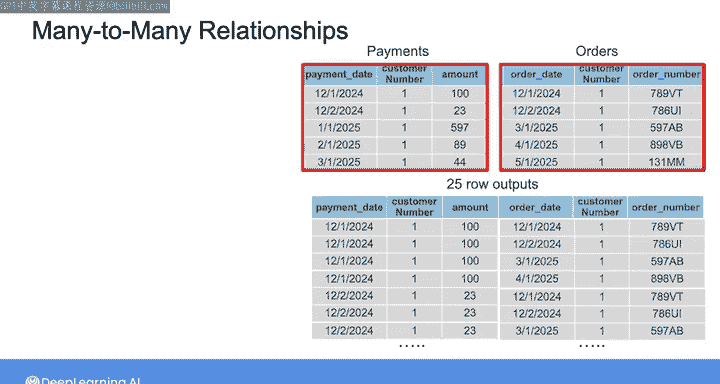

#  176：JOIN语句详解 🔗

在本节课中，我们将学习SQL中**JOIN**语句的工作原理、常见实现方法及其对查询性能的影响。理解JOIN是设计高效数据管道和优化数据模型的关键。

## 概述

**JOIN**是组合数据集最常用的方法之一。它允许你在数据管道中转换数据并创建新的数据集。此外，最终用户也可能使用JOIN来组合你提供的数据。然而，JOIN是最耗时的查询操作之一，因此在数据建模时，理解最终用户如何通过JOIN组合数据至关重要。

## JOIN的工作原理

为了回顾JOIN的工作原理，我们考虑以下两个表。`orders`表包含一家电子商务公司每个订单的信息，`customer`表包含每个客户的信息。这两个表通过客户ID相互关联，属于一个**规范化模型**，该模型将数据存储在单独的表中以减少冗余。

为了简化查找订单及其下单客户信息的过程，你可以使用SQL JOIN语句组合`orders`表和`customer`表的数据。你将选择`orders`表中的所有记录，这些记录通过`customer`表的ID列和`orders`表的`customer_id`列与`customer`表连接。这样，基于客户ID，`customer`表中相应的客户信息将与订单信息组合。

例如，对于这三个客户ID均为1的订单，你将附加ID为1的客户信息。然后，对于下一个客户ID为2的订单，你将附加ID为2的客户信息，依此类推。这种类型的JOIN称为**内连接**，它只组合两个表中共享匹配客户ID的行。

## JOIN的实现方法

为了帮助你理解为什么JOIN操作是最耗时的查询操作之一，我们介绍三种常见的JOIN实现方法。大多数数据库查询优化器在制定JOIN语句的执行计划时会使用其中一种方法。

### 嵌套循环连接

默认方法是**嵌套循环连接**，其工作原理类似于嵌套的for循环。从`orders`表的第一行开始，数据库记录下`customer_id`，然后扫描`customer`表中的每一行，仅检索具有此匹配`customer_id`的行。它将`orders`表该行的信息与检索到的客户信息行组合。对`orders`表中的每一行重复此过程，最后返回组合结果。

### 基于索引的嵌套循环连接

第二种方法是**基于索引的嵌套循环连接**，这是第一种方法的变体。当至少一个连接属性存在索引时，可以使用此方法。在本例中，索引可以是`customers`表中的ID列或`orders`表中的`customer_id`列。

假设`customers`表的ID列存在索引。你可能有一个B树结构，包含根节点、内部节点和叶节点。要执行此连接，数据库从`orders`表检索第一行，然后使用ID索引定位`customer`表中所有具有匹配ID为1的行。然后，数据库从`customer`表检索该行的数据，并将其与`orders`表的第一行连接。对`orders`表中的每一行重复此过程，然后返回组合结果。

### 哈希连接

最后一种方法是**哈希连接**。此方法使用哈希函数将每个表的行映射到桶空间，映射依据是连接属性的值（在本例中是客户ID）。

使用此方法，数据库首先扫描较小表（本例中是`customers`表）的所有行，并将每一行发送到特定的桶。然后，数据库扫描较大`orders`表的行，根据相同的哈希函数将每一行发送到一个桶。最后，在每个桶内，数据库组合`customers`表和`orders`表中共享匹配客户ID的行。最终返回组合结果。

这种方法可能快得多，因为并行扫描较小的桶比扫描整个表要快得多。在所有这些方法中，JOIN操作要求数据库扫描每个表中相当数量的行，并且可能发生多次。这就是JOIN操作成为最耗时查询操作之一的原因。

## 数据建模与JOIN

作为一名数据工程师，除了能够自己编写高效的JOIN查询外，还应该以能够使最终用户在需要时轻松连接数据的方式建模和提供数据。你选择的**数据模型和模式**会影响最终用户为获取所需数据而需要执行的JOIN数量。

通常，**规范化模式**会导致数据冗余较少，但需要更复杂的JOIN语句来组合数据。以下是你在专项课程第一个实验中看到的两种模式。

第一种是你摄入管道的输入数据的规范化模式。然后，你运行一个Glue作业，将数据转换为星型模式，再提供给数据分析师。假设数据分析师有兴趣计算每个国家/地区销售的产品总数。

如果你将数据保持在其原始的规范化模式中，那么数据分析师需要将`customer`表与`orders`表连接，然后将`orders`表与`orders_details`表连接。另一方面，在星型模式中，数据分析师只需通过组合事实表`orders`和维度表`dim_locations`执行一次JOIN。

另一种选择是将相关属性组合成一个大表，那么数据分析师就根本不需要执行任何JOIN。如果数据建模对你来说是新的，请不要担心，我们将在下一课程中更详细地介绍数据建模以及每种方法的优缺点。

## 多对多关系与行爆炸

除了数据建模之外，在使用JOIN时你可能遇到的另一个挑战是当两个表具有**多对多关系**时。例如，这里显示的`payments`表和`orders`表具有多对多关系：一个支付可以与多个订单关联，一个订单可以通过多次支付完成。

每个支付都与一个客户关联，假设客户1进行了五次不同的支付。每个订单也与一个客户关联，假设客户1下了五个不同的订单。因此，你可以基于客户编号连接`payments`表和`orders`表以获得此表。

这听起来很简单，对吧？问题在于，这个表可能并不像你第一眼认为的那样。你可能认为这个表显示了支付信息及其关联的订单，但实际上这里的连接逻辑存在错误。通过基于客户编号连接表，你盲目地将`payments`表与`orders`表连接，而没有考虑给定的支付是否正确映射到其对应的订单。

由于这个错误，`payments`表中与客户1关联的每一行都映射到`orders`表中同样与客户1关联的每一行。这在输出中创建了5乘以5，即25行。现在假设客户编号列中还有许多其他重复项。这会导致一种称为**行爆炸**的情况，即查询返回的行数比预期的多。

行爆炸可能产生足够多的输出行，消耗大量数据库资源，甚至偶尔可能导致查询失败。为了避免这个问题，请确保检查你的查询计划，看它是否正确描述了你希望JOIN执行的操作。如果此查询将频繁运行，那么考虑在你的模型中添加一个正确映射支付到其对应订单号的表。

## 总结

在本节课中，我们一起学习了**JOIN语句**的核心概念、三种主要实现方法（嵌套循环连接、基于索引的嵌套循环连接、哈希连接），以及数据建模如何影响JOIN的复杂度。我们还探讨了多对多关系可能引发的**行爆炸**问题及其规避方法。理解JOIN的处理过程可以帮助你设计更高效的JOIN查询，并为最终用户正确地建模数据。