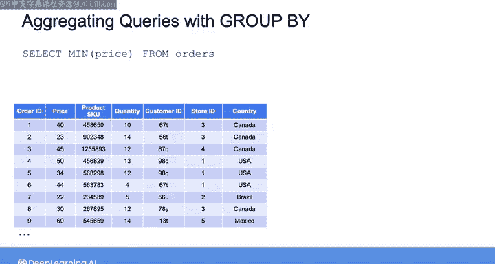
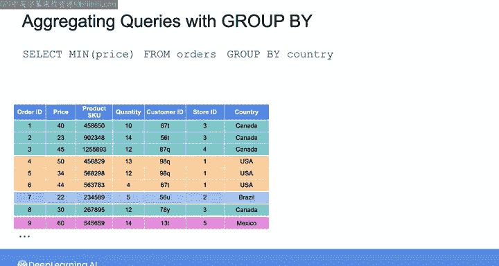
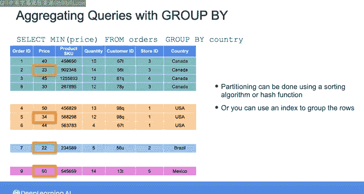
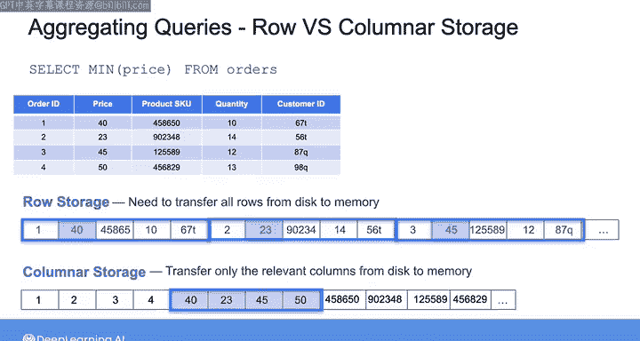

#  177：聚合查询 📊

在本节课中，我们将要学习聚合查询。聚合查询是分析型工作负载中的核心操作，用于从大型数据集中计算汇总值。我们将探讨其在行式存储和列式存储数据库中的执行方式与性能差异。

---

构建用于分析工作负载的系统时，必须支持对大型数据集进行聚合操作。

聚合查询用于计算某一列的汇总值，例如该列值的总和、平均值、最大值、最小值以及计数。以下是一个查询示例：从订单表中选择最低价格。在行式数据库中，此类聚合查询可以通过全表扫描来计算，即扫描表中的每一行以查找价格列中的最小值。如果可用，也可以通过使用索引结构来加速此查询。

例如，如果在价格列上存在一个B树索引，查询优化器可以决定使用该索引，并遍历B树以到达最左侧的叶节点，从而返回最低价格。

处理聚合查询时，还可以使用 `GROUP BY` 子句按特定列对查询结果进行分组，并返回每个组内的汇总值。例如，可以在查询中添加 `GROUP BY country`，以获取每个国家订单的最低价格。在这种情况下，表必须首先被分区成多个组。

每个组仅包含一个国家，然后为每个组计算最低价格。分区通常使用排序算法或哈希函数执行。如果分组属性（本例中是国家列）上存在索引，则可以避免这种分区操作。无论如何，聚合查询执行的是对列而非行的操作。

请记住，在行式数据库中，同一行的所有值在磁盘上是彼此相邻存储的。这意味着要从每一行获取价格值，必须将整行数据从磁盘传输到内存。因此，最终传输的数据量会超过执行分析查询实际所需的数据量。对于小型数据集，这可能没有问题。

但对于大型数据集，在行式存储中执行分析查询会变得非常缓慢。另一方面，列式存储在磁盘上将同一列的所有值相邻存储。

因此，在这种情况下，如果需要价格列的所有值，只需传输从第一个价格值到最后一个价格值之间存储的数据。在列式存储上执行分析查询效率要高得多，因为只需将分析查询相关的列数据从磁盘传输到内存。

在接下来的实验中，你将有机会比较行式存储与列式存储的查询性能。你将在托管于Amazon RDS的行式数据库上运行一个分析查询，然后在Amazon Redshift（一个利用列式存储的云数据仓库）上运行相同的分析查询，最后比较这两个查询的执行时间。

在下一个视频中，Morgan将带你详细了解Amazon Redshift。

之后，我将为你快速讲解实验步骤。

---

本节课中，我们一起学习了聚合查询的概念及其在行式与列式存储数据库中的执行机制。关键点在于，聚合查询针对列进行计算，而列式存储因其数据组织方式，在处理此类分析查询时具有显著的性能优势。接下来的实验将让你亲身体验这种差异。