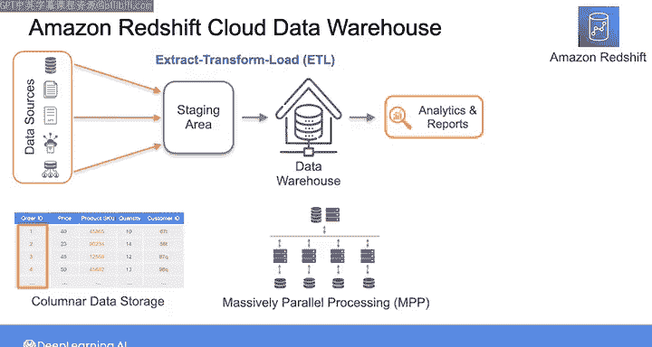
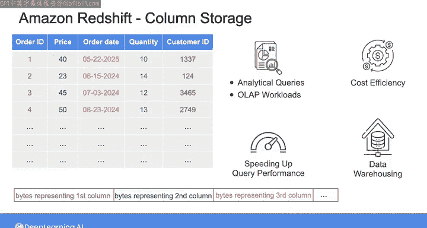
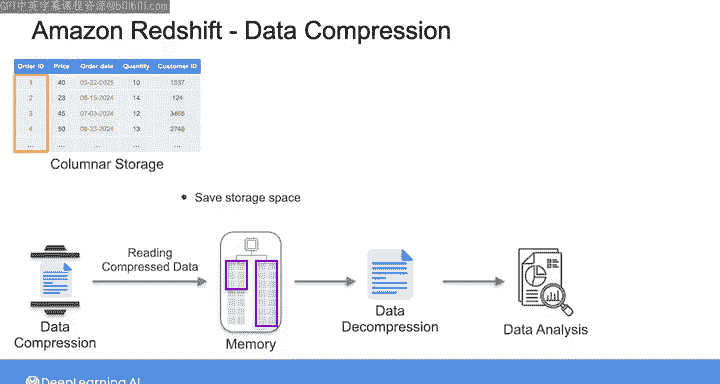
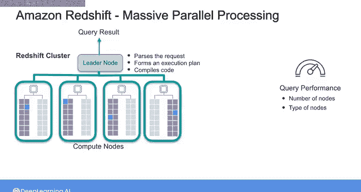
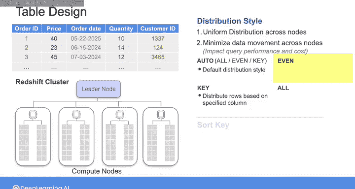

#  178：Amazon Redshift云数据仓库 🚀

在本节课中，我们将学习影响Amazon Redshift数据仓库工作负载查询性能的架构因素。我们将探讨Redshift如何查询数据，以及为了优化查询性能，在表设计时需要考虑哪些关键点。

上一节我们介绍了查询、索引以及编写高效SQL查询的各种策略和技巧。本节中，我们来看看一些影响在Amazon Redshift上运行的数据仓库工作负载查询性能的架构因素。

这里我们将探讨Redshift如何查询数据，以及为了优化查询性能，在表设计时需要牢记的一些考虑因素。

## Redshift的设计与架构 🏗️

Redshift被设计为一个高效的数据仓库解决方案。

它通过结合多种内部架构特性来实现这一目标，包括列式数据存储、大规模并行处理（MPP）以及数据压缩编码方案。

Redshift是一个列式数据库，这意味着它将数据按列（而非按行）一起存储在磁盘上。这种存储方式对于需要跨多行聚合数据，但任何特定查询只需访问少数几列的分析查询和OLAP工作负载尤其高效。通过这种列式存储方式，Redshift可以快速扫描和检索必要的数据，从而显著提升查询性能。这也是Redshift特别适合数据仓库和大规模数据分析的部分原因，在这些场景中，对大数据集的快速查询性能和成本效益至关重要。

列式存储还允许更好的数据压缩。当你运行查询时，Redshift将压缩数据读入内存，并按需解压。这意味着它可以利用更多内存来实际分析数据，从而使你的查询运行得更快。因此，你可以节省存储空间，并减少从磁盘读取的数据量。

Redshift还使用大规模并行处理（MPP），这个概念你上周已经和Joe学习了一些。让我们快速回顾一下。

Redshift由一个包含多个计算节点和一个领导节点的集群组成。与工作负载相关的数据分布在这些计算节点上，每个节点负责存储一部分数据，并处理对该数据的查询。计算节点被划分为称为“切片”的部分。一个切片使用计算节点的一部分内存和磁盘空间来处理分配给该节点的一部分数据。

通过MPP，这些计算节点协同处理查询，每个切片在不同部分的数据上运行查询。当你向Redshift提交查询时，领导节点会解析查询、制定执行计划并生成一系列必要步骤。然后，它编译执行任务所需的代码，并将其分发给计算节点执行。

每个切片并行处理其分配的数据部分。

一旦计算节点完成工作，它会将结果发送回领导节点，领导节点随后将结果聚合成最终的结果集。

这种并行方法确保了查询的快速执行。

然而，你的查询性能也可能取决于集群中的节点数量或节点类型。

## 表设计的关键因素 📊

现在，尽管有上述内置因素，但为了优化效率和性能，你不能仅仅依赖它们。

与表设计相关的多个关键因素需要考虑。当你创建表时，可以选择性地定义排序键和分布样式，这将极大地影响整体查询性能。

所以，让我们首先深入探讨分布样式的细节。

在我们讨论MPP如何在Redshift中工作时，我已经提到过这一点。数据在计算节点之间划分，而划分的方式是通过为表定义分布样式来控制的。

定义合适的分布样式有两个主要目标。

第一个目标是实现数据在节点间的均匀分布。

不均匀的分布（也称为数据分布倾斜）可能导致某些节点比其他节点做更多的工作。由于你的查询需要等待一个节点处理大量数据，这会导致性能瓶颈。像这样数据分布不均匀意味着你无法充分利用Redshift提供的大规模并行处理能力。

第二个目标是尽量减少节点间的数据移动。

如果在节点上运行的查询涉及连接表或聚合分布在多个其他计算节点上的数据，那么部分数据可能需要通过网络在节点之间重新分布。这种跨节点的数据移动会导致网络流量增加，进而可能减慢查询性能并增加查询成本。为了最小化这种情况，仔细为你的表选择分布样式非常重要。

节点间合理的数据分布确保相关数据位于同一节点上，减少了这种跨节点通信的需求。这种优化有助于平衡工作负载，并通过尽可能将处理本地化到每个计算节点来提高查询效率。

## 分布样式详解 🎯

因此，当你创建表时，可以从以下分布样式中选择：`AUTO`、`EVEN`、`KEY` 或 `ALL`。

`KEY` 样式允许你选择一个特定的列，然后使用该列的值在节点间分布数据行。领导节点会将具有相同键值的行分布到同一个节点。你可能想为你创建的每个表都定义一个特定的键，但这需要对数据进行彻底的分析，并且你可能无法确切知道哪个列最合适。在这种情况下，你可能希望使用 `AUTO`，这将让Redshift根据表数据的大小分配一个最佳的分布样式。如果你不提供分布样式的值，它将默认为 `AUTO`。

或者，你可以使用 `EVEN` 分布样式。Redshift会让领导节点使用轮询方式在节点间分布数据行，而不考虑任何特定列中的值。当表的数据集不太需要运行连接操作时，均匀分布是最合适的。

此外还有 `ALL` 选项。使用 `ALL` 时，整个表的完整副本会被分发到每个节点。当使用 `EVEN` 或 `KEY` 时，Redshift将表的一部分行放在每个节点上。但当你使用 `ALL` 时，Redshift确保该表参与的每次连接中，每一行都是共位的。这对于你经常将较小的表与非常大的表连接的情况很有用。通过在每个节点上拥有小表的完整副本，你消除了连接操作期间跨节点数据混洗的需要。

然而，`ALL` 分布将存储表数据所需的存储空间乘以集群中的节点数，因此向多个表加载、更新或插入数据所需的时间要长得多。因此，使用 `ALL` 分布仅适用于相对变化缓慢的表。

## 排序键的影响 ⚡

现在让我们继续讨论排序键及其如何影响查询性能。

Redshift根据你定义为排序键的内容，以排序顺序将数据存储在磁盘上。当你向Redshift提交查询时，查询优化器使用排序顺序来确定最优的查询计划。

你为表选择的排序键会影响查询性能，因为它决定了数据在磁盘上的物理组织方式。当你的查询基于排序键过滤或连接数据时，Redshift可以更有效地定位相关数据，减少需要从磁盘扫描的数据量。因此，选择合适的排序键可以最小化磁盘读取操作，并加快整体查询执行速度。

例如，如果你经常按订单日期查询销售表，将订单日期定义为排序键允许Redshift高效地仅扫描表中与查询中日期范围匹配的必要部分。

同样，如果你经常按客户ID过滤，将客户ID设置为排序键可以优化这些查询。你可以将其理解为OLTP数据库如何使用索引来加速查询，类似地，像Redshift这样的OLAP数据库使用排序键来加速查询。

以上就是表设计时需要牢记的一些考虑因素。

## 总结 📝

本节课中，我们一起学习了影响Amazon Redshift查询性能的核心架构因素。我们了解到Redshift通过列式存储、大规模并行处理和数据压缩来实现高效的数据仓库操作。在表设计方面，我们深入探讨了分布样式（`KEY`、`EVEN`、`ALL`、`AUTO`）的选择策略，以及如何通过定义合适的排序键来优化数据在磁盘上的物理组织，从而显著减少I/O操作并提升查询速度。这些设计决策对于在Redshift上构建高性能、可扩展的数据分析解决方案至关重要。

接下来，Joe将带你进行即将到来的实验，在那里你将比较行式数据库和列式数据库之间的性能差异。我们很快会再见面。