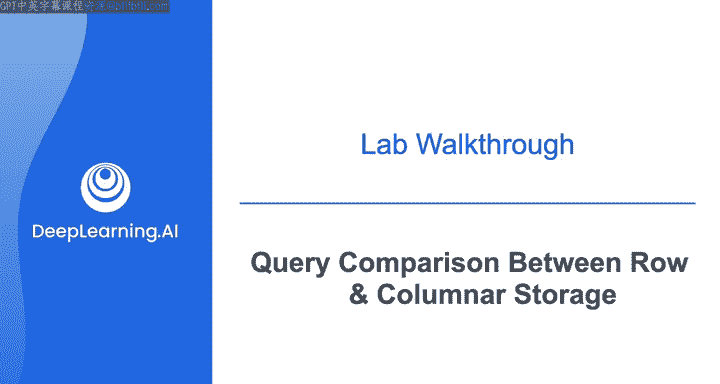
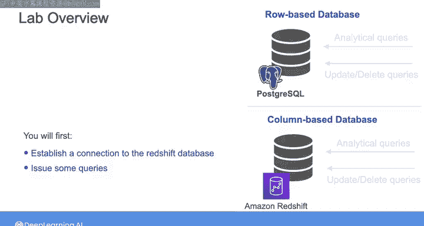
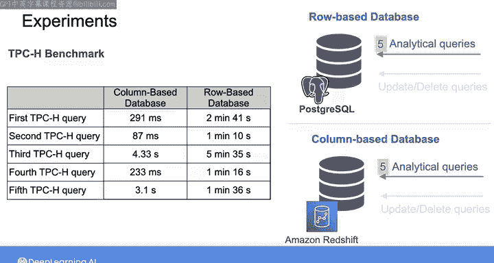
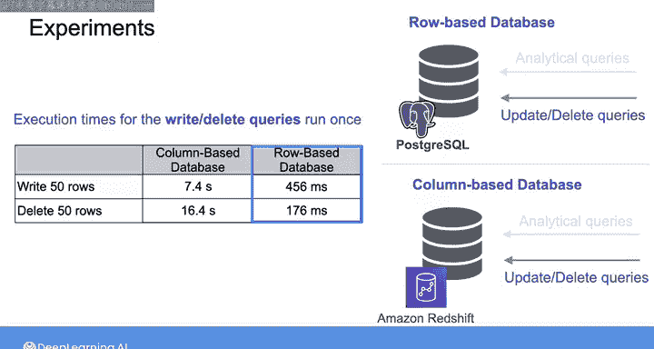

#  179：比较行存储与列存储的查询性能 🚀

在本节课中，我们将通过一个动手实验，探索基于行的数据库与基于列的数据库在查询性能上的差异。我们将对两种存储类型执行分析查询、更新和删除操作，并比较它们的执行时间。

## 概述

实验将使用基于特定实体关系图的基准测试数据。该数据同时存储在一个代表行式存储的 PostgreSQL 数据库和一个代表列式存储的 Redshift 数据仓库中。数据内容涉及订单、订单项、客户以及供应商信息。

我们将运行五组分析查询（即TPC-H基准测试），以模拟基本业务场景，评估不同数据库系统处理复杂查询的性能。此外，我们还将完成一个向`lineitem`表写入50行随机数据的函数，并比较其在两种数据库上的执行时间，随后删除这些行并再次比较删除操作的性能。

---

## 实验数据与设置

在开始实验前，你需要首先建立到 Redshift 数据仓库的连接并执行一些查询。你会发现，与数据仓库的交互方式与操作常规数据库非常相似。

以下是实验中将要使用的数据实体关系示意图：

---

## 分析查询性能对比

上一节我们介绍了实验的总体设置，本节中我们来看看分析查询的具体性能结果。

我已分别在两种数据库上运行了TPC-H基准测试中的五组分析查询，并得到了以下结果。在标准的基准测试中，理想情况下应多次运行查询以获取平均结果，但本次演示为了节省时间和成本只运行了一次。在实验中，你只需要运行第一组查询，其余查询为可选。

以下是查询执行时间的对比结果：

**关键发现：**
*   在**行式数据库**上，所有分析查询都需要**数分钟**才能完成。
*   在**列式数据库**上，所有分析查询仅需**毫秒或数秒**即可完成。

**结论：** 在列式数据库上执行分析查询的速度远快于在行式数据库上执行。

---

## 写入与删除操作性能对比

分析完查询性能后，我们接下来比较两种数据库在数据写入和删除操作上的表现。

以下是向`lineitem`表写入50行随机数据并随后删除这些行的操作时间对比：

**关键发现：**
*   在**行式数据库**中写入和删除50行数据的速度，比在**列式数据库**中执行相同操作要**快得多**。

**结论：** 对于写入和删除这类操作，行式数据库的性能优于列式数据库。

---

## 总结

本节课中我们一起学习了行式存储与列式存储的核心性能差异。通过实验我们明确：

1.  **列式数据库**在**分析查询**（如大规模数据扫描、聚合）上具有显著性能优势，其执行时间通常以毫秒或秒计。
    *   **核心概念**：列存储将同一列的数据连续存放，利于压缩和批量读取分析所需的特定列。
    *   **适用场景**：数据仓库、商业智能、复杂分析。

2.  **行式数据库**在**联机事务处理**（如单行插入、更新、删除）上表现更佳。
    *   **核心概念**：行存储将同一行的所有数据连续存放，便于快速读取和修改整行记录。
    *   **适用场景**：高并发的业务系统、订单处理、用户账户管理。

现在，你可以亲自尝试实验，在 PostgreSQL 和 Redshift 数据库上运行这些测试。完成后，请继续学习下一课，我们将探讨处理复杂查询的更多策略。