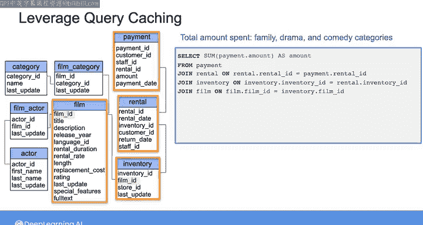
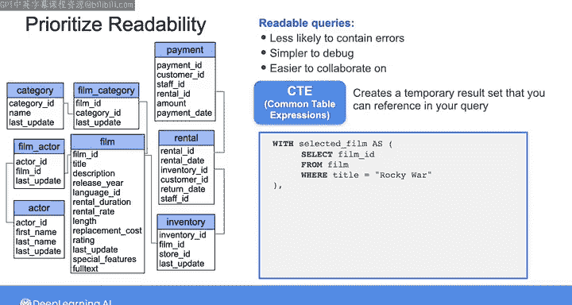
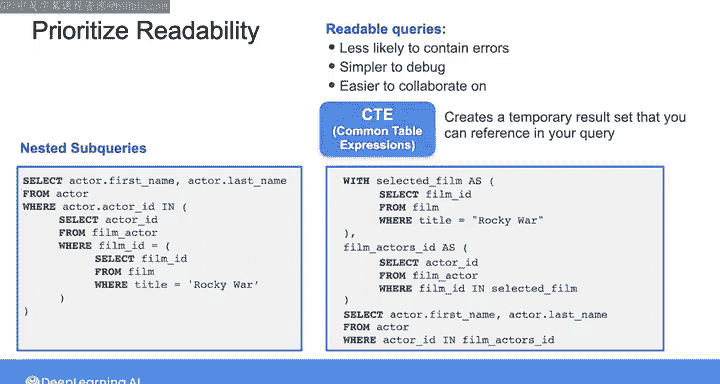
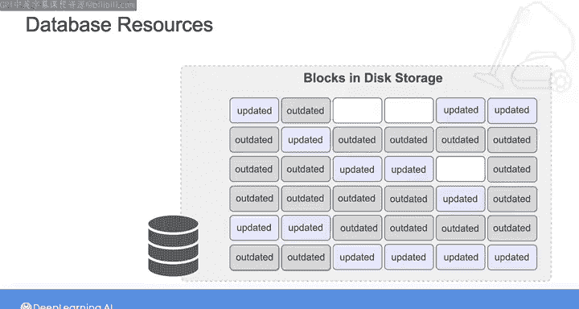
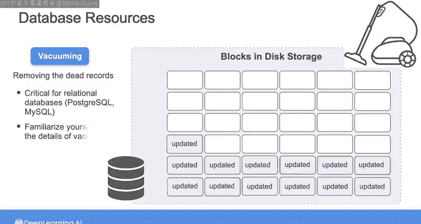

#  180：额外的查询策略 🚀

## 概述

在本节课中，我们将要学习几种提升查询性能的策略。除了了解查询在后台的处理机制，掌握处理复杂查询的策略（如查询缓存和公共表表达式）以及其他数据库维护技术（如清理），都能帮助你优化查询效率。

## 查询缓存策略

上一节我们介绍了查询的基本处理过程。本节中我们来看看如何避免重复执行高成本查询。

假设你正在使用之前课程中见过的DVD租赁数据库，并希望计算三个电影类别（家庭、剧情和喜剧）的总消费金额。你可以从选择支付表中的支付金额总和开始。

为了从类别表中获取电影类别名称，你需要进行多次连接操作。

以下是实现此查询所需的连接步骤：

1.  基于租赁ID，将支付表与租赁表连接。
2.  基于库存ID，将上一步结果与库存表连接。
3.  基于电影ID，将上一步结果与电影表连接。
4.  再次基于电影ID，将上一步结果与电影类别表连接。
5.  最后，基于类别ID，将上一步结果与类别表连接。

完成所有这些连接后，你就能选择类别名称。由于你只关心家庭、剧情和喜剧类别，你需要使用WHERE子句过滤结果。然后，按类别名称对结果进行分组，以便计算每个电影类别的聚合总消费。你还可以按金额对结果排序，将总消费从低到高排列。

在包含此数据的大型数据库上频繁运行此查询成本可能非常高。为了避免重复运行相同查询并在许多数据库（尤其是云数据库）上产生高昂费用，你可以利用查询缓存。

大多数应用数据库允许你缓存查询结果，以便后续即时检索。通过利用查询缓存，你可以减轻数据库负载，并提升频繁执行查询的用户体验。

## 使用公共表表达式提升可读性

除了缓存，编写复杂查询时，另一个建议是优先考虑可读性。就像编写任何代码一样，可读性高的查询更不容易出错，调试更简单，协作也更容易。

你可以通过使用公共表表达式来提升查询的可读性。CTE用于创建一个临时结果集，你可以在查询的其他地方引用它。这是你在本周第一个实验中练习过的概念。

例如，假设你想获取出演电影《Rocky War》的演员姓名。你可以创建一个名为 `selected_film` 的CTE，从电影表中选择电影标题为“Rocky War”的电影ID。

然后，你可以创建另一个名为 `film_actors_id` 的CTE，从电影演员表中选择演员ID，条件是电影ID等于从 `selected_film` CTE中获取的ID。

最后，你可以编写一个主查询，从演员表中选择名字和姓氏，条件是演员ID来自 `film_actors_id` CTE。

与编写许多嵌套子查询相比，CTE可以帮助你以更易读的方式构建复杂查询，从而更容易理解查询的逻辑流程。

## 数据库维护：清理操作

在优化查询本身的同时，你还需要优化数据库管理系统资源的使用，以尽可能高效快速地执行查询。

某些数据库的设计允许在数据更新时并发访问数据。当你在这些数据库中删除或更新记录时，它们会创建新记录，同时在物理磁盘上保留过时的数据作为指向数据库最后状态的指针。这也有助于在发生故障时将事务回滚到之前的状态。

然而，随着这些过时的记录不断累积且不再需要被引用，它们可能导致表膨胀。这就是数据库在物理磁盘上占用的空间远超实际数据大小的情况。

除了浪费磁盘空间，数据库还必须跳过许多数据块来检索所需数据，从而拖慢查询速度。由于查询优化器依赖于磁盘上数据的内部统计信息来生成查询执行计划，过时的记录也可能导致生成次优或不准确的计划。

同样，索引也可能因累积了过时数据的条目而变得低效。因此，为了为新记录释放空间并实现更好的查询和索引性能，你应该使用一个称为“清理”的过程来移除这些死记录。

你可以清理单个表、多个表或数据库中的所有表。清理对于Postgres和MySQL等关系型数据库更为关键，因为大量的事务操作会导致死记录的快速累积。当你在这些系统中工作时，需要熟悉清理的细节和影响。

## 总结

本节课中我们一起学习了多种优化查询性能的策略。你现在掌握了更多策略来优化查询性能。

我们在批处理数据查询方面涵盖了很多内容。下一课我们将探讨流式数据的查询。