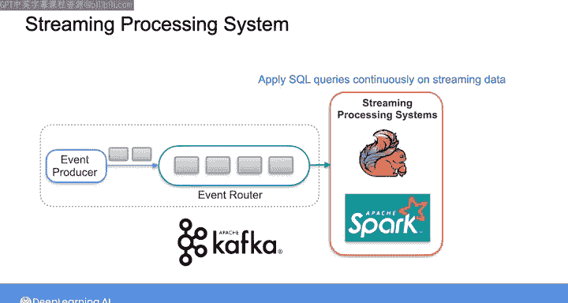
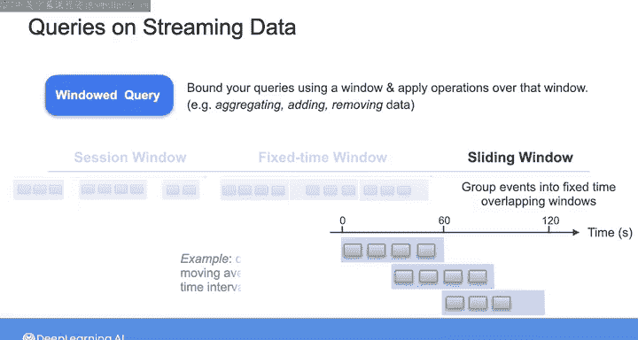
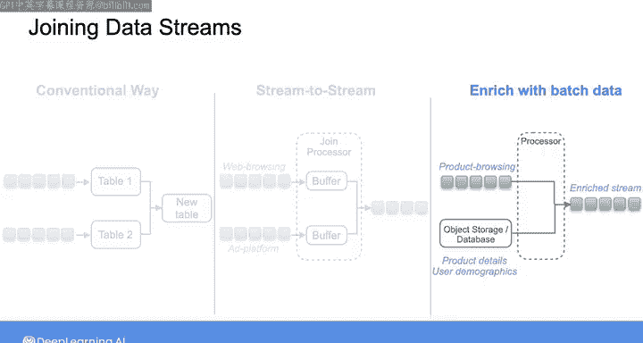

#  181：流数据查询 📊

## 概述

在本节课中，我们将要学习如何查询流数据。我们将探讨流数据处理的核心概念，特别是如何通过“窗口查询”来聚合和分析实时到达的数据流。课程将介绍三种常见的窗口类型，并解释如何连接多个数据流或流数据与批处理历史数据。

---

之前我们讨论了如何查询批处理数据。随着流数据变得越来越普遍，在查询流数据时，您可能也需要对数据进行聚合和连接操作。您必须采用能反映数据实时特性的查询模式。

假设您希望从流系统中摄取数据，并在收到数据后立即处理数据流。您可以使用诸如 Apache Flink 和 Spark Streaming 这样的流处理系统。这些系统使您能够对数据流持续应用 SQL 查询，甚至是复杂的查询。

像 Kafka 这样的流平台也支持查询 Kafka 流中的数据。使用这些系统，您可以通过应用一种称为“窗口查询”的技术来持续聚合流数据。窗口查询允许您使用一个窗口来限定查询范围，然后在该窗口上应用诸如聚合、添加或删除数据等操作。

让我们来看看三种常见的窗口类型。

以下是三种主要的窗口类型：

*   **会话窗口**：适用于处理不规则时间到达的事件。
*   **固定时间窗口**：也称为滚动窗口。
*   **滑动窗口**：允许窗口重叠。

---

### 会话窗口

会话窗口非常适合处理不规则时间到达的事件。它将相似时间发生的事件分组，并过滤掉没有事件的时段。使用这种窗口时，您需要指定事件之间允许的最大时间间隔，以确定一个会话何时结束、另一个会话何时开始。

例如，假设我们正在分析每个用户的网站点击行为，并决定将用户不活动的时间间隔设置为五分钟或更长时间来划分会话窗口。那么，这里将会有三个会话窗口，因为它们各自被五分钟或更长的用户不活动时间隔开。

请注意，会话窗口对每个键（例如用户ID）是唯一的。因此在本例中，每个用户都有自己的一套会话窗口。对这些窗口进行分析，例如，可以让分析师采取后续行动，比如向用户发送一封包含优惠券的电子邮件，该优惠券针对用户在上一个会话窗口中浏览过的产品。

为了确定会话边界，处理系统在第一个事件发生时（本例中是用户的第一次网站点击）启动一个新的会话窗口。然后，只要新事件在前一个事件的五分钟内到达，系统就会继续为该用户累积到达的事件。一旦出现五分钟的不活动期，系统就会关闭窗口，将任何指定的聚合结果（如最大值、最小值或平均值）发送给消费者，然后刷新数据。如果之后该用户没有事件到达，系统将启动一个新的会话窗口。

因此，对于会话窗口，只要事件持续紧密地到达，窗口可以扩展到任意大小。

---

### 固定时间窗口

或者，您可以在固定大小的窗口上聚合事件数据，这被称为固定时间窗口或滚动窗口。

例如，这里有三个固定时间窗口，每个持续20秒。系统处理每个窗口内到达的所有数据，然后在窗口关闭后立即发送聚合结果。如果您想计算例如每20秒内发生的点击总数，这会很有用。这类似于传统的批处理ETL处理，您可能每天或每小时运行一次数据更新作业。然而，流处理系统允许您更频繁地生成窗口，并以更低的延迟交付结果。

---

### 滑动窗口

在会话窗口和固定时间窗口中，窗口是不重叠的。但对于滑动窗口，您可以在固定时间长度的窗口中分组事件，并且这些窗口可以重叠。

例如，这里有三个60秒的重叠窗口，每30秒生成一个。这种类型的窗口化可以帮助您计算诸如时间间隔内的移动平均值等数据。

---

### 连接数据流

除了聚合数据流，您还可以连接多个数据流，或将一个数据流与批处理历史数据相结合。

连接多个数据流的传统方法是将每个流转换为一个表，然后在数据库中对这些表进行连接。但流处理系统正越来越多地支持直接的流到流连接。

例如，您可能希望将网络浏览数据流与来自广告平台的流数据连接起来。由于这些流可能以不同的事件速率产生并具有不同的延迟，典型的流连接架构依赖于流缓冲区，这些缓冲区可以在一定时间内保留这些事件。来自各个流的事件在缓冲区中被连接，并在缓冲区的保留期过后最终被发出。

除了连接两个数据流，您可能还希望将流数据与存储在数据库或对象存储中的批处理历史数据连接起来，以产生一个经过丰富的事件流。

例如，您可能希望用产品详情和用户人口统计信息来丰富来自电子商务网站的产品浏览事件。为此，您可以使用无服务器函数或处理系统在内存数据库或对象存储中查找产品和用户信息，然后将所需信息添加到事件中，最后将增强后的事件输出到另一个流。

在本周最后一个实验中，您将处理在课程1中见过的流数据。但现在，您将应用基于时间的窗口查询来处理这些数据。在下一个视频中，Morgan 将概述我们将用来完成此任务的 Amazon 托管服务 Apache Flink。现在，我将带您了解接下来的实验。

---

## 总结

本节课中，我们一起学习了流数据查询的核心概念。我们了解到，处理实时数据流需要使用特殊的窗口查询模式，包括**会话窗口**、**固定时间窗口**和**滑动窗口**。我们还探讨了如何连接多个流数据或将流数据与历史批处理数据相结合，以生成更丰富、更有价值的数据流，为实时分析和决策提供支持。