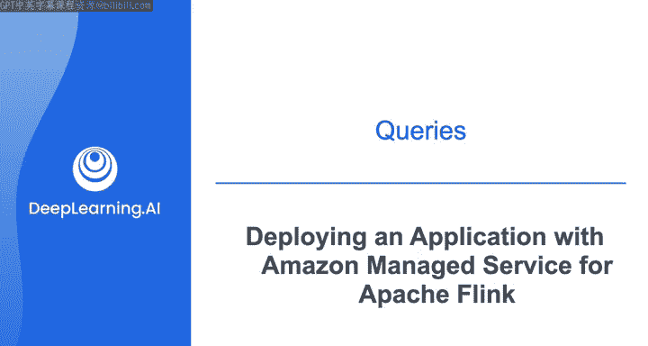
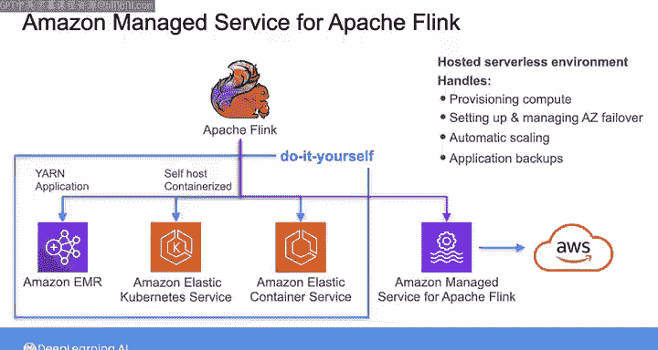
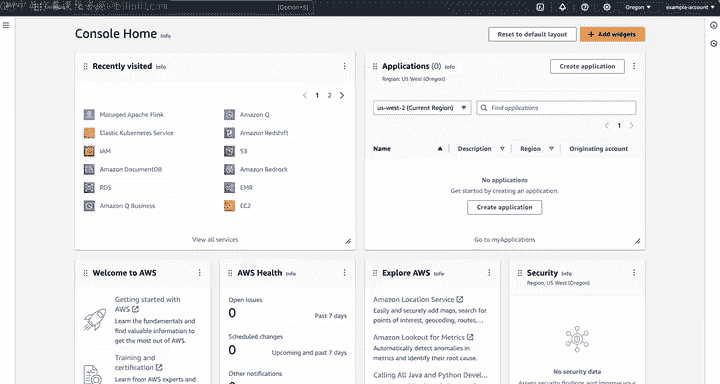
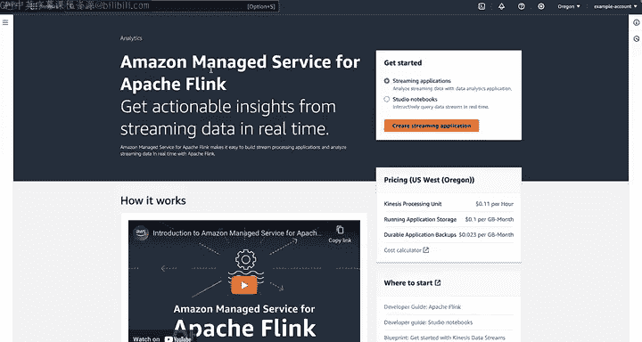
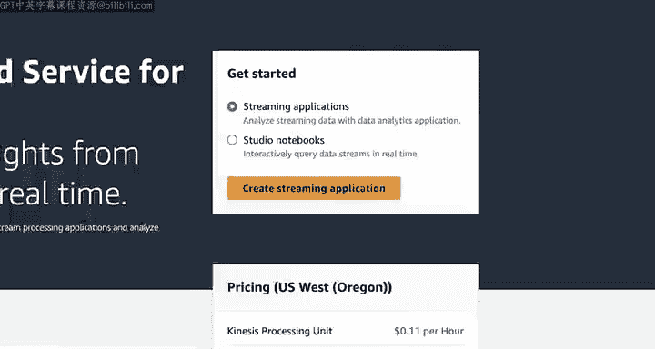
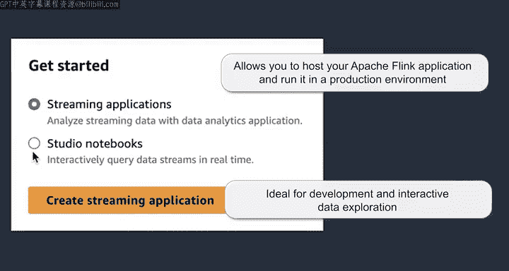
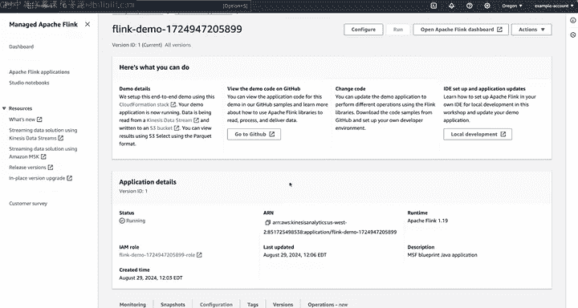
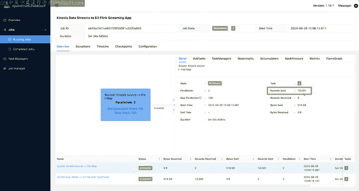

#  182：使用Amazon托管服务部署Apache Flink应用 🚀



## 概述

在本节课中，我们将学习如何在AWS上使用Amazon Managed Service for Apache Flink来部署和管理Apache Flink流处理应用。我们将了解托管服务的优势，并通过一个实际演示，学习如何创建一个处理实时股票数据的Flink应用，以及如何通过Studio Notebook进行交互式数据探索。

---

## 1. Apache Flink在AWS上的部署选项

上一节我们介绍了Apache Flink用于查询流数据。本节中我们来看看在AWS上运行Apache Flink时可选择的几种方式。

在AWS上运行Apache Flink时，您有多种选择。

*   您可以在Amazon EMR上作为YARN应用程序运行Apache Flink。
*   您可以使用Amazon Elastic Kubernetes Service或Amazon Elastic Container Service在容器化环境中自行托管Apache Flink。

这些可以称为“自己动手”选项。但您也可以选择使用托管服务，例如Amazon Managed Service for Apache Flink，这正是我接下来要介绍的内容。



---

## 2. 认识Amazon Managed Service for Apache Flink

Amazon Managed Service for Apache Flink在AWS上运行Apache Flink。它为您的Apache Flink应用程序提供底层基础设施，并创建一个托管的无服务器环境供其运行。

它为您处理了许多繁重的工作，包括：
*   供应和配置计算资源
*   为弹性设置和管理Zookeeper故障转移
*   自动扩展
*   应用程序备份

为了让大家了解其工作原理，我将通过一个演示来介绍如何设置Amazon Managed Service for Apache Flink，并在此过程中讲解一些核心概念。

---

## 3. 演示：创建流处理应用程序



现在，我位于AWS管理控制台。我将在搜索栏中输入“Flink”，然后选择“Amazon Managed Service for Apache Flink”。





Amazon Managed Service for Apache Flink为您创建托管环境以运行Apache Flink应用程序，但您需要像其他编程项目一样，在本地使用Apache Flink框架编写应用程序。

在“开始使用”下，我可以选择创建应用程序或选择Studio Notebook。

以下是两种模式的主要区别：

**创建应用程序**：如果您希望托管Apache Flink应用程序并在生产环境中运行它，则应选择此选项。这涉及定义必要的资源、配置应用程序设置并部署您的Flink作业。AWS随后会处理底层基础设施、扩展和运维方面的工作，让您可以专注于应用程序逻辑。

**Studio Notebook**：非常适合开发和交互式数据探索。它提供了一个基于浏览器的界面（由Apache Zeppelin提供支持），该界面与Apache Flink集成，允许您使用标准SQL、Python和Scala运行流处理应用程序。使用这种交互式方法，您可以试验Flink代码、测试不同场景并快速交互式地可视化结果。这在开发阶段或进行临时数据分析任务时特别有用。

在本演示的第一部分，我将创建一个流处理应用程序。稍后，我将创建一个Studio Notebook。

在下一页，您需要选择是从头开始还是从蓝图开始。我将选择一个蓝图，该蓝图将使用AWS CloudFormation创建您入门所需的所有资源。

它将设置一个Amazon Kinesis Data Stream作为我们要分析的源，然后设置将演示数据发送到流中所需的资源，并部署一个将从流中读取数据、处理数据，然后将处理后的数据发送到Amazon S3进行存储的应用程序。




我将选择“在CloudFormation中部署蓝图”。CloudFormation现在将部署必要的资源。这需要几分钟才能完成，因此我们将在完成后返回。

---

## 4. 演示应用解析

现在，CloudFormation模板已完成部署，我们的演示应用程序正在运行。

这个演示应用程序通过Kinesis数据流发送股票代码价格的样本数据，模拟实时传入的股票市场数据，然后部署一个Flink应用程序，该程序执行简单的数据转换，然后将数据写入S3。

该蓝图提供了一个指向GitHub仓库的链接，您可以在其中探索要部署的Apache Flink应用程序。这个应用程序是用Java编写的。

以下是应用程序核心逻辑的说明：

```java
// 此方法设置了从Kinesis读取数据的源，并运行转换逻辑
public void runAppWithKinesisSource() {
    // 设置源为Amazon Kinesis Data Streams
    StreamExecutionEnvironment env = StreamExecutionEnvironment.getExecutionEnvironment();
    DataStream<String> sourceStream = env.addSource(new FlinkKinesisConsumer<>(...));

    // 转换逻辑：过滤价格低于1美元的股票
    DataStream<String> filteredStream = sourceStream
        .flatMap(new StockPriceParser())
        .filter(stock -> stock.getPrice() >= 1.0);

    // 将过滤后的数据写入S3
    filteredStream.addSink(new FlinkS3Writer(...));
    env.execute("Kinesis to S3 Streaming Job");
}
```

这段代码从Amazon Kinesis流中将股票数据读入Flink数据流，过滤数据以仅保留价格在1美元或以上的股票，然后将过滤后的数据写入S3文件。

---

## 5. 监控Flink作业

了解了应用程序的功能后，让我们回到AWS控制台，选择“打开Apache Flink仪表板”按钮。

这将打开Apache Flink仪表板，其中有一个作业正在运行。如果在导航中选择“Running Jobs”，会看到一个名为“KinesisDataStreamsToS3FlinkStreamingApp”的蓝图作业。

点击它以查看更多详情，我们可以看到为此作业定义的算子图。我们正在从流中读取股票数据，使用一个flatMap算子来过滤掉价格低于1美元的股票，然后将过滤后的数据写入S3文件。



该图直观地表示了数据通过这些算子的流动，使得更容易理解处理步骤以及数据如何被转换和存储。

如果我选择这里的这个算子，您可以看到已经处理了10,000条记录。

---



## 6. 总结与下节预告

本节课中我们一起学习了如何使用Amazon Managed Service for Apache Flink部署一个数据处理和分析作业，该作业从Amazon Kinesis Data Streams拉取数据。

正如我之前提到的，在AWS上使用Flink的另一种方式是通过Studio Notebook，这对于数据探索或临时分析非常有用。这就是我接下来想向大家展示的内容。

请继续观看下一个视频，学习如何使用Amazon Managed Service for Apache Flink部署一个Studio Notebook。