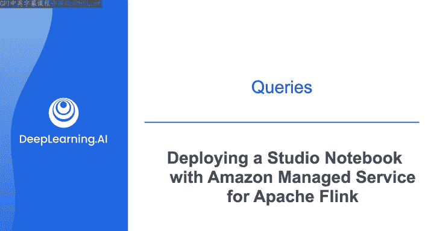
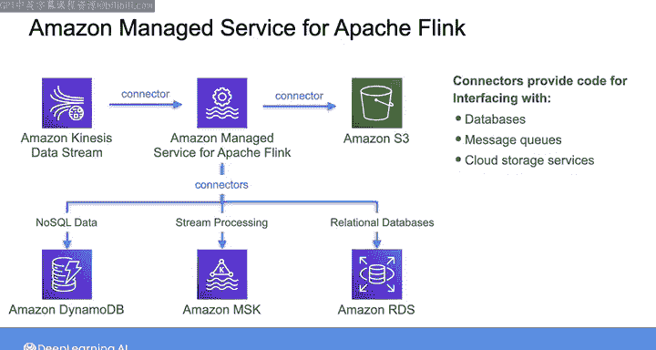
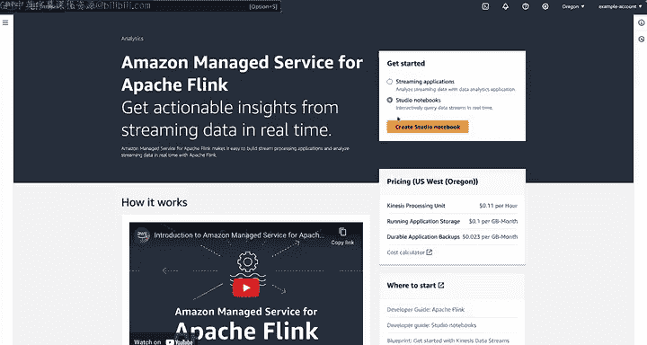
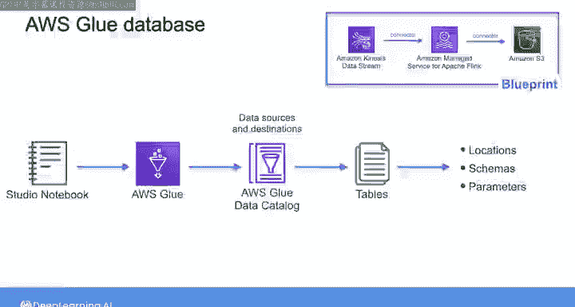

#  183：使用Amazon托管服务部署Apache Flink Studio笔记本 🚀

## 概述

在本节课中，我们将学习如何使用Amazon Managed Service for Apache Flink来部署一个Studio Notebook。我们将了解Flink如何通过连接器与不同系统交互，并实际操作一个基于Zeppelin的交互式笔记本，用于实时处理来自MSK主题的股票行情数据。

---

上一节我们介绍了如何将Flink应用程序部署到Amazon Kinesis数据流。本节中，我们来看看如何使用Studio Notebook进行类似的部署。

首先，我们需要了解Flink在幕后是如何工作的。Flink能够连接到Kinesis数据流并将数据写入S3，是通过使用**连接器**实现的。连接器提供了与各种系统交互的代码，这些系统包括数据库、消息队列和云存储服务。

例如：
*   你可以连接到**Amazon DynamoDB**来处理NoSQL数据。
*   可以使用**Amazon Kafka**连接器来处理Apache Kafka主题的流数据。
*   Flink连接器还通过**JDBC**支持关系型数据库，允许与运行在Amazon RDS上的MySQL或PostgreSQL等数据库集成。

这些连接器使Flink能够与不同的数据源和目的地交互，帮助你在不同平台和服务之间构建实时数据处理管道。

---

现在，让我们使用Amazon Managed Service for Apache Flink创建一个Studio Notebook，以便了解部署笔记本与部署应用程序之间的区别。

在AWS控制台中，我位于Managed Apache Flink仪表板上。这次我将选择“Studio notebook”，然后点击“创建”。

我将再次使用一个蓝图。这个蓝图会将演示数据发送到Managed Streaming for Apache Kafka（MSK）主题，然后由Managed Apache Flink读取。我们将使用Studio Notebook与这些数据进行交互。

部署蓝图后，当部署完成时，演示笔记本就可以供我们与MSK主题进行交互了。

这个演示将股票行情价格的演示数据发送到MSK主题，我们可以使用Flink实时与这些数据交互。

要打开笔记本，我可以选择“在Apache Zeppelin中打开”。这是一个基于浏览器的笔记本，支持协作式交互式数据分析。Zeppelin支持用SQL、Python和Scala等语言编写代码，你可以用表格和图表等不同格式可视化数据，还可以与Flink等工具和框架集成。这是数据科学家、分析师和工程师用来协作开发和分享数据见解的流行工具。

这就是由蓝图创建的Zeppelin笔记本。

---

在Zeppelin笔记本中，你使用**段落**来定义工作单元。

每个段落可以执行诸如运行代码、显示文本或执行数据可视化等操作，并且它们可以独立执行。这允许你将数据分析或数据处理任务分解为更易于管理的步骤，从而更轻松地开发、测试和调试工作流。

你可以在这些段落中使用不同的**解释器**来执行操作，例如运行SQL查询、执行Python脚本或与Apache Flink和Spark等大数据框架交互。

以下是笔记本中的关键段落及其功能：

*   **第一个段落**创建了一个用于生成股票行情数据的用户自定义函数。
    *   第一行 `%flink` 指定代码将使用Flink解释器执行。
    *   随后的代码定义并注册了一个名为 `random_ticker_udf` 的自定义Flink函数。该函数从一个预定义的列表中返回一个随机的股票代码符号，并为该行情价格提供一个随机值。然后，此函数可以在Flink SQL查询中用于生成随机的行情数据。

*   **第二个段落**使用MSK主题的连接器定义了一个源表。
    *   还有一个查询对该表执行 `SELECT *` 并显示结果。我们也可以将此显示更改为其他类型的可视化，如折线图或条形图。

*   **最后一个段落**允许你通过运行之前定义的函数，再次运行初始数据生成。
    *   这是为了让你可以执行基于时间窗口的查询。因为如果数据生成已经发生，并且当前没有数据流经流，你将得到空结果。所以你可以运行此段落来再次生成样本数据，以测试基于时间的查询。你将在接下来的实验课中看到使用基于窗口查询的示例。

---

在幕后，系统使用**AWS Glue数据库**来存储有关脚本正在使用的数据源和目的地的信息。

我们使用了蓝图，因此该数据库的创建和连接信息是由CloudFormation模板设置的。然而，在实际操作中，当你创建自己的Studio Notebook时，你需要指定包含数据源和目的地连接信息的AWS Glue数据库。

然后，当你想访问数据源和目的地时，你需要指定该数据库中包含的相关Glue表。这些表提供了对Glue连接的访问，这些连接定义了数据源和目的地的位置、模式和参数。

---

以上就是我们对Amazon Managed Service for Apache Flink的快速介绍。

接下来，你将在实验课中充分运用所有这些知识。一如既往，祝你学习愉快，我们稍后见。