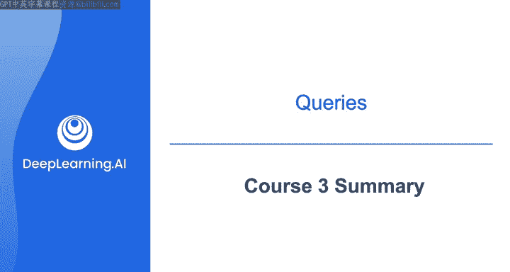
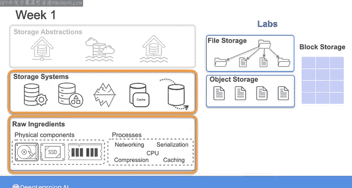
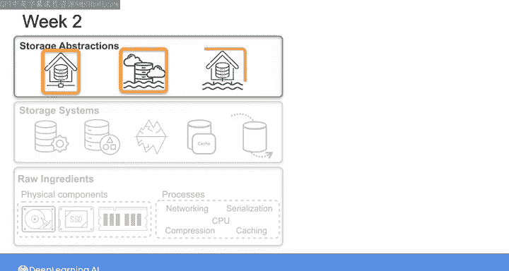
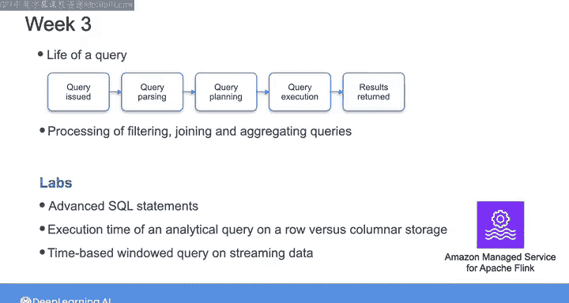

#  184：数据存储与查询 🗄️

在本节课中，我们将对数据工程专项课程的第三部分——“数据存储与查询”进行总结。我们将回顾本课程涵盖的核心内容，包括存储层次结构、存储系统的演进以及查询处理的生命周期。

---

恭喜你完成数据工程专项课程的第三部分。这意味着我们已经完成了三门课程，只剩最后一门。本课程我们深入探讨了数据工程生命周期中最复杂的阶段——数据存储，大家做得非常出色。

在第一周，我们探讨了存储层次结构中的前两层：**原始存储组件**以及由这些组件构建的**存储系统**。在实验环节，你比较了文件、块和对象云存储选项，并有机会实践了图数据库的操作。

以下是第一周的核心要点：
*   **原始存储组件**：如硬盘、SSD等物理或逻辑存储单元。
*   **存储系统**：基于原始组件构建的系统，例如文件系统、数据库。
*   **云存储比较**：文件存储（如NFS）、块存储（如AWS EBS）和对象存储（如AWS S3）的适用场景与差异。
*   **图数据库实践**：用于处理高度连接关系的数据，其核心查询语言通常是 **`Cypher`** 或 **`Gremlin`**。

---

上一节我们介绍了基础的存储组件与系统，在第二周，我们着眼于存储抽象概念的演进：从数据仓库到数据湖，最终到湖仓一体。你为数据湖设置了分区和数据目录，并获得了使用AWS Lake Formation和Apache Iceberg创建湖仓一体的实践经验。

以下是第二周的核心要点：
*   **数据仓库**：为结构化数据分析而优化的集中式存储库，通常采用星型或雪花型**`Schema`**。
*   **数据湖**：存储原始、各种格式（结构化、半结构化、非结构化）数据的存储系统。
*   **湖仓一体**：结合数据湖的灵活性与数据仓库的管理和性能优势的新型架构。
*   **实践内容**：在数据湖上配置**`PARTITION BY`**，使用AWS Glue建立数据目录，并利用Apache Iceberg表格式构建湖仓一体。

---

在了解了数据存储的形态之后，第三周我们深入探讨了查询的生命周期细节，包括筛选、连接和聚合查询在后台是如何被处理的。你通过高级SQL语句获得了实践经验，比较了在行式存储与列式存储上执行分析查询的时间，最后使用Amazon Managed Service for Apache Flink对流数据执行了基于时间窗口的查询。

以下是第三周的核心要点：
*   **查询生命周期**：从解析SQL语句到生成执行计划，再到从存储中读取和处理数据的过程。
*   **行式 vs 列式存储**：行式存储（如MySQL）适合事务处理，列式存储（如Amazon Redshift）适合分析查询，因其查询公式可表示为 **`SELECT column_a, column_b FROM table WHERE condition`**，仅需读取特定列。
*   **流处理窗口查询**：使用Apache Flink对无界数据流进行聚合，例如计算每分钟的销售额：**`SELECT TUMBLE_START(rowtime, INTERVAL '1' MINUTE), SUM(amount) FROM orders GROUP BY TUMBLE(rowtime, INTERVAL '1' MINUTE)`**。

---

到目前为止，通过完成三门课程，你已经掌握了成为一名成功的数据工程师所需的许多核心技能。在最后一门课程中，我们将重点学习如何为分析和机器学习用例建模并提供数据。我们下一门课再见。

---

**本节课总结**：
本节课我们一起回顾了“数据存储与查询”课程的核心内容。我们从存储的基础组件和系统学起，探索了从数据仓库到湖仓一体的架构演进，最后深入了解了查询处理的内部机制及不同存储格式对性能的影响。这些知识构成了构建高效、可靠数据平台的基石。