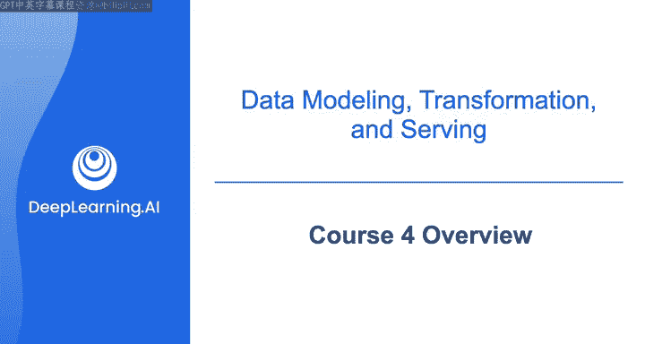
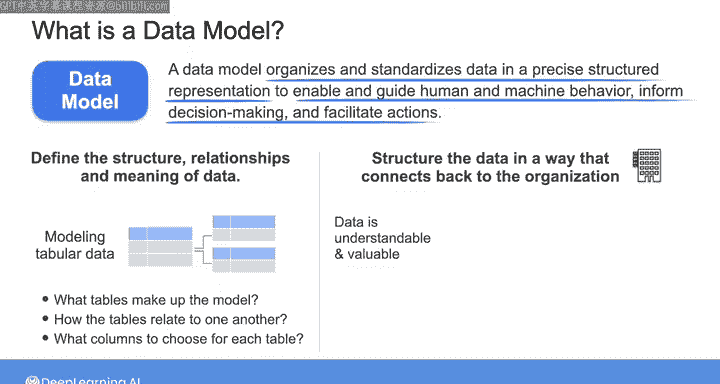
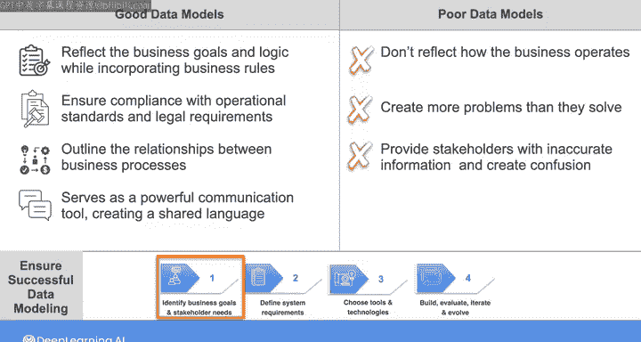
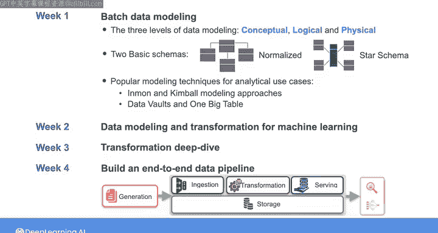

# 002：数据建模概览 🗺️

在本节课中，我们将要学习数据建模的核心概念、重要性以及它在数据工程生命周期中的位置。我们将了解什么是数据模型，为什么需要它，以及如何构建一个有效的模型来支持业务目标。

---

在第二和第三课中，你学习了如何将数据摄取到数据管道中，并探索了用于存储数据的各种解决方案。现在，在将数据提供给最终用户之前，你需要以一种支持其预期用例的形式来转换和建模数据。在本课程中，我们将从数据建模开始，然后在课程的后半部分更深入地探讨数据转换。

对你的数据进行建模，涉及有意识地选择一个与业务目标和逻辑相一致的、连贯的数据结构。那么，什么是数据模型呢？以下是我的定义：**数据模型将数据组织和标准化为精确的结构化表示，以启用和指导人类与机器的行为、支持明智的决策并促进行动**。

定义的第一部分意味着，当你对数据进行建模时，你需要定义数据的结构、关系和含义。例如，当你对表格数据进行建模时，你需要考虑构成模型的表、如何标记这些表、表之间如何关联以及为每个表选择哪些列。

你应该以一种与组织相关联的方式来构建数据，这是定义第二部分所暗示的。为了让数据服务于其目的，你需要让数据对人类而言是可理解和有价值的（如果你是为分析用例建模数据，例如创建报告或仪表板），或者让数据对计算机而言是有意义的（如果数据将用于机器学习用例）。

一个构建良好的数据模型应该反映业务目标和逻辑，同时纳入业务规则（例如，在处理订单前要求有效的支付方式），以确保符合运营标准和法律要求。一个好的数据模型还应概述业务流程之间的关系。例如，将销售数据与产品库存数据联系起来，以确保销售过程能直接了解当前库存水平，防止超卖。

除此之外，一个稳健的数据模型是一个强大的沟通工具，它在工程师、分析师和高管等利益相关者之间创建了一种共同语言。通过标准化业务词汇（例如，明确定义什么构成“活跃用户”——是过去30天内登录其账户的人，还是过去6个月内进行过购买的人，或是其他完全不同的标准），仔细定义业务术语可以对描述客户行为、预测客户流失等下游报告产生巨大影响。

因此，为了确保成功的数据建模，请回顾第一课中“像数据工程师一样思考”的框架，并始终从与利益相关者沟通开始。理解业务定义、规则和目标是建模数据并为业务提供高质量数据以获取可操作的见解和智能自动化的第一步。

另一方面，那些随意创建、不能反映业务运作方式的糟糕数据模型，可能会制造比解决的问题更多的问题。糟糕的数据模型非但不能促进沟通和共同理解，反而可能向利益相关者提供不准确的信息并造成混乱。我经常看到的另一个专业疏忽是，数据团队完全忽视数据建模，因为他们认为这是一个缓慢、乏味且无关紧要的过程，只适用于大公司。因此，他们直接开始构建数据系统，却没有计划如何组织数据以使其对业务有用。

这是一个巨大的错误。数据建模作为一种实践已有数十年历史，传统上用于构建存储在数据仓库和关系数据库中的数据。随着数据湖1.0、NoSQL和大数据系统的兴起，工程师们开始忽视传统的数据建模（有时是为了获得合理的性能提升）。然而，缺乏严格的数据建模导致了数据沼泽，以及大量冗余、不匹配或根本不准确的数据。

如今，数据管理（特别是数据治理和数据质量）日益普及，正在推动对连贯业务逻辑的需求。我认为数据建模是一项关键的实践，它能增强你作为数据工程师在整个数据生命周期中对数据的理解。数据建模有助于你提高数据质量和集成度，并鼓励在整个组织内采用数据。无论你所在的企业规模大小，你都应该采取有针对性的方法进行数据建模，专注于特定的业务领域。

例如，你可以创建一个数据模型来帮助营销团队更好地理解客户行为和活动效果。或者，你可以对公司的财务交易进行建模，以便财务团队能够分析支出模式并识别节省成本的机会。有针对性的数据建模工作可以提供有价值的见解，以推动更好的决策和有影响力的人工智能模型，即使在高度复杂的企业中也是如此。

在本课程的第一周，我将主要讨论批处理数据建模，因为大多数数据建模技术都源于此。我们将首先快速了解数据建模的三个传统层次：概念层、逻辑层和物理层，它们提供的细节程度各不相同。然后，我们将介绍两种基本模式：范式模式和星型模式，你将在本周的实验中实现它们。最后，我们将深入探讨一些用于分析用例的流行建模技术，例如Inmon和Kimball建模方法，以及其他技术，如数据仓库和数据保险库。

在本课程的第二周，我们将讨论用于机器学习用例的数据建模和转换技术。然后在第三周，我们将更深入地探讨转换，并讨论选择数据处理框架的各种技术考量。最后，我们将在本课程的第四周把你在这个项目中学到的所有知识整合起来，你将有机会构建一个端到端的数据管道，涵盖数据工程生命周期的所有阶段以及关键的底层支撑。

---

本节课中我们一起学习了数据建模的基本概念、其重要性以及它在数据工程中的核心地位。我们明确了数据模型的定义，理解了良好数据模型的特征，并概述了本课程后续将深入探讨的建模层次、模式和技术。下一节，我们将开始具体了解数据建模的不同层次。