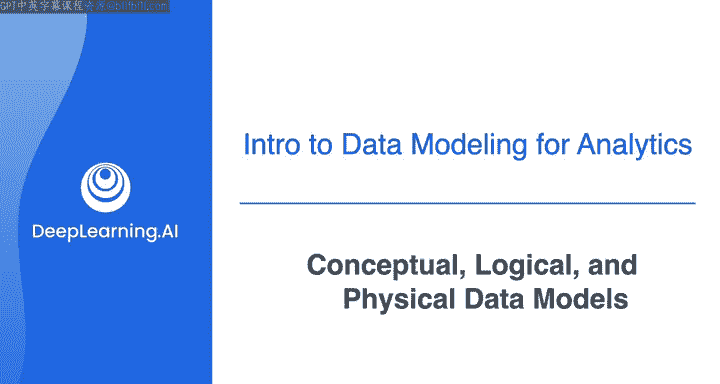
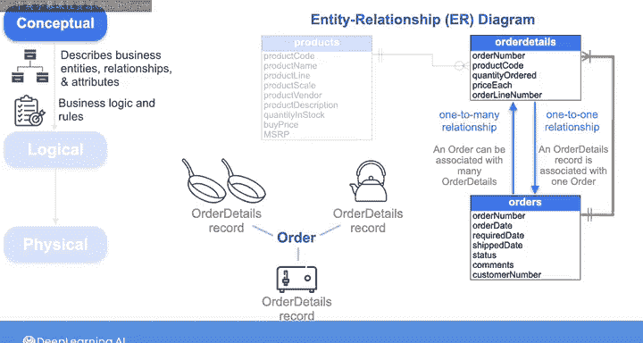
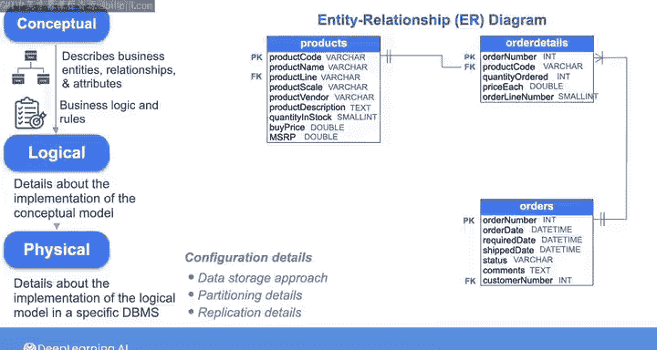

# 003：概念性、逻辑性与物理性数据建模 📊

在本节课中，我们将学习数据建模的三个关键层次：概念性、逻辑性和物理性数据模型。理解这些层次将帮助你构建清晰、高效且易于维护的数据架构，从而促进团队沟通与协作。

---

## 概述

作为数据工程师，你可以通过构建和维护数据模型来为组织创造价值，这些模型能促进沟通并建立共识。那么，从哪里开始呢？建议从高层的**概念性数据模型**开始，它描述了业务实体。然后，你可以填充更多细节以创建**逻辑性数据模型**。最后，你将创建**物理性数据模型**，在其中决定用于存储和提供数据的数据库或其他存储系统，并概述实现细节，即你在数据管道中用于实现这些存储系统的具体工具。

---

## 概念性数据模型 🧠

上一节我们介绍了数据建模的整体流程，本节中我们来看看最抽象的层次——概念性数据模型。

概念性模型应聚焦于高层次的业务实体、实体之间的关系以及每个实体的属性。它还应反映业务逻辑和规则。例如，对于表格数据，描述可以包括表、表之间的关系以及列名。

创建概念性模型时，可以使用**实体关系图**（ER图）进行可视化，这是一种标准工具，用于可视化数据不同方面（如客户、产品或事件）之间的关系。

以下是我们在第一门课程中使用的经典模型数据集ER图的一部分：

如图所示，它包含了产品和每个订单的订单详情数据。它使用特定符号编码了产品数据与订单详情之间的连接。

*   **`|`** 符号代表“有且仅有一个”，意味着每条订单详情记录只能与**一个且仅一个**产品关联。通常称这种从订单详情到产品的关系为**一对一关系**。
*   **`O<`** 符号代表“零个或多个”，意味着一个产品可以与**零个**订单详情关联（如果无人购买该产品），也可以与**多个**订单详情关联（如果被多次购买）。因此，这种从产品到订单详情的关系是**零或一对多关系**，更常简称为**一对多关系**，意味着一个产品可以与多个订单详情关联。

请注意，关系的性质取决于你观察关系的方向。此ER图还显示：
*   从订单详情到订单的关系是**一对一**（一个订单详情只能与一个订单关联）。
*   从订单到订单详情的关系是**一对多**（一个订单可以与多个订单详情关联）。

例如，如果客户在同一订单中购买了一批产品，那么就会有许多订单详情（每种购买的产品对应一个）。每个订单详情只与一个订单关联，但该订单会与多个订单详情关联。

---

## 逻辑性数据模型 📐

在概念性模型之后的下一个层次是逻辑性模型，你将在其中添加关于如何实现概念性模型的更多细节。

以下是逻辑性模型需要补充的关键信息：

*   为每个表的列添加**数据类型**信息。
*   规划出**主键**和**外键**。

---

## 物理性数据模型 ⚙️

最后，你将创建物理性模型，在其中选择特定的数据库管理系统（DBMS），并定义如何在该系统中实现逻辑性模型。

这个物理性模型应定义描述数据如何存储的配置细节（例如存储在磁盘、RAM或使用混合方法），以及如何实现**分区**和**复制**等过程。

因此，在对数据进行建模时，你将沿着这个连续体前进：从抽象的建模概念到具体的实现。

---

## 总结

本节课中，我们一起学习了数据建模的三个核心层次：
1.  **概念性模型**：关注业务实体和关系，使用ER图可视化。
2.  **逻辑性模型**：添加实现细节，如数据类型和键（主键、外键）。
3.  **物理性模型**：决定具体的存储系统（DBMS）和配置细节（如分区、复制）。

接下来，让我们深入数据建模的细节，首先详细探讨规范化。