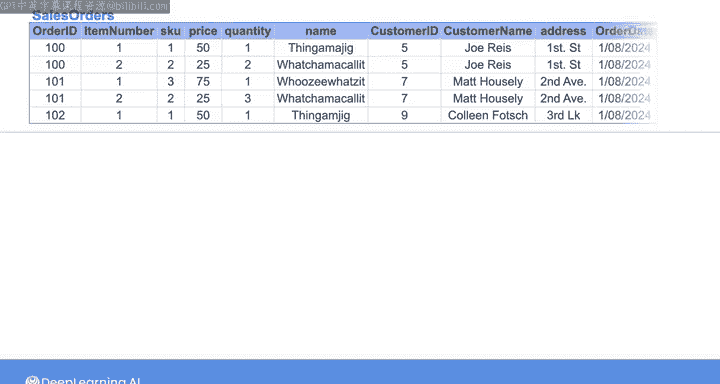
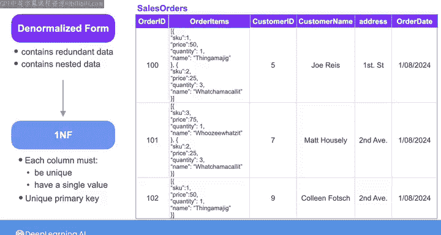
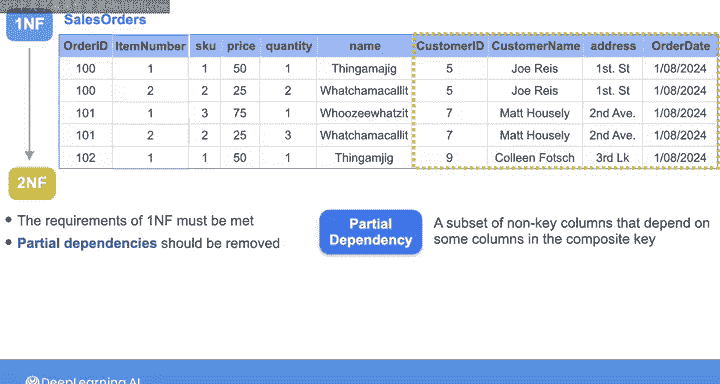
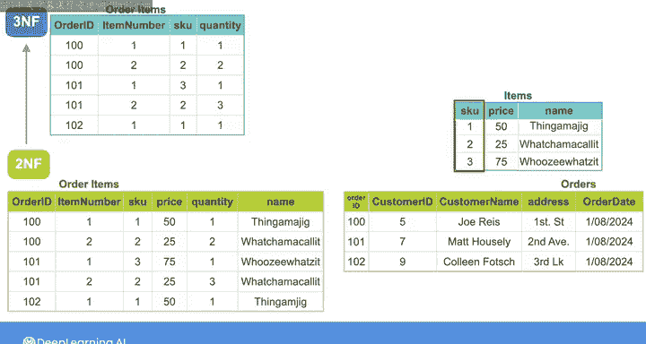
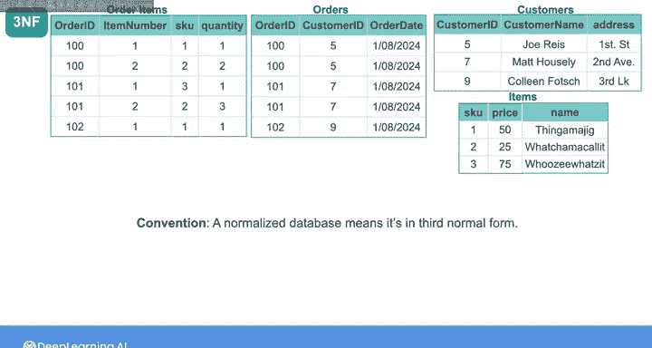

# 004：规范化 📊

在本节课中，我们将学习数据库设计中的一个核心概念——**规范化**。我们将回顾规范化的目的，并详细探讨其不同形式，从非规范化形式逐步演进到第三范式。通过理解这些概念，你将能够设计出更高效、更易于维护的数据库结构。

---

## 概述

在第二门课程中，我们讨论了关系型数据库作为源系统。我们学习了规范化如何减少数据冗余并提高数据完整性。在本视频中，我们将重新审视这一主题，并讨论规范化的各种形式。

规范化是一种数据建模实践，通常应用于关系型数据库，以消除数据库内的数据冗余，并确保数据库表之间的引用完整性。它最早由关系型数据库先驱埃德加·科德于1970年提出。

以下是科德当时概述的一些规范化目标：
*   使关系集合免受不良的插入、更新和删除依赖的影响。
*   减少在引入新数据类型时对关系集合进行重构的需求，从而延长应用程序的生命周期。

为了更好地理解科德的规范化目标，让我们看一个例子，其中销售订单数据以两种不同的方式表示。

第一个模型将数据表示在一个巨大的销售订单表中，而第二个模型将相同的数据分散在多个表中。

第一个模型的规范化程度较低，第二个模型的规范化程度较高。这意味着，与第二个模型中的较小表相比，巨大的销售订单表包含了更多的冗余数据。

例如，如果你想更新客户的地址（比如这里的乔·里斯），在第一个表中，你需要更新与乔·里斯对应的每一行。而在第二个模型中，客户数据存储在一个单独的表中。因此，每当你想更新客户的地址时，只需更改客户表中的一行即可。

现在，假设你想添加订单的发货信息。在规范化程度较低的模型中，你需要通过为发货信息添加新列来更改表的结构。但在规范化程度较高的模型中，你可以简单地创建一个新的发货数据表，然后使用订单ID作为外键将这个新表链接到现有的订单表。这样，你就不必更改任何其他表。

第一个规范化程度较低的模型称为**第一范式**，而这里规范化程度较高的模型称为**第三范式**。在规范化的谱系中，还有**非规范化形式**和**第二范式**。每种形式都包含不同级别的冗余，并包含了先前形式的条件。

---

## 从非规范化到第三范式

使用相同的销售订单示例，让我们从非规范化形式开始，逐步将其转换为第三范式。

以下是包含客户每个订单详细信息的非规范化表。它包含六列，以订单ID为主键。

非规范化形式不仅包含冗余数据，还包含嵌套数据。在这个例子中，“订单商品”列包含嵌套对象，每个对象包含诸如商品SKU编号、价格、数量和名称等信息。

### 转换为第一范式 (1NF)

为了将此非规范化表转换为**第一范式**（此处记为1NF），你需要确保每列都是唯一的且具有单一值（即没有嵌套数据），并且表必须具有唯一的主键。

因此，让我们展开“订单商品”列，并用四个新列替换它：`item_sku`、`price`、`quantity` 和 `name`。

现在，每一行代表给定订单中的一个商品。由于一个订单可以包含多个商品，订单ID不再是此表的唯一主键。为了创建唯一的主键，让我们通过添加一个名为 `item_number` 的列来为每个订单中的商品编号。

现在，由 `order_id` 和 `item_number` 组成的复合键共同构成了此表的唯一主键。

### 转换为第二范式 (2NF)

但这种形式仍然包含冗余数据，可以通过将其转换为**第二范式**（此处记为2NF）来进一步规范化。

对于第二范式，必须满足第一范式的要求，并且应移除任何**部分依赖**。部分依赖发生在非键列的子集依赖于复合键中的某些列时。

例如，`customer_id`、`customer_name`、`customer_address` 和 `order_date` 这些非键列都依赖于 `order_id`。这意味着，如果你知道 `order_id`，你就可以唯一地确定这最后四列中的信息。

因此，你可以将销售订单表拆分为两个表：一个订单商品表和一个订单表。

由 `order_id` 和 `item_number` 组成的复合键现在是订单商品表的唯一主键，而 `order_id` 是订单表的主键。

现在，这些表中不再有部分依赖，但它们有另一种形式的依赖，称为**传递依赖**。

### 转换为第三范式 (3NF)

传递依赖发生在非键列依赖于另一个非键列时。

例如，在订单商品表中，商品的价格和名称取决于其SKU。在订单表中，客户姓名和地址取决于客户ID。

虽然这种类型的依赖可以存在于第二范式的表中，但**第三范式**的表需要满足第二范式的所有要求，并且没有传递依赖。

因此，为了将这些表从第二范式转换为第三范式，你可以通过创建另一个名为 `items` 的表来移除订单商品表中的传递依赖，该表包含每个商品的名称、价格和SKU。`sku` 现在是 `items` 表的唯一主键。

同样，让我们通过创建一个包含每个客户的客户姓名和客户地址的新表来移除订单表中的传递依赖。`customer_id` 现在是 `customers` 表的唯一主键。

---

## 规范化的应用与权衡

数据库如果处于第三范式，通常被认为是规范化的，这也是我们在本课程中将使用的惯例。

作为数据工程师，你可能会从已规范化的源数据库（尤其是那些代表事务系统的数据库）中提取数据，或者你可能会处理包含规范化数据的数据仓库。

当你对数据进行建模时，应用于数据的规范化程度取决于你的使用场景。

没有一种放之四海而皆准的解决方案。你可能会遇到非规范化实际上具有性能优势的情况，因为它不需要你在表之间执行任何连接操作。在其他情况下，你可能更喜欢规范化的形式，以确保高效的读写操作和更好的数据完整性。

在本周的第一个实验中，你将有机会练习创建一个规范化的数据模型，类似于我们刚刚在本视频中一起做的练习。你将获得一个非规范化的表，并需要应用几个规范化步骤将其转换为第三范式。

---

## 总结

在本节课中，我们一起学习了数据库规范化的核心概念。我们从非规范化形式出发，逐步探讨了第一范式、第二范式和第三范式的定义与转换方法。我们了解到，规范化通过消除冗余和依赖，可以提高数据完整性并简化数据维护。同时，我们也认识到，在实际应用中，需要在规范化带来的结构优势与非规范化可能带来的性能优势之间做出权衡。掌握这些知识，将帮助你作为数据工程师，根据具体业务需求设计出更合理、更高效的数据模型。