# 005：维度建模与星型模式 ⭐

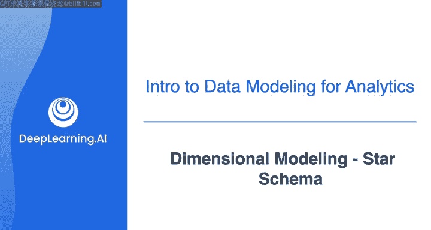

在本节课中，我们将要学习一种名为**星型模式**的数据建模方法。星型模式，也称为维度数据模型，其核心目标是通过特定的结构组织数据，以支持更快的分析查询，并使业务用户更容易理解数据。我们将详细探讨星型模式的构成、设计原则及其相较于规范化模型的优势。

## 概述：什么是星型模式？

规范化模型侧重于连接数据实体并建模关系以减少数据冗余。而星型模式则采用不同的思路。

星型模式将业务度量值收集在一个称为**事实表**的表中，并用存储在**维度表**中的必要上下文信息围绕该表，形成一个类似星型的结构，因此得名“星型模式”。

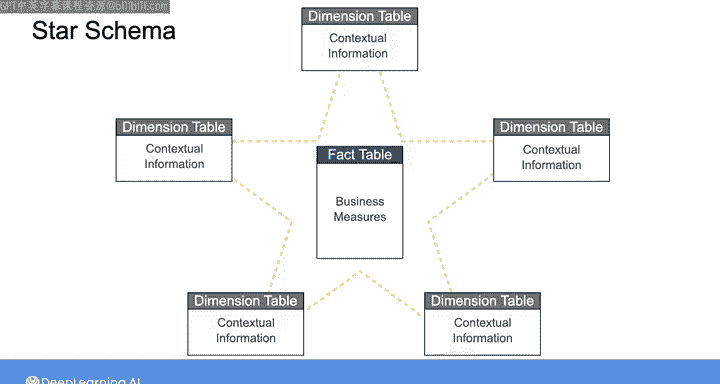

接下来，让我们深入了解事实表和维度表，看看它们如何更好地支持分析查询。

## 深入事实表与维度表

### 事实表：记录业务事件的核心

事实表包含由业务事件或流程产生的定量业务度量值。

例如，当你预订一次网约车时，该事件会产生诸如行程时长、行程价格、支付的小费、行程延误等度量值。这些业务度量值就是我们所说的**事实**。因此，事实表中的每一行都对应一个特定业务事件的事实。

在设计星型模式模型时，你还需要决定所谓的**粒度**，即你希望在事实表的每一行中显示的详细程度。

在网约车的例子中，事实表的每一行可以代表：一天内所有客户完成的所有行程、一天内单个客户的所有行程，或者单个客户完成的一次行程等。虽然存在多种粒度级别，但我建议你采用所谓的**原子粒度**，它指的是给定业务流程捕获数据的最详细级别。

因此，对于网约车示例，理想情况下，事实表的每一行应对应单个客户完成的一次行程。

由于事实与事件相关，而事件发生后无法更改，因此事实表中的数据是**不可变的**。换句话说，事实表不会更改，我们只追加新数据。因此，你会发现大多数事实表通常都是**窄而长**的，这意味着它们不会有太多列，但可以有很多行来代表事件。

### 维度表：提供事件的上下文

事实表总是伴随着维度表，维度表为存储在事实表中的事件提供参考数据、属性和关系上下文。

它们描述事实表中每个事件的**内容、人物、地点和时间**，并且通常有很多列。因此，与窄而长的事实表相比，维度表通常是**宽而短**的，这意味着它们会有很多描述性列，但行数较少。

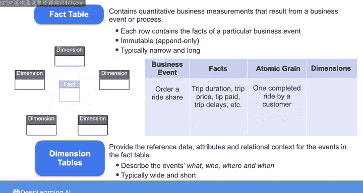

在网约车示例中，你可以有包含客户、司机和行程位置信息的维度表。

因此，在星型模式中，中心是包含业务事件事实的事实表，周围是提供额外上下文的维度表。

在某些情况下，你甚至可以将一个维度表连接到来自不同星型模式的多个事实表。在多个星型模式中重复使用的维度称为**一致性维度**。

## 星型模式的结构与连接

事实表通过**外键**连接到维度表。每个维度由一个**主键**定义，事实表也有自己的主键，这个主键可以是来自生产表的自然主键，但最佳实践是创建自然主键的替代品，也称为**代理键**。

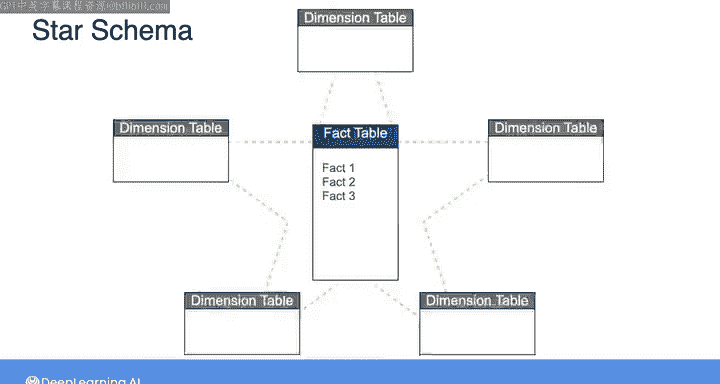

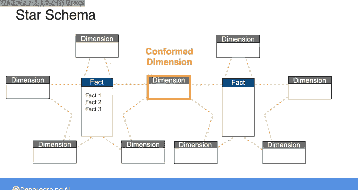

这样，你就可以组合来自不同源系统的数据，这些系统的自然主键可能以不同格式编写，并且你可以将星型模式的主键与可能发生变化的源数据库主键解耦。

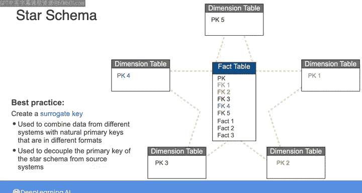

以下是你在课程1的第一个实验中接触过的一个星型模式示例。

事实表中的每一行对应订单中放置的一个产品，并包含诸如订购数量、单价、总价等业务度量值。该事实表连接到三个维度表，这些表提供与客户、产品以及下单地点相关的进一步特征。

你可以看到事实表有一个由订单号和订单行号组成的复合主键，并且该表包含三个外键来连接三个维度表。

## 星型模式如何助力分析查询？

那么，星型模式究竟如何帮助分析查询呢？

你可以从事实表开始，通过应用聚合查询来查找事实表中特定事实度量值的总和、平均值或最大值。然后，你可以使用维度表来过滤或分组事实。

例如，假设你有兴趣找出美国境内每个产品线的总销售额。你需要对事实表中的订单金额列进行求和。

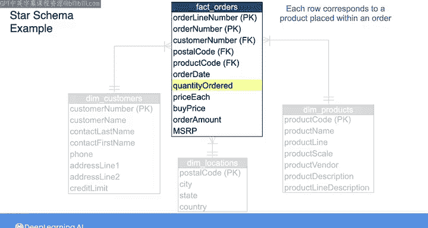

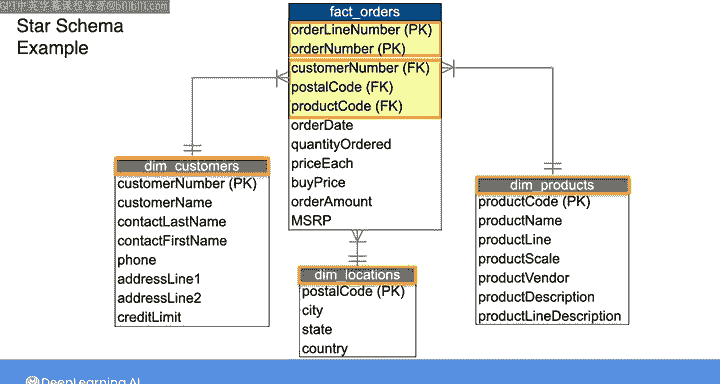

在SQL中，你可以从事实表中选择订单金额的总和，并将其命名为总销售额。然后，你需要使用产品维度表中的产品线列来对销售额进行分组，因此你可以基于产品代码将事实表与产品维度表连接起来。你还需要在SELECT子句中指定产品线，然后按产品线对结果进行分组。

接着，你必须使用位置维度表中的国家列来过滤结果，以便只计算发生在美国的销售额。因此，你可以基于邮政编码连接位置表，然后过滤国家等于“USA”的结果。

最终，你会得到一个如下所示的SQL查询：

```sql
SELECT 
    p.productLine,
    SUM(f.orderAmount) AS total_sales
FROM 
    fact_table f
JOIN 
    product_dimension p ON f.productCode = p.productCode
JOIN 
    locations_dimension l ON f.postalCode = l.postalCode
WHERE 
    l.country = 'USA'
GROUP BY 
    p.productLine;
```

## 与规范化模型的查询对比

假设你想使用数据集的规范化版本查找相同的信息（美国境内每个产品线的总销售额）。那个查询会是什么样子呢？

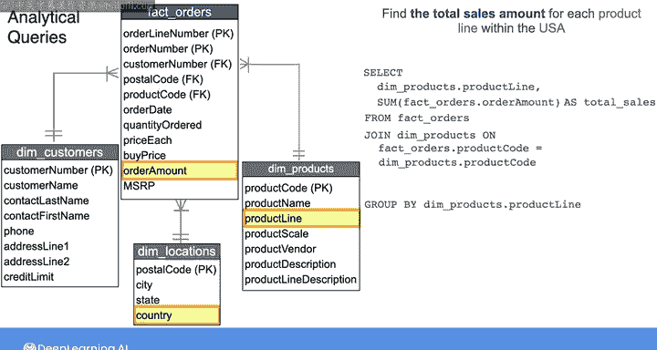

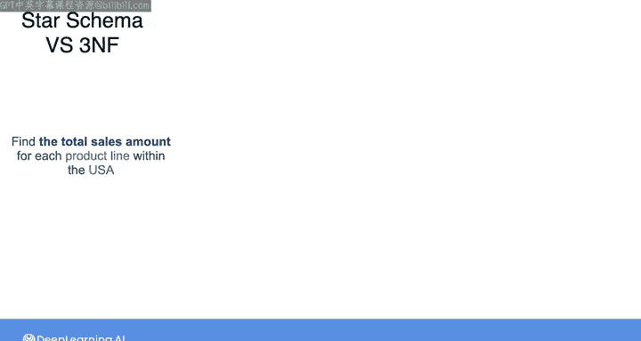

首先，你需要定位你要查找的业务度量值，即总销售额。你可以通过将订单明细表中的单价列与订购数量列相乘来获得这个值。

然后，你必须将订单明细表与产品表连接，再将产品表连接到产品线表以按产品线分组。最后，你必须连接客户表、订单表和订单明细表，以按国家过滤结果。

虽然两种模型包含相同的信息，但星型模式以更易于业务用户理解和导航的方式组织数据。它还导致查询更简单，连接更少，从而加快了查询性能。

## 总结：两种模型的适用场景

在本节课中，我们一起学习了星型模式（维度数据模型）的核心概念。我们了解到，事实表存储不可变的业务事件度量值，维度表提供描述性上下文。它们通过外键连接，形成星型结构，旨在优化分析查询。

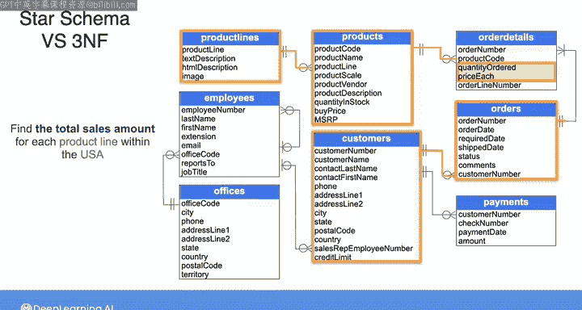

规范化形式和星型模式各有其用武之地。规范化形式确保数据完整性并避免数据冗余，而星型模式则有助于分析工作负载。

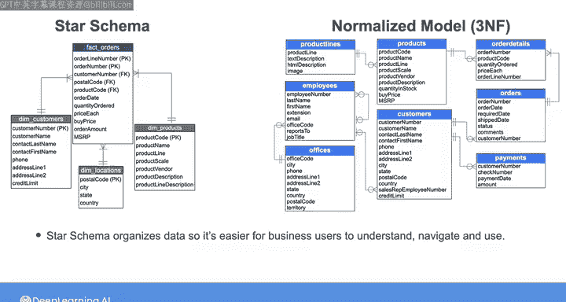

在下一个视频中，我们将讨论这两种形式如何在数据仓库中使用。我们下次见。