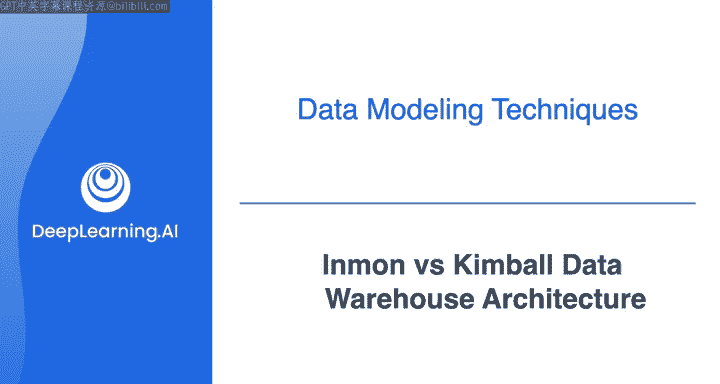
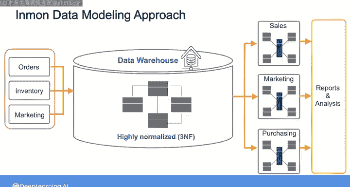
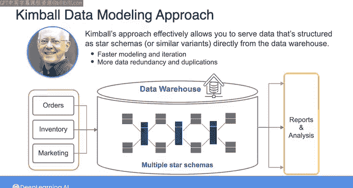
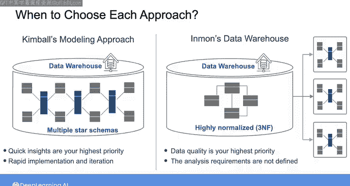

# 006：Inmon与Kimball数据仓库建模方法对比 🏗️

在本节课中，我们将要学习数据仓库领域的两种核心数据建模方法：Inmon方法和Kimball方法。我们将探讨它们各自的定义、核心思想、应用场景以及优缺点，帮助你理解如何在不同的业务需求下选择合适的建模策略。

---

## 概述

在之前的课程中，我们讨论了数据仓库作为一种存储系统，用于将事务处理系统与分析系统分离。但我们并未深入探讨数据在数据仓库内部是如何被建模以支持这一目标的。数据仓库的数据建模有多种方法，作为数据工程师，你在工作中很可能会遇到其中最主要的几种：Kimball方法、Inmon方法和数据仓库建模方法。本视频将重点讲解Inmon和Kimball方法。

---

## Inmon数据建模方法

上一节我们回顾了数据仓库的基本概念，本节中我们来看看由“数据仓库之父”Bill Inmon提出的建模方法。Inmon在1989年创建了他的数据仓库建模方法，其核心目标是实现事务系统与分析系统的分离。

Inmon将数据仓库定义为一个**面向主题的、集成的、非易失的、随时间变化的数据集合**，用于支持管理决策。该定义的延伸指出，数据仓库包含细粒度的企业级数据，这些数据能够用于多种不同目的，甚至可以满足当前尚未明确的未来需求。

这里的“面向主题”和“细粒度”意味着，Inmon模型将数据按照业务的主要主题领域进行组织，并包含与这些主题相关的所有细节。例如，在一家电子商务公司，主题可能包括产品、订单、客户、货运等。对于每个主题，数据模型必须包含所有细节，如业务键、关系和属性。

因此，采用Inmon数据建模方法，你需要整合来自不同数据源的数据，并将其建模为高度规范化的形式，然后存储到数据仓库中。随后，你可以通过部门特定的数据集市为下游的报告和分析提供数据。

这种方法使数据仓库成为**支持多种数据用例的单一事实来源**，即使当前的分析需求尚未明确。数据仓库中严格的规范化要求减少了数据重复，从而降低了下游分析错误，并确保了更好的数据完整性和一致性。

以下是应用Inmon建模方法于电商数据的示例：

假设业务将订单、库存和营销信息存储在不同的源系统中。你可以从这些源摄取数据，并以高度规范化的第三范式将其存储在数据仓库中。为了满足部门特定的数据需求，你可以从数据仓库中取出这些数据，将其建模为各种星型模式或其他合适的模型，并放入下游的销售、营销和采购数据集市中。每个部门都有其独特且针对特定需求优化的数据结构，这样各部门的数据用户就能轻松查询数据以满足其用例。

---

## Kimball数据建模方法

了解了以高度规范化的数据仓库为核心的Inmon方法后，本节我们来看看另一种思路。与Inmon方法不同，Kimball建模方法更侧重于直接在数据仓库中对部门特定的分析进行建模和服务，而无需先将数据规范化。

该方法由Ralph Kimball在20世纪90年代初提出，它允许你直接从数据仓库本身提供结构化为星型模式或类似变体的数据，从而将数据集市整合到整体的仓库架构中。

以下是Kimball数据仓库用于电商的示例：

从订单、库存和营销存储系统摄取数据后，你将数据建模为多个星型模式，以应对业务的不同事实，然后直接将其存储在数据仓库中。

Kimball方法支持更快的建模，从而实现比Inmon方法更快的迭代，但其代价是潜在的数据完整性问题。因为你将具有更多数据冗余和重复的星型模式直接存储在了数据仓库中。

---

## 方法对比与选择建议

我们已经分别介绍了Inmon和Kimball两种方法的核心流程，现在我们来对比一下，并探讨如何根据实际情况进行选择。

以下是两种方法的关键对比点：

*   **核心理念**：Inmon方法将数据仓库视为规范化的单一事实来源，在其上构建数据集市。Kimball方法则在数据仓库内直接构建面向部门的维度模型（如星型模式）。
*   **数据结构**：Inmon强调**高度规范化（如第三范式）**。Kimball强调**维度建模（如星型模式）**。
*   **实施速度**：Inmon方法通常较慢，因为需要先完成全面的规范化。Kimball方法通常更快，利于快速迭代。
*   **数据一致性**：Inmon方法通过单一事实来源确保更高的数据一致性和完整性。Kimball方法由于可能存在冗余，数据一致性维护的挑战更大。
*   **灵活性**：Inmon方法对未定义的分析需求更灵活。Kimball方法更针对已知的、具体的业务分析流程。

因此，如果你的组织优先考虑对特定业务流程的快速、实用洞察，并寻求数据仓库的快速实施和迭代，那么建议你采用Kimball方法。

另一方面，如果数据质量是你的最高优先级，或者分析需求尚未明确，那么建议你选择Inmon的数据建模方法。该方法将数据仓库视为单一事实来源，所有数据集市都建立在高度规范化的数据仓库之上，以确保数据的一致性和完整性。

根据你所在的组织，在为不同的数据仓库建模时，你可能需要同时应用Inmon和Kimball两种建模方法。因此，理解如何处理高度规范化的数据和星型模式中的数据非常重要。

---

## 总结与下节预告

本节课中，我们一起学习了数据仓库的两种基础建模方法：Inmon方法和Kimball方法。我们了解了Inmon方法如何通过高度规范化的数据仓库确保数据质量与一致性，以及Kimball方法如何通过维度建模实现快速的业务洞察交付。

在讨论另一种数据建模方法之前，请与我一起进入下一个视频，学习如何将第三范式中的规范化数据模型转换为星型模式。