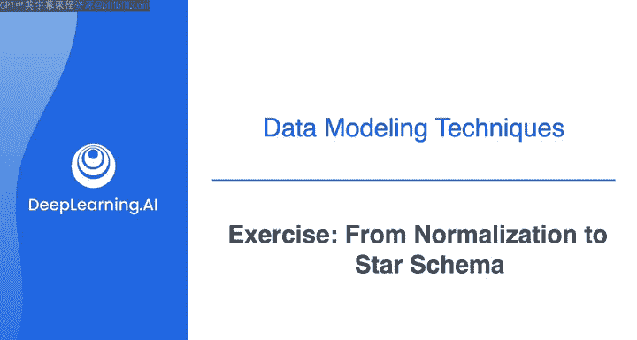
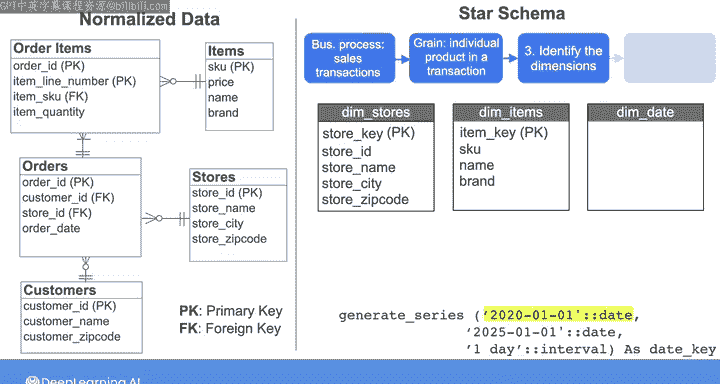
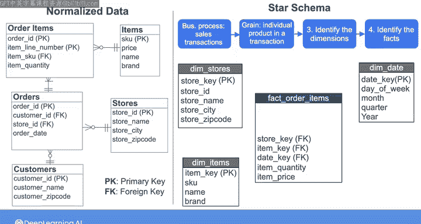
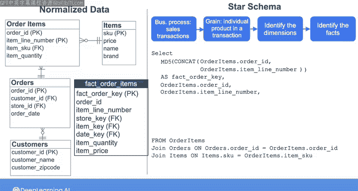
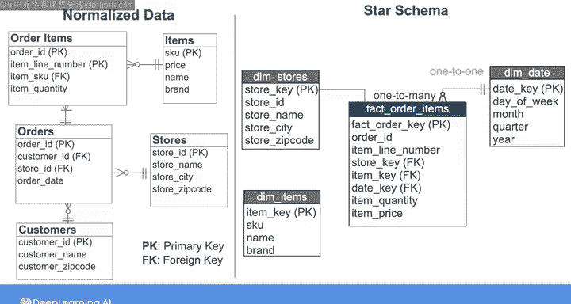
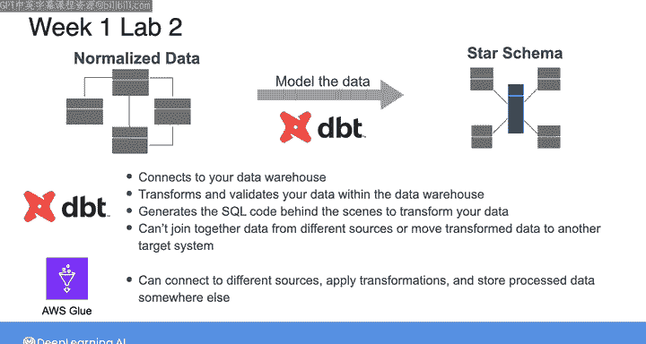

# 007：从规范化模型到星型模式 🚀



在本节课中，我们将学习如何将存储在规范化模式中的数据转换为星型模式。这是数据工程师的一项常见任务，旨在使数据更易于查询和分析。

## 概述

作为数据工程师，您很可能需要将存储在规范化模式中的数据转换为星型模式。例如，您可能需要从关系数据库中提取规范化数据，并将其建模为星型模式，以便在加载到部门特定的数据市场之前更容易查询。本节我们将通过一个示例，演示如何将第三范式（3NF）的规范化数据转换为星型模式。

## 从规范化模型到星型模式的转换步骤

以下是我们在之前视频中通过应用规范化阶段获得的规范化数据的ER图。它由四个表组成：`customers`（客户）、`orders`（订单，由客户下达）、`order_items`（构成每个订单的商品）以及`items`（每个商品的特性）。我在这里添加另一个表`stores`，来表示每个订单下达的商店。在此图中，PK表示主键，FK表示外键。

假设您的任务是将这些数据建模为星型模式，以供公司内的数据分析师使用。我们将遵循Kimball提出的设计星型模式的四个关键步骤。

### 第一步：理解业务需求

这有助于您确定要在事实表中建模的业务事件或流程，并帮助您声明粒度，即您希望事实表中每一行代表的详细程度。

以下是确定业务需求的关键点：
*   与数据分析师沟通后，了解到他们有兴趣分析销售数据，以了解特定日期哪些产品在哪些商店销售。
*   分析不同商店之间的销售是否存在差异。
*   确定哪些产品品牌最受欢迎。

由此，您确定需要建模的业务流程是公司的销售交易。

### 第二步：确定事实表粒度

您可以选择在事实表的每一行中表示特定日期的总销售交易额、单笔销售交易，甚至是销售交易中的单个产品项目。在决定粒度时，建议选择原子粒度，以捕获销售交易的最低级别细节。这样可以使您的系统足够灵活，以应对未来不可预测的用户问题。

因此，我们将粒度声明为**交易中的单个产品项目**。

### 第三步：选择维度表

由于数据分析师有兴趣分析关于商店、日期和品牌的销售情况，您可以创建一个代表商店的维度表、一个代表商品特性的维度表以及一个日期维度表。

以下是创建维度表的SQL示例：

**创建商店维度表**
您需要从`stores`表中选择`store_id`、`store_name`、`store_city`和`store_zip_code`。您还需要为此表设置一个主键。通常，您希望生成代理键并将其用作维度和事实表的主键。这可以确保星型模式中的每一行都可以通过事实表和维度表的主键唯一标识，而不受商店系统可能发生的变化的影响。

要为商店维度表生成代理键，您可以创建一个从1开始的整数序列，并为每个商店分配一个整数；或者，您可以使用哈希函数，该函数接收自然主键并为每个商店输出唯一的代理键。流行的数据库管理系统（如PostgreSQL和MySQL）支持多种哈希函数。例如，MD5是一种将字符串编码为哈希输出的哈希函数。

假设生产数据库中的`store_id`是字符串，我可以对`store_id`应用MD5哈希函数来为每一行生成代理键，并将代理键标记为`store_key`。如果`store_id`实际上是整数值，则需要先将其转换为字符串。

```sql
SELECT
    MD5(store_id) AS store_key,
    store_id,
    store_name,
    store_city,
    store_zip_code
FROM stores;
```

执行此SQL语句后，您将得到这个商店维度表。请注意，为了便于引用和解释，它同时包含代理键`store_key`和自然键`store_id`。

**创建商品维度表**
通过从`items`表中选择`sku`、`name`和`brand`来创建商品维度表。然后，对于主键，您可以对`sku`（假设`sku`是字符串）应用MD5哈希函数，然后将代理键标记为`item_key`。

```sql
SELECT
    MD5(sku) AS item_key,
    sku,
    name,
    brand
FROM items;
```

您将得到这个商品维度表。



**创建日期维度表**
日期维度背后的理念是，对于每个日期，您可以创建指定相应星期几、月份、季度和年份的列。这将帮助数据分析师回答诸如“2022年第一季度总销售额是多少？”或“周末哪些产品最受欢迎？”等问题。

要创建日期维度表，您可以生成一系列覆盖所需时间段的连续日期。以下是在PostgreSQL中生成一系列每日日期的一种方法：首先生成从2020年1月1日到2025年1月1日的一系列日期，然后从每个日期中提取星期几、月份、季度和年份。

```sql
SELECT
    date_series AS date_key,
    EXTRACT(DOW FROM date_series) AS day_of_week,
    EXTRACT(MONTH FROM date_series) AS month,
    EXTRACT(QUARTER FROM date_series) AS quarter,
    EXTRACT(YEAR FROM date_series) AS year
FROM generate_series('2020-01-01'::date, '2025-01-01'::date, '1 day'::interval) AS date_series;
```

这样，三个维度表就创建好了。



### 第四步：创建事实表



事实表中的每一行必须代表销售交易中的一个产品。与每个产品相关的事实是销售数量（可以从`order_items`表获取）和每个商品的价格（可以从`items`表获取）。此外，事实表必须包含连接维度表的外键。在本例中，这些是`store_key`、`item_key`和`date_key`，它们是为每个维度表创建的代理键。当然，事实表必须包含一个主键来唯一标识每一行。您可以创建一个由`order_id`和`item_line_number`组成的复合键，但更好的做法是从这两个自然键的组合生成一个代理键。

因此，`fact_order_item`表应该类似这样。现在，让我们编写SQL查询来创建这个事实表。

对于主键，您将从`order_items`表中选择`order_id`和`item_line_number`，然后连接它们，以便对连接后的字符串应用MD5哈希函数来生成代理键。您将其标记为`fact_order_key`。为了便于引用，您还将在事实表中包含自然键`order_id`和`item_line_number`。然后，您将连接`orders`表和`items`表，以便创建其余属性。

对于外键，让我们对`orders`表中的`store_id`应用哈希函数，以创建连接到商店维度表的`store_key`。然后，对`order_items`表中的`item_sku`应用哈希函数，以创建连接到商品维度表的`item_key`。最后，从`orders`表中选择`order_date`，以创建连接到日期维度表的`date_key`。别忘了，我们需要添加两个事实：从`order_items`表中选择`item_quantity`，从`items`表中选择`price`。

```sql
SELECT
    MD5(CONCAT(oi.order_id, oi.item_line_number)) AS fact_order_key,
    oi.order_id,
    oi.item_line_number,
    MD5(o.store_id) AS store_key,
    MD5(oi.item_sku) AS item_key,
    o.order_date AS date_key,
    oi.item_quantity,
    i.price
FROM order_items oi
JOIN orders o ON oi.order_id = o.order_id
JOIN items i ON oi.item_sku = i.sku;
```

## 星型模式的关系分析

这是我们刚刚创建的星型模式的ER图。由于订单中的商品是在特定日期购买的，`order_items`事实表中的每一行只能与日期维度表中的一行关联。因此，从`order_items`事实表到日期维度表的关系是一对一的，并由此处的符号表示。

另一方面，一个特定日期可能不与任何订单关联（如果当天没有人购买任何东西），或者可能与多个订单关联（如果当天下了多个订单）。从日期维度表到`order_items`事实表的关系是零或一对多，或更常见地称为一对多。

类似地，订单中的商品在给定商店购买，并对应单个商品。因此，事实表中的每一行与商店维度表中的一行和商品维度表中的一行关联。从事实表到这些维度表的关系是一对一。但任何商店和任何商品都可能与多个订单关联，因此从这些维度表到事实表的关系是一对多。



## 工具选择：DBT 与 AWS Glue

如果您想进行更多练习，我已在视频后的阅读材料中包含了另一个建模示例。在本周最后一个实验中，您还将有机会将规范化数据建模为星型模式。虽然您可以像在前面的实验中使用AWS Glue那样编写自己的代码来转换数据，但在这个实验中，您将使用一个流行的数据转换工具DBT，它通过抽象掉大量编写纯SQL代码的繁重工作来帮助您建模数据。

DBT允许您连接到数据仓库，然后在数据仓库内部转换和验证数据。它将建模过程视为转换任务，并在后台生成SQL代码来转换数据。尽管DBT简化了转换步骤，但它只能连接到单个目标，这意味着您不能使用DBT连接来自不同源的数据，并且在数据转换后不能将其移动到另一个目标系统。要连接来自多个源的数据，您需要首先将数据引入同一个目标系统内。

另一方面，AWS Glue允许您连接到不同的源，应用转换，并将处理后的数据存储在其他地方。因此，如果您需要对将要移动的数据执行转换，应选择AWS Glue或类似的摄取工具，而不是DBT。

## 总结



在本节课中，我们一起学习了如何将规范化数据模型转换为星型模式。我们首先理解了业务需求并确定了事实表的粒度，然后创建了维度表（商店、商品、日期）和事实表，并分析了它们之间的关系。最后，我们简要比较了DBT和AWS Glue这两种数据转换工具的使用场景。通过掌握这些步骤，您将能够更有效地构建易于查询和分析的数据模型。