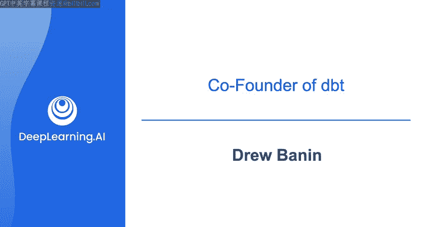

# 008：与Drew Banin讨论dbt 🛠️

在本节课中，我们将与dbt Labs的联合创始人Drew Banin进行对话，深入探讨dbt是什么、它解决了什么问题，以及数据从业者应如何有效地使用它。我们将了解dbt在现代数据平台中的角色，并学习一些使用dbt的最佳实践。

---

## 什么是dbt？🤔

上一节我们介绍了课程概述，本节中我们来看看dbt究竟是什么。Drew Banin首先为不了解他的观众做了自我介绍。

我的名字是Drew，是dbt Labs的联合创始人之一。我住在宾夕法尼亚州费城，我们从事dbt开发工作大约已有八年。

对于学习者可能首先会问的问题——“什么是dbt”，Drew给出了详细的解释。

这是一个很好的问题。我为所有新员工做一个入职培训，我们称之为“什么是dbt”。有趣的是，这个培训长达一小时，而我用前50分钟谈论dbt之外的一切。我喜欢先为现代数据平台搭建一个背景。

这涉及数据仓库或类似的东西，以及连接到数据平台的工具。所以，首先是数据仓库和数据摄取，将你所有的数据集中到一个地方。只有在介绍了所有这些之后，我们才谈论dbt。我将把这个60分钟的演讲浓缩到大约一分钟。

我认为dbt是为你的数据应用业务逻辑规则，从而将数据转化为有用信息的工具。

如果我们思考数据，它是数字、字符串、状态。但时间戳是UTC时间还是太平洋时间？出现的数字是美元、加元还是欧元的收入？如果我们把业务逻辑看作规则，那么使用dbt，你可以用SQL和Python将这些规则代码化，可以版本控制这些逻辑，并采用基于软件工程的工作流来管理逻辑随时间的变化。

然后，dbt会帮助你在数据平台内部将这些逻辑应用到你的数据上。我们不会把你的数据从数据仓库中取出、转换再放回去。我们所做的是指示数据仓库在原地转换你的数据。人们喜欢这一点，因为它更安全、治理更好，数据不会离开你的数据平台。

这是三万英尺的宏观视角，除此之外还有很多可以讨论的，但概括来说，dbt是关于业务逻辑的。

---

## dbt出现之前的世界 🌍

上一节我们了解了dbt的核心概念，本节中我们来看看在dbt出现之前，数据分析师、数据工程师或分析工程师的工作流程是怎样的。

确实，“分析工程师”这个职位描述或头衔，可以说是从dbt以及我们通过dbt推广的模式中诞生的。在dbt出现之前，主要有两种情况。

第一种是“狂野西部”时期。那时人们将随机的SQL脚本存储在个人硬盘上。事实上，我以前工作过的一个地方，当一位数据分析师离职时，他给他的老板（CFO）发送了一个包含大约50个SQL脚本的压缩文件。这不是一个好的离职交接计划，这很混乱。

在dbt之前，人们只是临时处理这些事情，创建表格，运行随机的插入和删除语句来修复数据，并没有一个真正的审计追踪来记录所有应用于数据的转换，它们只是实时发生在数据仓库中。

在dbt之后，我们看到的情况是，人们会更好地版本控制他们的代码。我们围绕这项工作建立了一个实践社区，或者至少帮助促成了一个实践社区。这些人自称分析工程师，我们亲切地称他们为“紫色人群”。我们认为工程师是“红色人群”，业务人员是“蓝色人群”，而一个好的分析工程师正好处在中间。你理解业务背景，也理解技术，可以帮助这两个群体走到一起，在正确的时间创建正确的数据来解决正确的问题。

我认为学习者应该明白，在类似dbt的工具出现之前，世界是怎样的。我在那样的世界里工作过，非常繁琐。你版本控制SQL脚本，但有人改了，别人又改了，很快你就有数不清的SQL脚本，最终变成一团乱麻。

---

## 如何开始使用dbt 🚀

上一节我们对比了dbt出现前后的工作方式，本节中我们来看看对于dbt新手，Drew有哪些入门建议。

我想说，我们一直认为dbt类似于Ruby on Rails（如果你熟悉的话）。其理念是，dbt在很大程度上是一个应用业务逻辑的框架，有很多“约定”。其思想是，如果你遵循“dbt之道”，那么简单的事情会变得容易，困难的事情也将成为可能。

所以我认为，如果你一开始就发现自己在与dbt对抗，这可能是一个信号，提醒你应该查阅我们的文档或本课程，确保你使用了正确的思维模型来接近dbt。当然，不可避免地，你会需要突破框架的限制，因为数据很复杂，每个业务都不同。

我们确实有很多“逃生舱口”，你可以注入自己的逻辑，进行自定义操作。但显然，作为起点，开始使用dbt应该非常容易。你创建一个SQL文件，输入`dbt build`，就可以开始运行了。然后，你可以开始考虑测试数据、编写文档，最终在其核心模型和能力之上构建语义层等功能。但建议从模型开始，可能接着是测试，然后逐步深入。

---

## dbt建模与维护的最佳实践 📋

上一节我们讨论了如何开始使用dbt，本节中我们来看看Drew推荐的一些关于构建和维护dbt模型的最佳实践。

如果人们在一个组织中大规模进行这项工作，我们总是建议使用SQL风格指南或类似的东西。其目标是确保每个人的代码，无论团队或个人是谁，看起来都非常相似。为如何命名列、如何将逻辑拆分为暂存表、中间转换表，以及更类似于集市或维度模型，制定约定，这对于大规模保持组织有序非常有用。

除此之外，我认为很多软件工程的最佳实践通常也适用。保持代码相对模块化，不要试图在一个文件中做太多事情。因为我们把SQL模型看作一个函数，所以不要试图在一个函数或文件中做太多事情。

确保在编码过程中进行测试，特别是我们刚刚真正支持了单元测试，实际上在dbt中有新的测试编写方式。

总之，模块化、养成创建拉取请求并在代码上线前进行代码审查的习惯、设置CI/CD等实现自动化部署，这些都是dbt Cloud可以帮助的事情，如果你需要，也可以用自己的方式实现。

---

## 软件工程知识的重要性 💻

上一节提到了软件工程实践，本节中我们来探讨学习者是否应该去学习一些软件工程原理。

这总是一个有趣的问题，因为我在大学学过计算机科学，但我不推荐它（主要是开玩笑）。

听我说，一些基础知识是超越时间和趋势而不变的。比如SQL是一项有几十年历史的技术，当然它进化了，但基础大致相同。在软件方面，Git相对较新，我想大概不到20年历史吧？我认为是的，Linus Torvalds有一天随机推出了它。

但在Git之前也有版本控制，同样的规则适用：保持更改较小、使其可测试、以可测试的方式编写代码。老实说，这实际上不是大学计算机科学课程教的内容，至少我上学的地方没有。有时他们把它放在另一类课程中，称之为“软件工程”，更多是关于测试、方法论和扩展。我自己在这方面没有大量的正式经验。

但我知道，如果你以前以任何身份编写过代码，你就能理解什么时候代码像意大利面一样混乱，或者架构良好。关键在于，事先认真思考你试图做什么，并确保你在解决正确的问题。我认为当人们一开始就写代码时就会遇到麻烦。有句话说得好：10小时的编码可以节省你1小时的规划，请记住这一点。

---

## dbt社区与资源 👥

上一节我们讨论了技术实践，本节中我们来看看Drew希望学习者了解的关于dbt的其他方面，特别是其社区。

我们非常重视社区。dbt背后的很多能量来自社区。我们在全球各地都有聚会，我们有像社区Slack这样的地方，每年十月我们还有一个名为“Coalesce”的社区会议。所以我想说，除了课程本身，如果你正在寻找与其他从事这项工作的人建立联系的方式，一定要查看dbt社区，欢迎加入，我们很乐意有你。

---

## 总结 📝

本节课中，我们一起学习了dbt的核心概念及其在现代数据平台中的角色。我们了解了dbt出现之前数据工作的混乱状态，以及dbt如何通过引入版本控制、模块化和测试等软件工程最佳实践来改变这一局面。我们还探讨了如何开始使用dbt、一些建模和维护的最佳实践，以及软件工程原理的相关性。最后，我们认识到dbt拥有一个充满活力的社区，为学习者提供了额外的支持和联系机会。希望本课程能帮助你更好地理解dbt及其在数据工程领域的重要性。