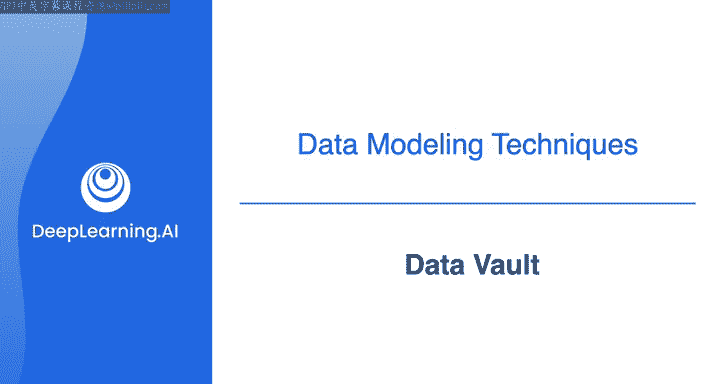
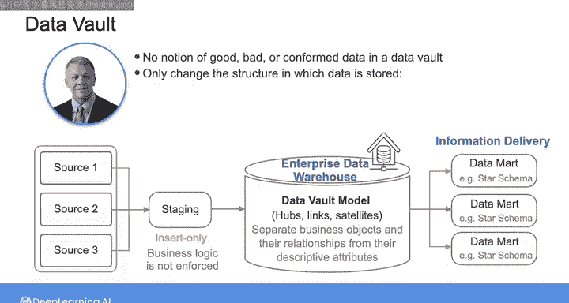
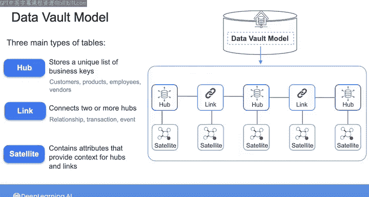
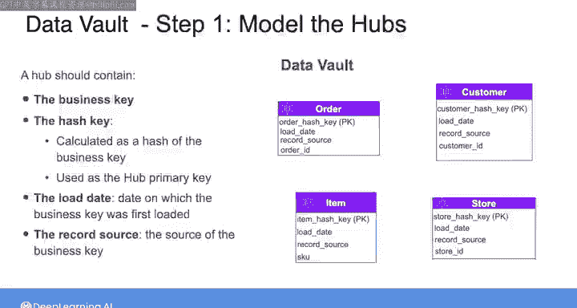
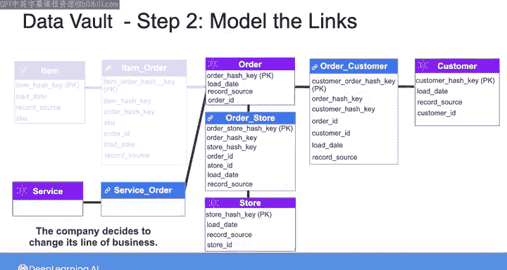

# 009：数据仓库建模方法 🏗️

在本节课中，我们将要学习数据仓库的第三种核心建模方法：Data Vault。我们将了解它与Inmon和Kimball方法的不同之处，并详细解析其三层架构以及核心的Hub、Link和Satellite表结构。

## 概述

Data Vault建模方法侧重于将数据的结构（即业务实体及其关系）与数据的描述性属性分离开来。它通过使用独立的表来代表核心业务概念、概念间的关系以及这些概念的描述属性，旨在构建一个灵活、敏捷且可扩展的数据仓库结构，使其能够紧密跟随业务变化。

## Data Vault 架构

上一节我们介绍了Inmon和Kimball方法，本节中我们来看看Data Vault的独特架构。与之前的方法不同，Data Vault架构通常包含三个层次。

以下是Data Vault的三层架构：

1.  **暂存区**：从源系统加载原始数据，采用仅插入方式，不改变数据或强制执行业务逻辑，仅确保摄入预期的数据类型。
2.  **企业数据仓库层**：使用Hub、Link和Satellite表对数据进行建模，将业务对象、关系与描述属性分离。这是Data Vault的核心层。
3.  **信息交付层**：将数据加载到下游数据集市中，这些数据集市可以建模为星型模式或其他结构，以支持不同的业务领域。在此层进行聚合、分组等操作以满足用户需求。

## 企业数据仓库层模型详解

现在，让我们深入了解企业数据仓库层的具体模型。Data Vault模型主要由三种类型的表构成。

以下是三种核心表类型：

*   **Hub**：存储业务键的唯一列表，用于表示核心业务概念，例如客户、产品、员工。其主键是业务键的哈希值。
*   **Link**：连接两个或多个Hub，表示业务概念之间的关系、交易或事件。其主键是所连接Hub的业务键的复合哈希值。
*   **Satellite**：包含为Hub或Link提供描述性上下文的属性。其主键是父级Hub或Link的哈希键与加载日期的组合。

在Data Vault中，没有“好”或“坏”数据的概念，只改变数据的存储结构。这种方式可以轻松追溯数据到其源头，并在业务需求变化时避免重构整个数据仓库。

## 构建Data Vault模型：一个电商示例

为了更直观地理解，我们通过一个电商示例来演示构建Data Vault模型的关键步骤。假设我们需要为客户、订单、商店和商品建模。

以下是构建模型的三步流程：

1.  **建模Hub**：首先识别核心业务概念及其业务键。例如，`Customer Hub`的业务键是`Customer ID`，`Order Hub`是`Order ID`。每个Hub还必须包含哈希键、加载日期和记录源这三个标准字段。
    *   **公式/代码示例**：`Hub_PK = HASH(Business_Key)`

2.  **建模Link**：其次，使用Link表连接Hub以捕获关系。例如，创建一个`Order-Customer Link`连接订单和客户Hub，表示“哪个客户下了哪个订单”。再创建`Item-Order Link`和`Order-Store Link`。Link表的主键由父Hub的业务键组合哈希而成。
    *   **公式/代码示例**：`Link_PK = HASH(Hub1_BK, Hub2_BK)`

3.  **建模Satellite**：最后，创建Satellite表为Hub和Link提供描述性上下文。例如，为`Customer Hub`创建`Customer Satellite`，包含客户姓名、邮编等属性。为`Item-Order Link`创建Satellite，包含商品订购数量。
    *   **公式/代码示例**：`Satellite_PK = HASH(Parent_Hub_Link_PK) + Load_Date`

通过这种设计，当业务规则变化时（例如，允许多个客户共同支付一个订单），只需通过Link表建立多对多关系，而无需重新设计整个模型，体现了其灵活性。

## 总结与延伸

本节课中我们一起学习了Data Vault数据建模方法。它通过分离业务键、关系和描述属性，提供了一种解耦于源系统的灵活设计，使数据仓库能够轻松适应业务演变。

然而，本章内容仅涵盖了Inmon、Kimball和Data Vault这三种最流行方法的基础，远未体现其各自的复杂性与细微差别。在资源部分，我列出了每种方法创始人的一些书籍，强烈推荐你阅读以进一步理解数据建模对于批处理分析数据为何及如何至关重要。

近年来，一种称为“单一大表”的方法已出现，用于为分析用例建模数据。请观看下一个视频，我们将“单一大表”作为本周要介绍的最后一种数据建模方法进行探讨。