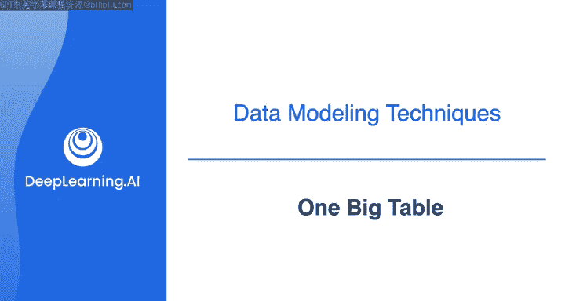
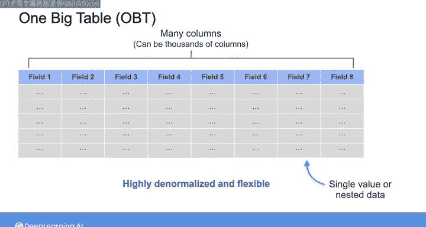
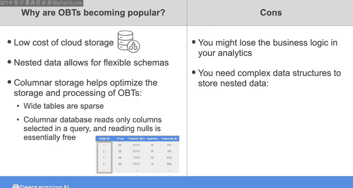

# 010：大表模型 🗃️



在本节课中，我们将要学习一种在现代数据工程中日益流行的数据建模方法——大表模型。我们将探讨其核心概念、优缺点以及适用场景。

## 概述

本周我们已经学习了金博尔模型和英曼模型等传统数据建模方法。这些方法诞生于数据仓库成本高昂、资源受限且计算与存储紧密耦合的本地部署时代。虽然批处理数据建模传统上与这些严格的方法相关联，但一种更为宽松的方法，即“大表模型”，正变得越来越普遍。

## 什么是大表模型？📊

大表模型，简称OBT，其核心思想是将所有数据放入一个单一的宽表中。顾名思义，这是一个包含许多列的非常“宽”的表，通常在列式数据库中创建。

一个宽表可能拥有数千列，而关系数据库中的表通常只有十几列。列可以是单个值，也可以包含嵌套数据。因此，大表模型中的宽表是高度反规范化和灵活的。



以下是一个宽表的示例，它本质上是你在之前视频中见过的反规范化表。这只是一个简单的例子，实际的大表模型宽表可能拥有更多的列。

```sql
-- 示例：一个宽表可能包含客户、订单、产品等所有相关信息
SELECT
    customer_id,
    customer_name,
    order_id,
    order_date,
    product_id,
    product_name,
    quantity,
    unit_price,
    -- ... 可能还有数百个其他字段
FROM one_big_table
```

如图所示，这个表结合了各种数据类型，每一行代表一个客户订单。你可以将大表模型视为金博尔方法的延伸，它将事实和维度数据都呈现在同一个表中。

## 大表模型的优势与原理 🚀

通过将事实和维度数据放在同一张表中，数据分析师可以免于执行任何复杂的连接操作，甚至完全不需要进行表连接。

此外，在宽表上运行相同的分析查询，通常比在高度规范化的数据上，甚至在星型模型（可能仍需连接维度表和事实表）上运行得更快。宽表简单地包含了所有原本需要通过连接才能获取的数据。对于任何需要扫描大量数据的查询性能而言，这都可能产生巨大影响。

大表模型之所以越来越普遍，主要得益于云存储的低成本。同时，许多组织选择在其源系统和分析系统中使用嵌套数据来设计灵活的架构。使用大表模型，你可以将这些嵌套数据全部存储在一个表中，而无需担心在存储中表示它们的最佳方式。

## 技术考量：列式存储的重要性 💾

宽表通常是稀疏的，这意味着任何给定字段中的绝大多数条目可能都是空值。在传统的面向行的关系数据库中，存储和读取包含大量空值的宽表成本极高，因为数据库需要为每个条目分配固定的空间，并且在读取时必须完整读取每一行的内容。

然而，随着列式数据库的出现，你可以只读取查询中选定的列，因此读取空值基本上没有成本。列式存储有助于优化宽表的存储和处理性能。

## 大表模型的缺点与权衡 ⚖️

对大表模型最主要的批评是，在混合数据的过程中，你可能会丢失分析中的业务逻辑。另一个缺点是，你需要使用数组等复杂数据结构来存储嵌套数据。这些结构在更新和聚合元素时性能较差。

因此，我建议在以下情况下使用宽表：当你拥有大量数据，并且需要比传统数据建模方法提供更大的灵活性时。



在数据建模领域，没有放之四海而皆准的解决方案。因此，你必须理解不同可能方法之间的权衡，包括灵活性、数据完整性以及对下游利益相关者的易用性，从而为你的具体用例选择最佳方法。

## 总结

本节课我们一起学习了大表模型。我们了解到，这是一种将数据高度反规范化、存储在一个宽表中的现代建模方法。它的优势在于查询简单、性能高效，特别适合云存储和列式数据库环境。然而，它也存在可能丢失业务逻辑、处理嵌套数据性能较低等缺点。关键在于根据数据量、灵活性需求和查询模式来权衡选择。


在接下来的实验中，你将练习将规范化数据建模为星型模式和大表模型，这是数据工程师的一项常见任务。但在进入实验之前，课程提供了一个关于DBT的演示和一个练习，让你在实验中使用的SQL查询中实践数据建模技巧。