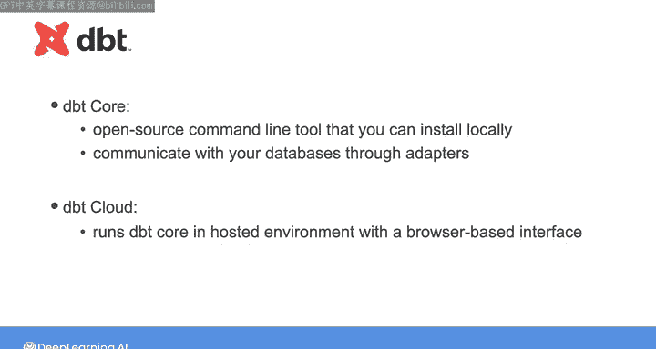
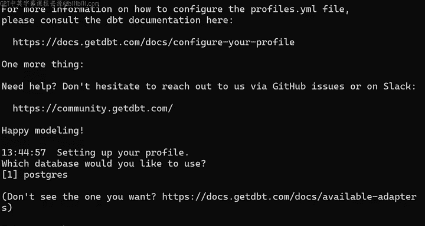
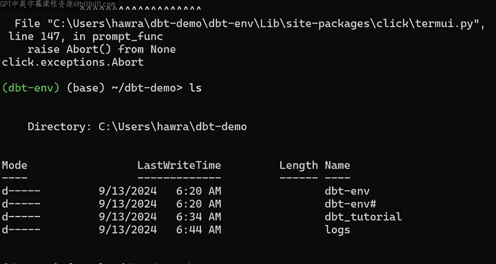
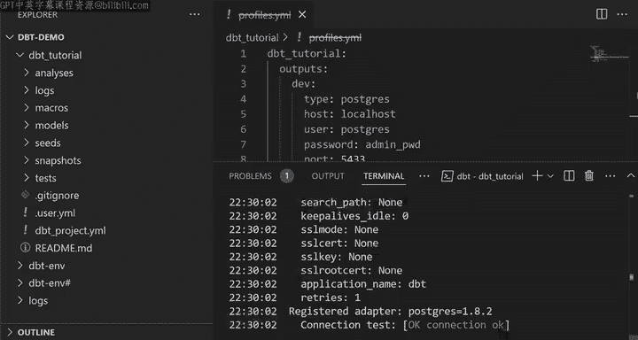

# 011：使用dbt转换数据（第1部分）📊

在本节课中，我们将学习如何使用数据构建工具（dbt）将规范化的数据转换为星型模式。我们将从安装dbt和配置环境开始，为后续创建数据模型做好准备。

## 概述

我们将使用dbt对一个包含五个表（`order_items`、`orders`、`customers`、`items`、`stores`）的本地PostgreSQL数据库进行操作。这些表目前位于名为`staging`的模式下。我们的目标是在一个新的`star_schema`模式下，创建事实表`fact_order_items`以及维度表`dim_stores`、`dim_items`和`dim_date`。dbt可以帮助我们通过封装SQL语句来轻松创建这些表，并协助进行数据文档化和验证。

## 安装与设置dbt环境

首先，我们需要安装dbt并设置工作环境。dbt提供两种环境：**dbt Core**（开源命令行工具）和**dbt Cloud**（基于浏览器的托管环境）。本教程将使用dbt Core，这也是后续实验中将用到的工具。



以下是设置步骤：

1.  创建一个新的虚拟环境并激活它。
    ```bash
    python -m venv dbt_env
    source dbt_env/bin/activate  # 在Windows上使用 `dbt_env\Scripts\activate`
    ```
2.  安装dbt Core及其PostgreSQL适配器。
    ```bash
    pip install dbt-core dbt-postgres
    ```
    dbt Core通过适配器与数据库通信，您可以根据所使用的数据库类型选择其他适配器。

## 初始化dbt项目

安装完成后，我们需要创建一个dbt项目文件夹，该文件夹将包含定义新表所需的所有文件。





1.  运行`dbt init`命令来初始化项目。
    ```bash
    dbt init dbt_tutorial
    ```
2.  系统会提示选择数据库类型。由于我们只安装了PostgreSQL适配器，输入`1`即可。
3.  随后，dbt会要求输入数据库信息以自动创建连接配置文件。此时，我们可以按`Ctrl+C`中断此过程，稍后手动创建该文件。

运行上述命令后，您的工作目录中会生成一个名为`dbt_tutorial`的文件夹。

## 认识dbt项目结构

让我们打开IDE，查看`dbt_tutorial`项目文件夹中的主要目录和文件：

*   **`models/`**：这是核心目录，您将在此处花费大部分时间。您需要为星型模式中的每个表创建一个`.sql`文件，其中包含定义该表的SQL语句。您还可以添加`.yml`文件来配置模型、定义测试和文档。
*   **`analyses/`**：用于存放不属于核心模型、但可能用于探索性分析的SQL语句。
*   **`macros/`**：用于存储希望在多个模型中复用的SQL代码片段。
*   **`seeds/`**：用于存放希望加载到数据仓库的CSV文件。
*   **`snapshots/`**：用于记录表随时间的变化。
*   **`tests/`**：用于创建对数据执行特定测试的SQL语句。

在本视频和实验中，我们将主要使用`models/`子文件夹。

## 配置项目文件

除了子文件夹，项目根目录下还有一个重要的`dbt_project.yml`文件，它包含了项目的配置。

让我们查看这个文件的关键部分：
```yaml
name: ‘dbt_tutorial’
version: ‘1.0.0’

profile: ‘dbt_tutorial’

model-paths: [“models”]
analysis-paths: [“analyses”]
...

models:
  dbt_tutorial:
    # 在此配置默认模型设置
    +materialized: table
```
在配置中，您需要指定项目名称、版本和配置文件（profile）名称。`profile`包含了连接数据库的详细信息，需要在另一个名为`profiles.yml`的文件中定义。

您还可以在此处定义模型的默认配置，例如使用`+materialized: table`或`+materialized: view`来指定模型是物化为表还是视图。

## 创建数据库连接配置文件

现在，让我们创建`profiles.yml`文件来指定如何连接到本地PostgreSQL数据库。

在`dbt_tutorial`项目目录中（或将其移至`~/.dbt/`目录下以提高安全性），创建`profiles.yml`文件：
```yaml
dbt_tutorial:  # 此名称必须与 dbt_project.yml 中的 ‘profile‘ 一致
  target: dev  # 指定默认使用的目标配置
  outputs:
    dev:  # 开发环境配置
      type: postgres
      host: localhost
      user: your_username
      pass: your_password
      port: 5432
      dbname: your_database_name
      schema: star_schema  # 默认模式
      threads: 1
```
请务必将`host`、`user`、`pass`、`port`、`dbname`替换为您实际的数据库连接信息。

## 验证数据库连接

配置文件创建完成后，我们需要验证dbt是否能成功连接到数据库。

1.  在终端中，确保位于`dbt_tutorial`项目目录下。
2.  运行连接测试命令：
    ```bash
    dbt debug
    ```
如果所有凭证无误，您应该会看到连接成功的提示信息。

## 总结

在本节课中，我们一起完成了使用dbt进行数据转换的第一步准备工作。我们安装了dbt Core并设置了Python虚拟环境，初始化了一个新的dbt项目，并了解了其核心目录结构。接着，我们配置了`dbt_project.yml`和`profiles.yml`两个关键文件，成功建立了与本地PostgreSQL数据库的连接。



下一部分，我们将开始创建具体的SQL模型文件，来构建星型模式中的事实表和维度表。