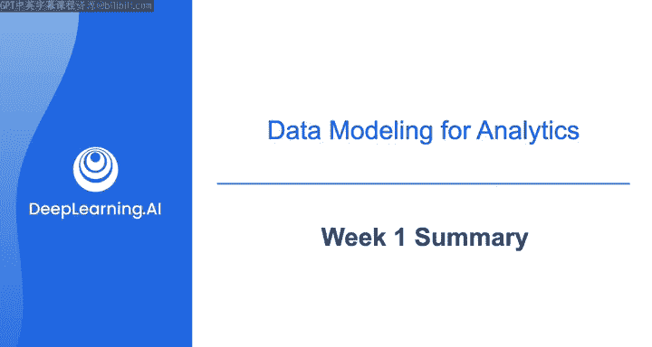
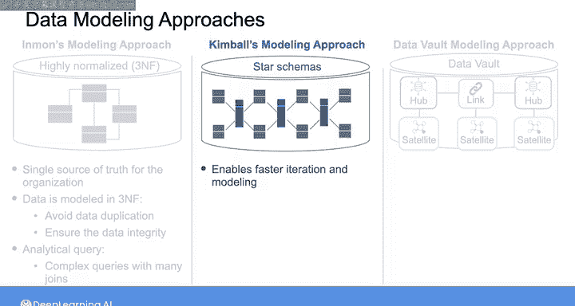
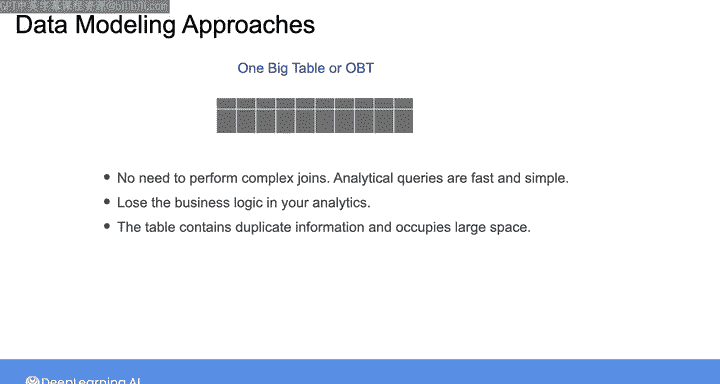

# 012：第1周总结 📊



在本节课中，我们将回顾第一周学习的核心内容，重点总结为批处理分析用例进行数据建模的不同方法。我们将探讨每种方法的原理、优缺点，并理解它们在实际数据工程工作中的应用场景。

---

## 概述

第一周，我们深入探讨了为批处理分析用例设计数据模型的各种方法。在实验环节，你实践了多个规范化步骤，将理论数据转化为第三范式。同时，你也使用DBT工具将规范化数据建模为星型模式。我们讨论了四种主要的数据仓库建模方法：Inmon方法、Kimball方法、Data Vault模型以及“一张大表”方法。每种方法都有其独特的侧重点和适用场景。

---

## 四种数据建模方法详解

上一节我们概述了本周的学习内容，本节中我们将详细回顾这四种核心的数据建模方法。

### 1. Inmon 建模方法 🏛️

Inmon建模方法的核心是使用高度规范化的模型（即第三范式）在数据仓库中构建数据。

**主要优势**在于它使数据仓库成为组织的**单一事实来源**，并确保了数据的完整性。这是因为当你将数据建模为第三范式时，你避免了数据的重复和冗余。

**公式表示规范化目标**：消除数据中的部分函数依赖和传递函数依赖，以达到 `3NF`。

然而，对处于第三范式的数据执行分析查询时，通常需要依赖多次连接的复杂查询，这可能导致查询性能较慢。

### 2. Kimball 建模方法 ⭐

Kimball建模方法支持更快的迭代和建模，因为它直接使用星型模式在数据仓库中对数据进行建模。

在星型模式中，你将一个业务流程或事件的度量（事实）收集到一张**事实表**中。然后，为了提供关于这些事实的详细上下文信息，你用**维度表**包围事实表。

**代码示例表示结构**：
```sql
-- 事实表
FACT_SALES (sale_id, product_key, date_key, customer_key, amount)
-- 维度表
DIM_PRODUCT (product_key, product_name, category)
DIM_DATE (date_key, year, month, day)
DIM_CUSTOMER (customer_key, customer_name, region)
```

这种方式允许数据分析师聚合事实表的度量，并使用维度表对查询进行分组或过滤。但是，要使用这种方法，你需要对业务需求有很好的理解，而这些需求在某些情况下可能定义不清或非常不稳定。

### 3. Data Vault 模型 🔗

另一方面，Data Vault模型提供了一种更灵活的设计，适用于业务需求或源系统结构可能经常变化的敏捷环境。

Data Vault方法在**中心表**中对核心业务概念进行建模，并使用**链接表**表示它们之间的关系。这些表只包含标识核心概念的**业务键**。

为了提供更有意义的上下文，你可以将中心表和链接表连接到**卫星表**，卫星表包含父中心表或链接表的属性。



**公式表示核心思想**：`数据仓库 = 中心表(Hubs) + 链接表(Links) + 卫星表(Satellites)`。

然而，使用这种模型，你仍然需要在信息交付层进行一些下游工作，将数据建模为星型模式或其他易于查询的结构。

### 4. “一张大表” 方法 📑

最后，我们看了“一张大表”方法，这或许是建模数据最简单的方式。

顾名思义，这种方法就是将所有数据放入一张大表中。这样一来，数据分析师不需要执行任何复杂的连接操作，因此执行分析查询速度很快。

但是，使用这种方法，你会在分析中丢失业务逻辑，并且可能最终得到一个包含重复信息、占用大量空间的大表。

---

## 方法对比与总结

综上所述，每种方法都有其自身的优点和缺点。在你的数据工程师工作中，很可能会结合使用不止一种方法。

第一周，我们主要聚焦于为批处理分析进行数据建模。我们学习了如何通过规范化确保数据完整性，也了解了如何通过维度建模优化查询性能。

---

## 下周预告



下周，我们将继续讨论数据建模，但重点将转向如何为机器学习用例建模和转换数据。

我们下周见。