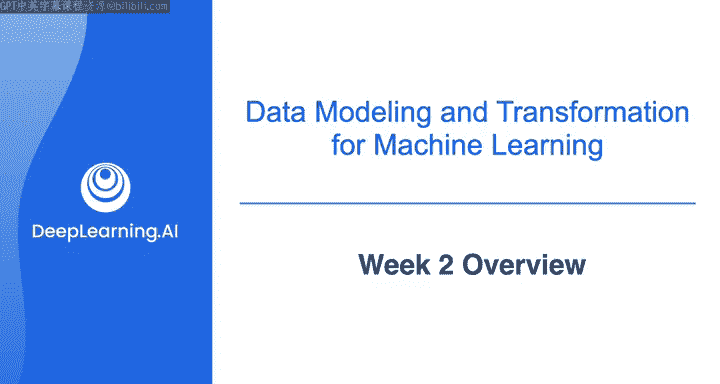
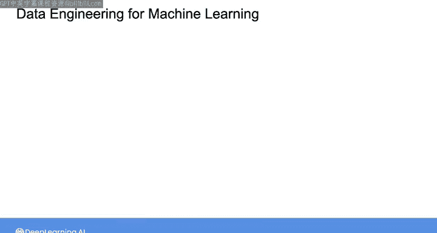
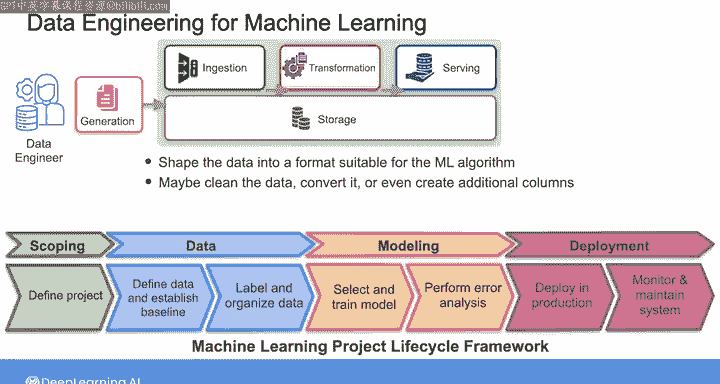
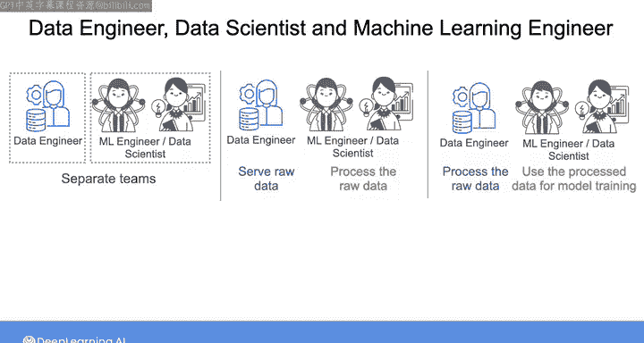
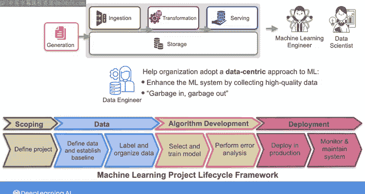
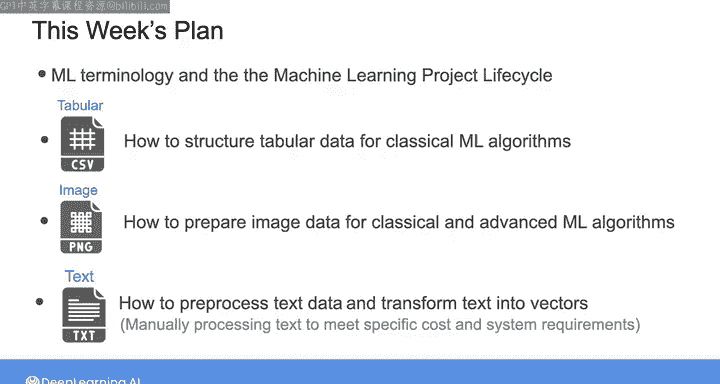

# 013：数据工程（数据建模、转换和服务）第4课，完结｜第2周概览 🗺️

在本节课中，我们将要学习如何为机器学习用例准备和建模数据。我们将从机器学习项目生命周期框架入手，明确数据工程师在其中的角色，并概述本周将学习的结构化数据、图像数据和文本数据的处理方法。

上周，我们介绍了几种用于批处理分析的数据建模方法，这些方法以支持分析查询的方式构建数据。

本节中我们来看看如何为机器学习用例准备和建模数据。这类建模的目标是以一种能帮助数据科学家或机器学习工程师理解数据含义的方式来构建数据，以便他们能利用这些数据开发机器学习系统并发现数据中的隐藏模式。

## 机器学习项目生命周期 🔄

构建一个机器学习系统涉及多个阶段。这里我将参考Andrew Ng在《Machine Learning and Production》课程中提出的机器学习项目生命周期框架。你会发现这个框架对大多数机器学习项目都很有用。

以下是该框架包含的主要阶段：
*   **项目范围界定**：确定机器学习项目的目标和范围。
*   **数据收集与准备**：收集数据并进行预处理。
*   **算法开发**：开发机器学习模型（为避免与数据建模混淆，此处将原“模型”阶段更名为“算法开发”）。
*   **系统部署**：将机器学习系统部署到生产环境。

你的工作，作为一名数据工程师，是构建和维护为上述一个或多个阶段提供数据的数据管道。在这些管道中，你需要从多个来源收集数据，并将其组合成适合机器学习算法的格式。你的任务还可能包括清洗数据、转换数据，甚至创建一些额外的列或特征。最后，你需要存储数据并将其分享给机器学习或数据科学团队。

## 数据工程师的角色定位 🧑‍💻

你可能会好奇，数据工程师的角色与数据科学家或机器学习工程师有何不同。必须承认，机器学习工程、数据科学和数据工程之间的界限正变得越来越模糊，并且这些角色的职责在不同组织间差异巨大。

以下是几种常见的情况：
*   一些组织可能拥有完全独立的数据团队，负责处理所有机器学习项目的整个生命周期。
*   在其他情况下，你作为数据工程师，可能只负责向机器学习或数据科学团队提供原始数据，然后由机器学习工程师或数据科学家接管后续的数据处理流程。
*   你也可能被要求处理原始数据，以便下游利益相关者可以直接使用处理后的数据来训练机器学习算法。
*   如果你的组织规模较小或没有成熟的机器学习团队，你甚至可能需要处理一些与机器学习高度相关的任务，例如数据的**特征工程**。

无论如何，作为一名数据工程师，你在帮助组织采用以数据为中心的机器学习方法方面扮演着关键角色。这种方法侧重于通过收集高质量数据来增强机器学习系统。

你可能听过“**垃圾进，垃圾出**”的说法，它指的是任何系统的输出质量都取决于其输入质量。因此，通过仔细地为机器学习算法准备数据，你可以帮助数据科学家或机器学习工程师提取准确且有意义的见解，从而创建更有用的机器学习系统。

我建议你对机器学习的工作原理有一个基本的了解，因为这将极大地帮助你为组织创造价值。

## 本周学习内容预览 📚

我不会试图教你关于机器学习的一切，而是将重点放在与经典或高级机器学习算法配合工作时，如何构建表格数据、图像数据和文本数据。要了解更多关于这些机器学习技术的知识，你可以在本周结束时的资源部分找到一份可供查阅的书籍和课程列表。

以下是本周的具体学习安排：

**第一课：表格数据与特征工程**
我们将从一些关键的机器学习术语概述开始，并深入探讨机器学习项目生命周期的各个阶段。然后，我们将讨论如何为经典机器学习算法构建表格数据。特别是，你将在本周的第一个实验课中执行特征工程和数据处理的某些步骤。

**第二课：非结构化数据处理**
你将学习如何建模和处理非结构化数据。你将学习为经典机器学习以及更高级的机器学习算法（如**卷积神经网络**）准备图像数据。

**第三课：文本数据处理**
最后，你将学习处理文本数据。如今，大多数文本数据的预处理步骤都可以由大型语言模型处理。然而，你仍然应该了解这些步骤，以防你需要手动处理文本数据以满足机器学习项目的特定成本或系统要求。因此，我将介绍一些基本的预处理技术，并向你展示如何将文本转换为可用于训练机器学习算法的向量。你将在本周的第二个实验课中有机会练习处理文本数据。

本周有很多内容要学习。让我们在下一个视频中开始吧。

---

**本节课中我们一起学习了**：机器学习项目生命周期的框架，明确了数据工程师在其中收集、准备、转换和提供数据的关键职责。我们还预览了本周将深入学习的三大主题：为机器学习准备表格数据、图像数据和文本数据。理解这些内容将帮助你更好地支持组织构建有效的机器学习系统。