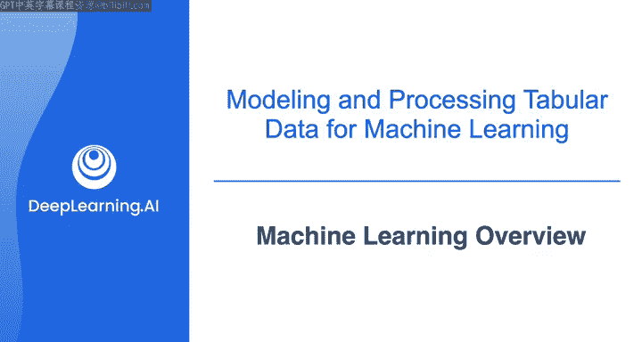
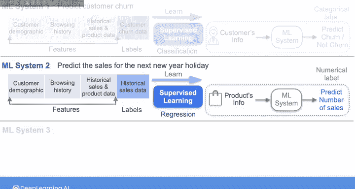
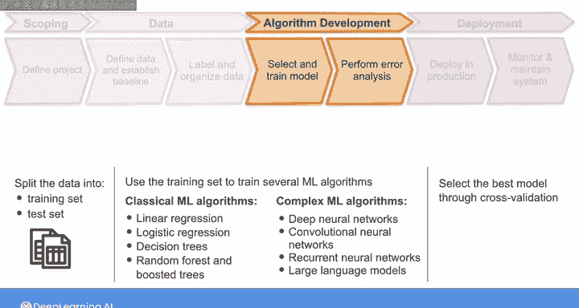
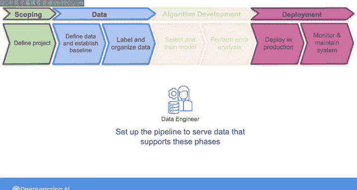

# 014：机器学习基础概念与项目生命周期 🧠

在本节课中，我们将学习机器学习的基本术语、核心概念以及一个完整的机器学习项目生命周期框架。作为数据工程师，理解这些内容对于与机器学习团队有效协作至关重要。

## 机器学习基本概念

上一节我们介绍了课程目标，本节中我们来看看机器学习的基础分类。

### 监督学习与无监督学习

机器学习主要分为监督学习和无监督学习。

以下是两者的核心区别：

*   **监督学习**：算法从带有**标签**的数据中学习。标签是我们要预测的目标值。例如，根据历史数据预测客户是否会流失（流失/不流失）。
*   **无监督学习**：算法从未标记的数据中发现模式或结构。数据只包含**特征**，没有预设的标签。例如，根据客户行为数据自动将客户分成不同的群组。

### 分类与回归

在监督学习中，根据预测目标（标签）的类型，可以进一步分为分类和回归。

以下是两者的具体说明：

*   **分类**：预测的标签是**类别型**的，属于有限个类别。例如，预测客户是否会流失（是/否），预测邮件是否为垃圾邮件（是/否）。其目标是找到一个决策边界。
*   **回归**：预测的标签是**连续数值型**的。例如，预测产品的销售额（具体金额），预测房价。其目标是拟合一个函数。

## 机器学习项目生命周期 🔄

理解了基本概念后，我们来看一个机器学习项目从构思到上线的完整流程。吴恩达教授提出的这个框架将帮助你理解数据在各个环节中的作用。

以下是项目生命周期的四个主要阶段：

1.  **范围界定**：明确项目目标和要解决的业务问题。
2.  **数据处理**：与机器学习团队协作，确定并收集所需的**特征**和**标签**，组织数据并建立基线。这是数据工程师参与最深的阶段。
3.  **模型开发与迭代**：机器学习工程师使用你提供的数据来训练和评估模型。这个过程通常是迭代的。
4.  **部署与维护**：将训练好的模型投入生产环境，并持续监控和维护。数据工程师需要为生产模型提供数据流，并可能提供新数据用于模型更新。

### 模型开发与迭代详解

在模型开发阶段，机器学习工程师会进行一系列操作。

以下是该阶段的关键步骤：

*   **数据划分**：将数据集分为**训练集**和**测试集**。
*   **算法选择与训练**：
    *   **经典算法**：如线性回归、逻辑回归、决策树、随机森林。它们易于实现，通常要求数据为**表格形式**。公式示例：线性回归 `y = w*x + b`。
    *   **复杂算法**：如深度神经网络。它们能处理更大规模的数据和更复杂的数据类型，如图像（卷积神经网络CNN）、时间序列（循环神经网络RNN）、文本（大语言模型LLM）。
*   **模型评估与迭代**：通过交叉验证选择最佳模型，并用测试集评估性能。如果效果不佳，团队可能会要求你提供更新或更丰富的数据集，重新开始训练，形成迭代循环。

### 数据工程师的角色

在整个生命周期中，数据工程师的核心职责是构建和维护**数据管道**，为各个阶段提供可靠、格式正确的数据支持。虽然不直接参与算法细节，但高质量的数据供给是项目成功的基石。

本节课中我们一起学习了机器学习的基础分类（监督/无监督学习，分类/回归），并深入了解了机器学习项目的完整生命周期框架。你明确了数据工程师在范围界定、数据处理、模型迭代和部署维护各阶段中的关键作用，即为机器学习系统提供坚实的数据基础设施支持。