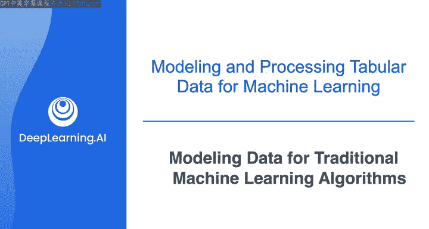
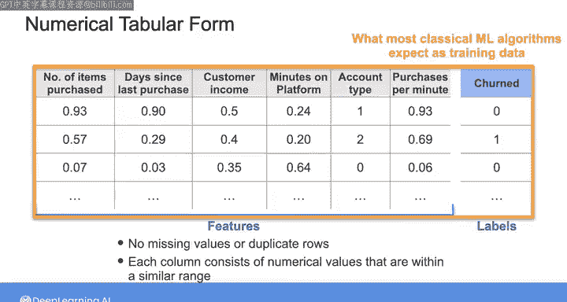
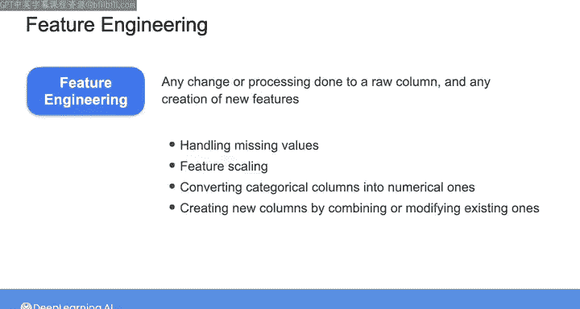
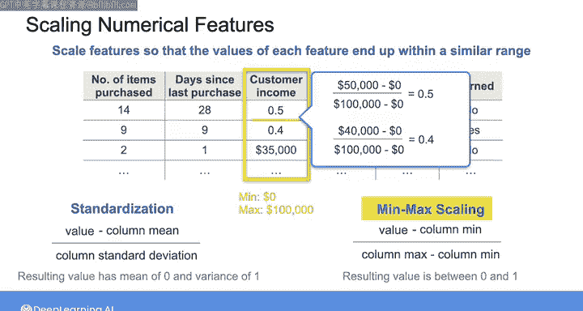
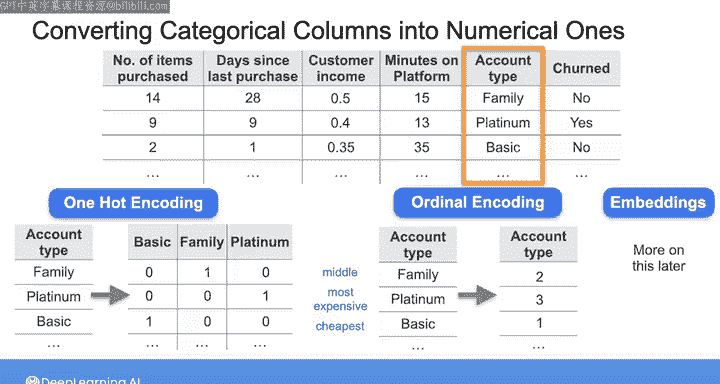

# 015：传统机器学习算法的数据建模 📊

在本节课中，我们将学习如何为传统机器学习算法准备和建模数据。我们将重点介绍如何将原始数据处理成算法期望的数值表格形式，并详细讲解特征工程中的关键步骤，包括处理缺失值、特征缩放和类别特征编码。

---

## 概述

为传统机器学习算法提供训练数据时，数据通常需要是仅包含数值的表格形式。为这类用例建模数据时，你需要决定包含哪些特征以及使用哪个标签作为预测目标。这些决策通常由机器学习或数据科学团队做出。根据项目需求和迭代阶段，你可能直接向团队提供原始数据供其探索，也可能需要在提供数据前，将特征和标签处理并转换为数值表格形式。

接下来，我们将通过一些基本的预处理步骤，来学习如何为训练准备表格数据。

---

## 客户流失案例回顾

让我们回到上一视频中介绍的客户流失示例。原始数据集可能如下所示：

每一行对应一位客户，显示了他们的购买次数、最近购买日期、收入、在平台上的时长、账户类型以及是否流失。

根据你所在团队和项目的具体情况，你可能被要求提供这样的原始数据，也可能被要求处理数据并将其转换为数值表格形式，转换后的数据可能如下所示：

请注意，我已将“是否流失”列分离为一个向量，其中包含每位客户的标签：1表示客户已流失，0表示未流失。你可以看到数据中没有缺失值或重复行，且每列都由数值组成，这些数值处于相似的范围之内。

此外，请注意我通过将“购买商品数”列除以“平台使用时长（分钟）”列，创建了一个新的“每分钟购买数”特征。通过组合或修改现有列来创建新特征，这一决策通常由机器学习团队决定并传达给你。

这种数值表格数据是大多数传统机器学习算法期望接收的训练数据。在机器学习中，当你处理原始列或创建新特征时，这个过程被称为**特征工程**。该过程包括处理缺失值、特征缩放、将类别列转换为数值列，以及通过组合或修改现有列来创建新列等操作。

下面让我们更详细地了解这些常见的特征工程操作。

---

## 处理缺失值

处理数据时，你很可能会遇到缺失值。

你首先应该理解数值缺失的原因，然后确定处理此问题的最合适方法。

最简单的方法是删除包含缺失值的列或行，但这种方式可能会无意中丢失重要数据。因此，只有在没有丢失有价值数据的风险时，才删除行或列。

另一种方法是用该列的一些汇总统计量来填补缺失值，例如用该列的平均值或中位数填补，或用相似记录的数值填补。然而，当你填补缺失值时，可能会给数据引入噪声或偏差。

在我们的客户流失示例中，第三行大部分是空值。假设我与机器学习工程师沟通后，确定我们拥有的非空值并不特别有价值，因此我决定删除该行。对于缺失的客户收入值，我决定用相似记录的值来替换。

处理缺失值没有单一完美的方法，你通常需要与机器学习团队合作，选择不影响机器学习系统性能的最佳方法。

---

## 特征缩放

处理完任何缺失值后，你需要对数值特征进行缩放，使每个特征的值最终处于相似的范围。

不深入技术细节，机器学习算法本质上是优化算法，它们使用训练数据来计算一组参数，以产生最优的输出。如果特征值差异巨大，算法可能需要很长时间才能收敛。

此外，某些机器学习算法基于距离度量，因此它们的准确性可能会受到特征值不同范围的影响。

在我们的客户流失示例中，“购买商品数”特征的值范围将远小于“客户收入”特征的值范围。

要对每列的值进行缩放，你可以应用**标准化**或**最小-最大缩放**。

*   **标准化**：取列中的每个值，减去列的平均值，然后除以列的标准差。标准化后，列中的值将具有均值为0、方差为1的分布。
*   **最小-最大缩放**：取列中的每个值，减去列的最小值，然后除以列的最大值与最小值之差。这样，列中的归一化值将介于0和1之间。

假设“客户收入”特征的最小值为0美元，最大值为100，000美元。如果对“客户收入”列的前两个值应用最小-最大缩放，你会得到什么值？

对于第一个值，你会得到 (50,000 - 0) / 100,000 = 0.5。对于第二个值，你会得到 (40,000 - 0) / 100,000 = 0.4。

---

## 编码类别特征

如果你的原始数据包含非数值的类别值呢？例如，假设账户类型可以是“基础版”、“家庭版”或“白金版”，如下所示。

由于传统机器学习算法期望每个特征都是数值型的，你需要应用预处理步骤将此类别特征转换为数值特征。

将此列转换为数值列的一种方法是应用称为**独热编码**的方法。使用此方法，将“账户类型”列替换为三列：第一列代表“基础版”，第二列代表“家庭版”，第三列代表“白金版”。由于此处的第一位客户拥有“家庭版”账户类型，我将在“家庭版”列中用1表示，其他两列用0表示。你对所有其他行执行相同的操作。

独热编码的列易于解释，但如果列中唯一值的数量很大，它会显著增加数据集中的列数。

另一种编码方法是使用**序数编码**，当类别列的唯一值之间存在自然顺序时，这种方法很有用。因此，假设账户类型可以按其订阅费用排序，“基础版”最便宜，“家庭版”居中，“白金版”是最贵的账户类型。那么你可以用1替换“基础版”，用2替换“家庭版”，用3替换“白金版”。这样，你可以在不向数据添加列的情况下将类别列转换为数值列。

还有其他方法，例如**哈希编码**，即应用数学哈希函数将类别替换为计算出的哈希值；或者你可以创建**嵌入**，这将在本周晚些时候讨论。同样，你将与机器学习工程师合作，根据你的具体用例决定使用哪种方法。

---

## 总结与后续

以上是为训练机器学习算法准备数据时可能应用的一些预处理或特征工程步骤。你应该始终与机器学习团队紧密合作，以决定最适合给定项目的步骤和方法。

接下来，我将通过一个简短的演示，向你展示如何使用 Pandas 将这些特征工程步骤应用到实际数据中。如果你还不熟悉 Pandas，你可能需要查看本周结束时资源部分中的 Pandas 教程链接。

在我们深入演示之前，我还包含了一个可选视频，其中我与 Pandas 的创建者 Wes McKinney 进行了交谈。如果你想跳过那个视频，我们将在随后的演示中再见。

---

**本节课中，我们一起学习了：**

1.  **数据形式要求**：传统机器学习算法通常期望接收数值表格形式的训练数据。
2.  **特征工程**：将原始数据处理成算法所需形式的过程，包括创建新特征。
3.  **处理缺失值**：理解缺失原因，并选择删除或填补等适当方法，需与团队协作决策。
4.  **特征缩放**：通过标准化或最小-最大缩放，使不同特征的值处于相似范围，以帮助算法收敛并提高某些算法的准确性。
5.  **编码类别特征**：使用独热编码、序数编码等方法将非数值类别数据转换为数值形式，选择取决于数据特性和项目需求。

这些步骤是构建有效机器学习管道的基础，与机器学习团队的持续沟通对于做出正确决策至关重要。