# 017：使用scikit-learn处理表格数据（第1部分）📊

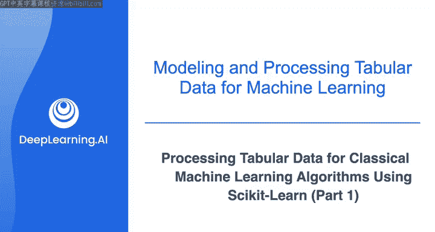

在本节课中，我们将学习如何应用数据预处理步骤来处理一个示例数据集。我们将使用开源机器学习库scikit-learn，并重点演示如何对数值列进行标准化以及对分类列进行独热编码。

上一节我们介绍了数据预处理的基本概念，本节中我们来看看如何在一个具体的客户流失数据集上应用这些步骤。

## 数据集概览与探索

我将使用一个从Kaggle数据科学平台下载的客户流失数据集。如果你想跟随操作，可以在本视频的资源部分找到Notebook文件和CSV数据文件。

首先，使用pandas快速探索数据。导入pandas并读取本地CSV文件到一个名为`data`的pandas DataFrame中。

```python
import pandas as pd
data = pd.read_csv('customer_churn.csv')
```

检查数据形状，可以看到它包含约440，000行和11列。

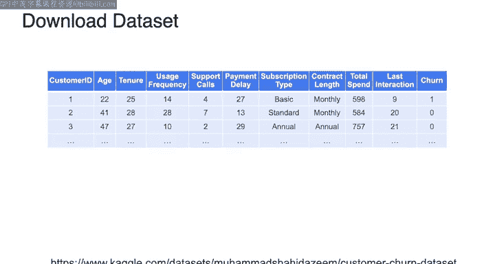

```python
data.shape
```

使用`head`方法查看数据的前几行。

```python
data.head()
```

每一行对应一个客户，包含一组特征，如客户年龄、使用频率、向服务提供商拨打的客服电话数量、订阅类型等。数据还包含`churn`列，这是每个客户的目标标签：值为1表示客户已流失，值为0表示客户未流失。

使用`describe`方法快速查看数值列的汇总统计信息。

```python
data.describe()
```

可以看到客户的平均年龄接近40岁，客服电话数量范围是0到10，总花费的中位数是661美元。还可以看到每个特征的计数比总行数少1，这表明每个特征中都存在一个空值。

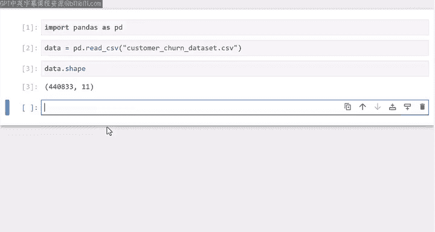

## 数据清洗：处理缺失值

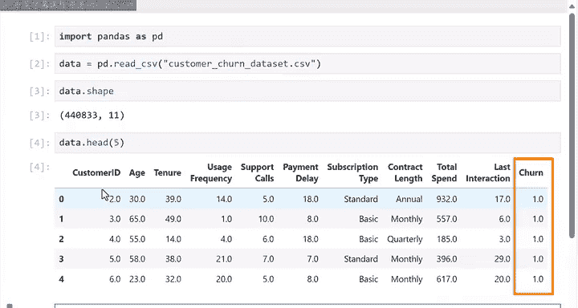

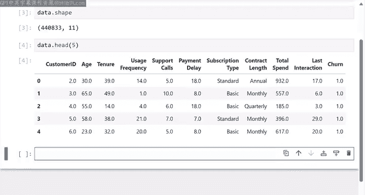

你可以使用`isnull`方法验证这些数值列中确实存在缺失值。

```python
data.isnull().sum()
```

从输出中可以看到，表中包含一整行的缺失条目。由于只有一行，并且该客户的所有列都是空值，我将使用`dropna`方法将其从数据集中删除。

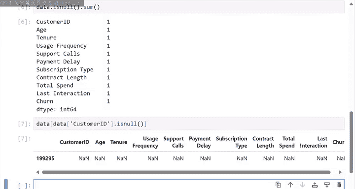

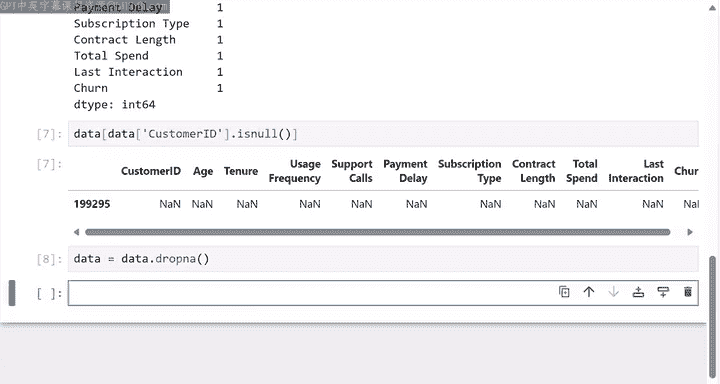

```python
data = data.dropna()
```

你可以再次验证所有列中是否已没有空值。

```python
data.isnull().sum().sum()
```

## 探索分类列

为了快速探索分类列（即`subscription_type`和`contract_length`），我将在每个列上使用`value_counts`方法。该方法将返回唯一的类别以及属于每个类别的行所占的百分比。

以下是需要执行的步骤：

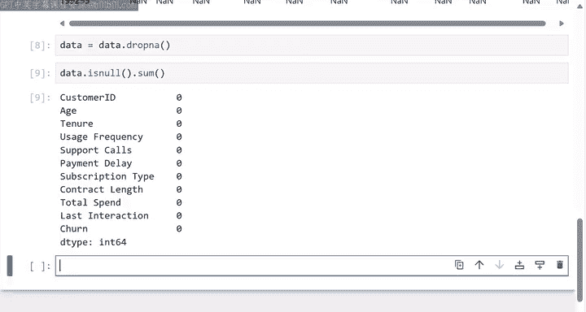

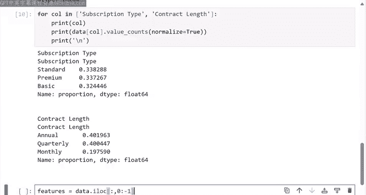

1.  对`subscription_type`列使用`value_counts`。
2.  对`contract_length`列使用`value_counts`。

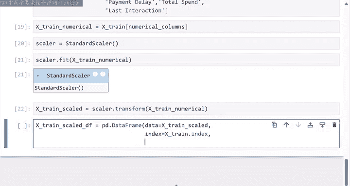

```python
print(data['subscription_type'].value_counts(normalize=True))
print(data['contract_length'].value_counts(normalize=True))
```

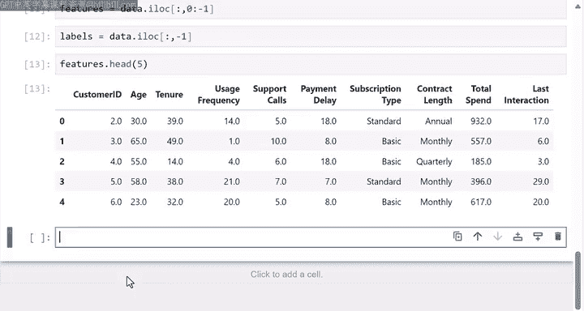

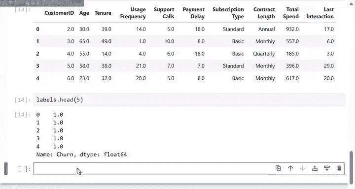

可以看到每个分类列都有三个唯一值。由于唯一值的数量较少，可以使用独热编码将这些分类列转换为数值列。

## 分离特征与标签

首先，由于大多数机器学习模型期望特征和标签分开存储，我将创建一个名为`features`的变量，并为其分配数据中代表客户特征的所有列。然后，创建一个名为`labels`的变量，并为其分配代表标签的单个列。

```python
features = data.drop(columns=['churn'])
labels = data['churn']
```

你可以查看特征和标签的前几行，以确保它们已正确分离。

```python
print(features.head())
print(labels.head())
```

## 数据预处理任务规划

现在假设你与机器学习团队进行了会议，他们要求你为训练机器学习模型准备这些数据。具体要求如下：
*   将数据按80%训练集和20%测试集的比例分割。
*   在每个数据集中需要保留客户ID。
*   对包含年龄、使用时长、使用频率、客服电话、付款延迟、总花费和最近交互的数值列进行标准化。
*   对分类列执行独热编码。
*   训练集和测试集应以Parquet文件格式存储。

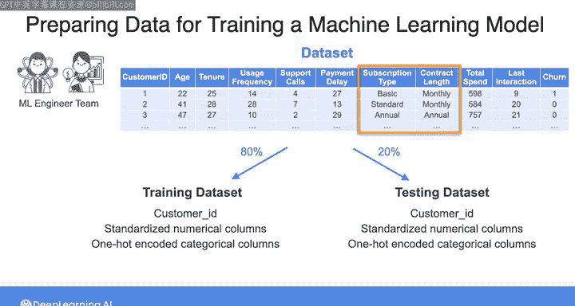

根据这些要求，以下是准备训练数据将遵循的步骤：

1.  将数据分割为训练集和测试集。
2.  首先处理训练数据：
    *   提取训练集的数值列，然后对每个数值列进行标准化。
    *   提取训练集的分类列，并使用独热编码对其进行编码。
    *   将处理后的数值列、编码后的分类列与客户ID合并到一个pandas DataFrame中。
    *   将此DataFrame转换为Parquet文件。
3.  对测试集重复相同的处理步骤。

将处理后的列连接成pandas DataFrame可以将元数据（即行和列标签）与值合并到一个对象中。这使得将数据存储为Parquet文件更加容易。

在评估或测试机器学习系统时，你应该使用在训练集上计算出的相同统计量，对测试集应用相同的预处理步骤。这是一个良好的实践，因为测试集用于评估机器学习算法在未见过的数据上的性能。因此，为了转换测试集，你应该使用用于转换训练集的任何统计量。

有了这个计划，让我们进入下一个视频，看看如何在scikit-learn中执行这些步骤。

---

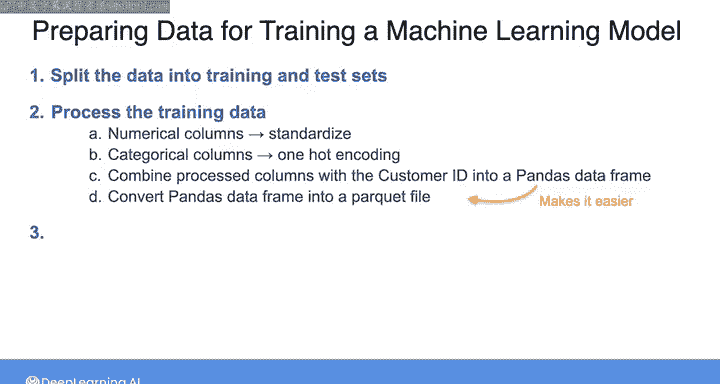

本节课中我们一起学习了如何使用pandas探索和清洗客户流失数据集，包括检查数据形状、处理缺失值、查看统计摘要以及分离特征与标签。我们还为接下来的数据预处理步骤制定了详细的计划，包括数据分割、数值标准化和分类列编码。下一部分我们将具体实现这些预处理步骤。